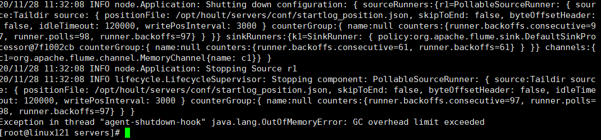
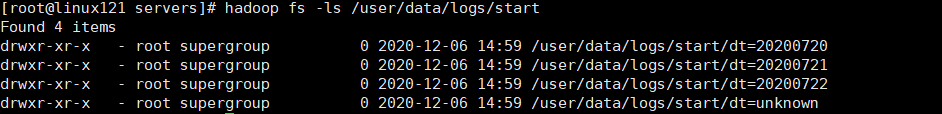

# Flume-接入Hive数仓搭建流程

实时流接入数仓，基本在大公司都会有，在`Flume1.8`以后支持`taildir source`, 其有以下几个特点，而被广泛使用：

> 1.使用正则表达式匹配目录中的文件名
> 2.监控的文件中，一旦有数据写入，`Flume`就会将信息写入到指定的Sink
> 3.高可靠，不会丢失数据
> 4.不会对跟踪文件有任何处理，不会重命名也不会删除
> 5.不支持`Windows`，不能读二进制文件。支持按行读取文本文件

本文以开源`Flume`流为例，介绍流接入`HDFS` ,后面在其上面建立`ods`层外表。

## 1.1 taildir source配置

```powershell
a1.sources.r1.type = TAILDIR
a1.sources.r1.positionFile = /opt/hoult/servers/conf/startlog_position.json
a1.sources.r1.filegroups = f1
a1.sources.r1.filegroups.f1 =/opt/hoult/servers/logs/start/.*log
```

## 1.2 hdfs sink 配置

```powershell
a1.sinks.k1.type = hdfs
a1.sinks.k1.hdfs.path = /user/data/logs/start/logs/start/%Y-%m-%d/
a1.sinks.k1.hdfs.filePrefix = startlog.
# 配置文件滚动方式（文件大小32M）
a1.sinks.k1.hdfs.rollSize = 33554432
a1.sinks.k1.hdfs.rollCount = 0
a1.sinks.k1.hdfs.rollInterval = 0
a1.sinks.k1.hdfs.idleTimeout = 0
a1.sinks.k1.hdfs.minBlockReplicas = 1
# 向hdfs上刷新的event的个数
a1.sinks.k1.hdfs.batchSize = 100
# 使用本地时间
a1.sinks.k1.hdfs.useLocalTimeStamp = true 
```

## 1.3 Agent的配置

```powershell
a1.sources = r1
a1.sinks = k1
a1.channels = c1
# taildir source
a1.sources.r1.type = TAILDIR
a1.sources.r1.positionFile = /opt/hoult/servers/conf/startlog_position.json
a1.sources.r1.filegroups = f1
a1.sources.r1.filegroups.f1 = /user/data/logs/start/.*log
# memorychannel
a1.channels.c1.type = memory
a1.channels.c1.capacity = 100000
a1.channels.c1.transactionCapacity = 2000
# hdfs sink
a1.sinks.k1.type = hdfs
a1.sinks.k1.hdfs.path = /opt/hoult/servers/logs/start/%Y-%m-%d/
a1.sinks.k1.hdfs.filePrefix = startlog.
# 配置文件滚动方式（文件大小32M）
a1.sinks.k1.hdfs.rollSize = 33554432
a1.sinks.k1.hdfs.rollCount = 0
a1.sinks.k1.hdfs.rollInterval = 0
a1.sinks.k1.hdfs.idleTimeout = 0
a1.sinks.k1.hdfs.minBlockReplicas = 1
# 向hdfs上刷新的event的个数
a1.sinks.k1.hdfs.batchSize = 1000
# 使用本地时间
a1.sinks.k1.hdfs.useLocalTimeStamp = true
# Bind the source and sink to the channel
a1.sources.r1.channels = c1
a1.sinks.k1.channel = c1 

```

`/opt/hoult/servers/conf/flume-log2hdfs.conf`

## 1.4 启动

```powershell
flume-ng agent --conf-file /opt/hoult/servers/conf/flume-log2hdfs.conf -name a1 -Dflume.roog.logger=INFO,console

export JAVA_OPTS="-Xms4000m -Xmx4000m -Dcom.sun.management.jmxremote"
# 要想使配置文件生效，还要在命令行中指定配置文件目录
flume-ng agent --conf /opt/hoult/servers/flume-1.9.0/conf --conf-file /opt/hoult/servers/conf/flume-log2hdfs.conf -name a1 -Dflume.roog.logger=INFO,console
```

要`$FLUME_HOME/conf/flume-env.sh`加下面的参数，否则会报错误如下：



## 1.5 使用自定义拦截器解决Flume Agent替换本地时间为日志里面的时间戳

### 使用netcat source → logger sink来测试

```powershell
# a1是agent的名称。source、channel、sink的名称分别为：r1 c1 k1
a1.sources = r1
a1.channels = c1
a1.sinks = k1
# source
a1.sources.r1.type = netcat
a1.sources.r1.bind = linux121
a1.sources.r1.port = 9999
a1.sources.r1.interceptors = i1
a1.sources.r1.interceptors.i1.type = com.hoult.flume.CustomerInterceptor$Builder
# channel
a1.channels.c1.type = memory
a1.channels.c1.capacity = 10000
a1.channels.c1.transactionCapacity = 100
# sink
a1.sinks.k1.type = logger
# source、channel、sink之间的关系
a1.sources.r1.channels = c1
a1.sinks.k1.channel = c1 
```

拦截器主要代码如下：

```java
public class CustomerInterceptor implements Interceptor {
    private static DateTimeFormatter formatter = DateTimeFormatter.ofPattern("yyyyMMdd");

    @Override
    public void initialize() {

    }

    @Override
    public Event intercept(Event event) {
        // 获得body的内容
        String eventBody = new String(event.getBody(), Charsets.UTF_8);
        // 获取header的内容
        Map<String, String> headerMap = event.getHeaders();
        final String[] bodyArr = eventBody.split("\\s+");
        try {
            String jsonStr = bodyArr[6];
            if (Strings.isNullOrEmpty(jsonStr)) {
                return null;
            }
            // 将 string 转成 json 对象
            JSONObject jsonObject = JSON.parseObject(jsonStr);
            String timestampStr = jsonObject.getString("time");
            //将timestamp 转为时间日期类型（格式 ：yyyyMMdd)
            long timeStamp = Long.valueOf(timestampStr);
            String date = formatter.format(LocalDateTime.ofInstant(Instant.ofEpochMilli(timeStamp), ZoneId.systemDefault()));
            headerMap.put("logtime", date);
            event.setHeaders(headerMap);
        } catch (Exception e) {
            headerMap.put("logtime", "unknown");
            event.setHeaders(headerMap);
        }
        return event;

    }

    @Override
    public List<Event> intercept(List<Event> events) {
        List<Event> out = new ArrayList<>();
        for (Event event : events) {
            Event outEvent = intercept(event);
            if (outEvent != null) {
                out.add(outEvent);
            }
        }
        return out;
    }

    @Override
    public void close() {

    }

    public static class Builder implements Interceptor.Builder {
        @Override
        public Interceptor build() {
            return new CustomerInterceptor();
        }

        @Override
        public void configure(Context context) {
        }
    }
```

### 启动

```powershell
flume-ng agent --conf /opt/hoult/servers/flume-1.9.0/conf --conf-file /opt/hoult/servers/conf/flume-test.conf -name a1 -Dflume.roog.logger=INFO,console
## 测试
telnet linux121 9999 
```

### 使用正式flume2hdfs

```sql
a1.sources = r1
a1.sinks = k1
a1.channels = c1
# taildir source
a1.sources.r1.type = TAILDIR
a1.sources.r1.positionFile =
/data/lagoudw/conf/startlog_position.json
a1.sources.r1.filegroups = f1
a1.sources.r1.filegroups.f1 = /opt/hoult/servers/logs/start/.*log
a1.sources.r1.interceptors = i1
a1.sources.r1.interceptors.i1.type = com.hoult.flume.CustomerInterceptor$Builder
# memorychannel
a1.channels.c1.type = memory
a1.channels.c1.capacity = 100000
a1.channels.c1.transactionCapacity = 2000
# hdfs sink
a1.sinks.k1.type = hdfs
a1.sinks.k1.hdfs.path = /user/data/logs/start/dt=%{logtime}/
a1.sinks.k1.hdfs.filePrefix = startlog.
# 配置文件滚动方式（文件大小32M）
a1.sinks.k1.hdfs.rollSize = 33554432
a1.sinks.k1.hdfs.rollCount = 0
a1.sinks.k1.hdfs.rollInterval = 0
a1.sinks.k1.hdfs.idleTimeout = 0
a1.sinks.k1.hdfs.minBlockReplicas = 1
# 向hdfs上刷新的event的个数
a1.sinks.k1.hdfs.batchSize = 1000
# 使用本地时间
# a1.sinks.k1.hdfs.useLocalTimeStamp = true
# Bind the source and sink to the channel
a1.sources.r1.channels = c1
a1.sinks.k1.channel = c1 
```

启动：

```sql
flume-ng agent --conf /opt/apps/flume-1.9/conf --conf-file /opt/hoult/servers/conf/flume-log2hdfs.conf -name a1  -Dflume.root.logger=INFO,console
```



