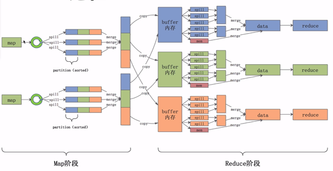

# Hadoop和spark为什么要对key进行排序

# 1.思考

只要对`hadoop`中`mapreduce`的原理清楚的都熟知下面的整个流程运行原理，其中涉及到至少三次排序，分别是溢写快速排序，溢写归并排序，`reduce`拉取归并排序，而且排序是默认的，即天然排序的，那么为什么要这么做的，设计原因是什么。先给个结论，为了整体更稳定，输出满足多数需求，前者体现在不是采用`hashShuffle`而是`sortShuffle` ,后者体现在预计算，要知道排序后的数据，在后续数据使用时的会方便很多，比如体现索引的地方,如`reduce`拉取数据时候。

# 2.MapReduce原理分析

在分析设计原因之前，先理解一下整个过程，在`map`阶段，根据预先定义的`partition`规则进行分区，`map`首先将输出写到缓存中，当缓存内容达到阈值时，将结果`spill`到硬盘，每一次`spill`都会在硬盘产生一个`spill`文件，因此一个map task可能会产生多个`spill`文件，其中在每次`spill`的时候会对`key`进行排序。接下来进入`shuffle`阶段，当`map`写出最后一个输出，需要在`map`端进行一次`merge`操作，按照`partition`和`partition`内的`key`进行归并排序（合并+排序），此时每个`partition`内按照`key`值整体有序。然后开始第二次`merge`，这次是在`reduce`端，在此期间数据在内存和磁盘上都有，其实这个阶段的`merge`并不是严格意义上的排序，也是跟前面类似的合并+排序，只是将多个整体有序的文件`merge`成一个大的文件，最终完成排序工作。分析完整个过程后，是不是觉得如果自己实现`MapReduce`框架的话，考虑用`HashMap` 输出map内容即可。

## 2.1 MapTask运行机制详解

整个流程图如下：

详细步骤：

1.  首先，读取数据组件`InputFormat`（默认`TextInputFormat`）会通过`getSplits`方法对输⼊入⽬目录中文件进行逻辑切⽚片规划得到`splits`，有多少个`split`就对应启动多少个`MapTask`。`split`与`block`的对应关系默认是⼀对⼀。
2.  将输入文件切分为`splits`之后，由`RecordReader`对象（默认`LineRecordReader`）进行读取，以`\n`作为分隔符，读取⼀行数据，返回`<key，value>`。`Key`表示每⾏行行⾸首字符偏移值，`value`表示这⼀行文本内容。
3.  读取`split`返回`<key,value>`，进⼊入⽤用户自己继承的`Mapper`类中，执行用户重写的`map`函数。`RecordReader`读取⼀行这里调用一次。
4.  `map`逻辑完之后，将`map`的每条结果通过`context.write`进⾏行行`collect`数据收集。在`collect`中，会先对其进行分区处理，默认使用`HashPartitioner`。`MapReduce`提供`Partitioner`接口，它的作用就是根据`key`或`value`及`reduce`的数量来决定当前的这对输出数据最终应该交由哪个`reduce task`处理。默认对`key hash`后再以`reduce task`数量量取模。默认的取模方式只是为了平均`reduce`的处理能力，如果用户自己对`Partitioner`有需求，可以订制并设置到`job`上。
5.  接下来，会将数据写入内存，内存中这⽚片区域叫做环形缓冲区，缓冲区的作用是批量量收集`map`结果，减少磁盘`IO`的影响。我们的`key/value`对以及`Partition`的结果都会被写⼊入缓冲区。当然写⼊入之前，`key`与`value`值都会被序列列化成字节数组
    -   环形缓冲区其实是一个数组，数组中存放着`key`、`value`的序列化数据和`key`、`value`的元数据信息，包括`partition`、`key`的起始位置、`value`的起始位置以及`value`的长度。环形结构是一个抽象概念。
    -   缓冲区是有大小限制，默认是`100MB`。当`map task`的输出结果很多时，就可能会撑爆内存，所以需要在一定条件下将缓冲区中的数据临时写⼊入磁盘，然后重新利利⽤用这块缓冲区。这个从内存往磁盘写数据的过程被称为`Spill`，中文可译为溢写。这个溢写是由单独线程来完成，不影响往缓冲区写map结果的线程。溢写线程启动时不不应该阻⽌`止`map的结果输出，所以整个缓冲区有个溢写的⽐比例例`spill.percent`。这个⽐比例例默认是`0.8`，也就是当缓冲区的数据已经达到阈值`（buffer size * spillpercent = 100MB * 0.8 = 80MB）`，溢写线程启动，锁定这`80MB`的内存，执行溢写过程`Maptask`的输出结果还可以往剩下的`20MB`内存中写，互不不影响、
6.  当溢写线程启动后，需要对这`80MB`空间内的`key`做排序(`Sort`)。排序是`MapReduce`模型默认的⾏行行为!
    -   如果`job`设置过`Combiner`，那么现在就是使⽤用`Combiner`的时候了了。将有相同`key`的`key/value`对的`value`加起来，减少溢写到磁盘的数据量量。`Combiner`会优化`MapReduce`的中间结果，所以它在整个模型中会多次使用。
    -   那哪些场景才能使⽤用`Combiner`呢？从这⾥里里分析，`Combiner`的输出是`Reducer`的输⼊，`Combiner`绝不不能改变最终的计算结果。`Combiner`只应该⽤用于那种`Reduce`的输入`key/value`与输出`key/value`类型完全一致，且不不影响最终结果的场景。⽐比如累加，最⼤大值等。`Combiner`的使⽤用一定得慎重如果用的好，它对`job`执⾏行行效率有帮助，反之会影响`reduce`的最终结果
7.  合并溢写文件：每次溢写会在磁盘上生成一个临时文件（写之前判断是否有`combiner`），如果`map`的输出结果真的很大，有多次这样的溢写发生，磁盘上相应的就会有多个临时文件存在。当整个数据处理理结束之后开始对磁盘中的临时文件进⾏行行`merge`合并，因为最终文件只有一个，写⼊磁盘，并且为这个文件提供了一个索文件，以记录每个`reduce`对应数据的偏移量量。

## 2.2 ReduceTask运行机制详解

`Reduce`⼤大致分为`copy`、`sort`、`reduce`三个阶段，重点在前两个阶段。`copy`阶段包含⼀一个
`eventFetcher`来获取已完成的`map`列列表，由Fetcher线程去`copy`数据，在此过程中会启动两个`merge`线程，分别为`inMemoryMerger`和`onDiskMerger`，分别将内存中的数据`merge`到磁盘和将磁盘中的数据进⾏`merge`。待数据`copy`完成之后，`copy`阶段就完成了，开始进⾏行行`sort`阶段，`sort`阶段主要是执⾏`finalMerge`操作，纯粹的`sort`阶段，完成之后就是`reduce`阶段，调⽤用⽤用户定义的`reduce`函数进⾏处理。
**详细步骤**

### 2.2.1 Copy阶段

简单地拉取数据。`Reduce`进程启动一些数据`copy`线程(`Fetcher`)，通过`HTTP`方式请求`maptask`获取属于自己的文件。

### 2.2.2 Merge阶段

`Merge`阶段。这⾥里里的`merge`如`map`端的`merge`动作，只是数组中存放的是不不同`map`端`copy`来的数值。`Copy`过来的数据会先放入内存缓冲区中，这⾥里里的缓冲区大小要⽐比`map`端的更更为灵活。`merge`有三种形式：内存到内存；内存到磁盘；磁盘到磁盘。默认情况下第⼀一种形式不不启⽤用。当内存中的数据量量到达一定阈值，就启动内存到磁盘的`merge`。与`map `端类似，这也是溢写的过程，这个过程中如果你设置有`Combiner`，也是会启⽤用的，然后在磁盘中生成了了众多的溢写文件。第二种merge方式⼀一直在运⾏行行，直到没有`map`端的数据时才结束，然后启动第三种磁盘到磁盘的`merge`方式生成最终的文件。

### 2.2.3 合并排序

把分散的数据合并成一个⼤大的数据后，还会再对合并后的数据排序。对排序后的键值对调⽤用`reduce`方法，键相等的键值对调⽤用一次`reduce`方法，每次调⽤用会产生零个或者多个键值对，最后把这些输出的键值对写入到`HDFS`文件中。

# 3.总结

从`MapReduce`的执行过程中，我们再来看为什么要排序，以及为什么在`Shuffle`时候采用`SortShuffle`,从设计上来看，MapTask和ReduceTask就是完全不同的跑在Yarn上的两个进程，进程的交互方式是通过内存或者磁盘，为了两个程序不耦合，更好地实现失败重试等机制，那么就不能像Kafka一样，生产者生产消息和消费者消费消息的时候，会有阻塞等问题，不能让集群卡住，MapReduce跑的数据都是大批量的数据，所以要尽可能让Map端处理完成的数据落盘但又要保证尽可能加快整个速度，所以在map结束时候，给reduce的是排序好的数据外加一份索引文件，这样虽然牺牲了一定的cpu，但是对落盘后的数据，让Reduce来拉取时候可以尽可能地快，Map如何结束执行完，理论上可以在停机后，继续跑ReduceTask，来完成整个任务同时为什么不是HashShuffe呢，是因为大数据情况下HashShuffle占用的内存很大，很可能会爆内存，导致集群计算不稳定。

# 4.Spark中SortShuffle的原理

## 4.1 hashShuffle的问题

-   每个Shuffle Map Task需要为每个下游的Task创建一个单独的文件
-   Shuffle过程中会生成海量的小文件。同时打开过多文件、低效的随机IO

## 4.2 SortShuffle

Sort Base Shuffle大大减少了shuffle过程中产生的文件数，提高Shuffle的效率

