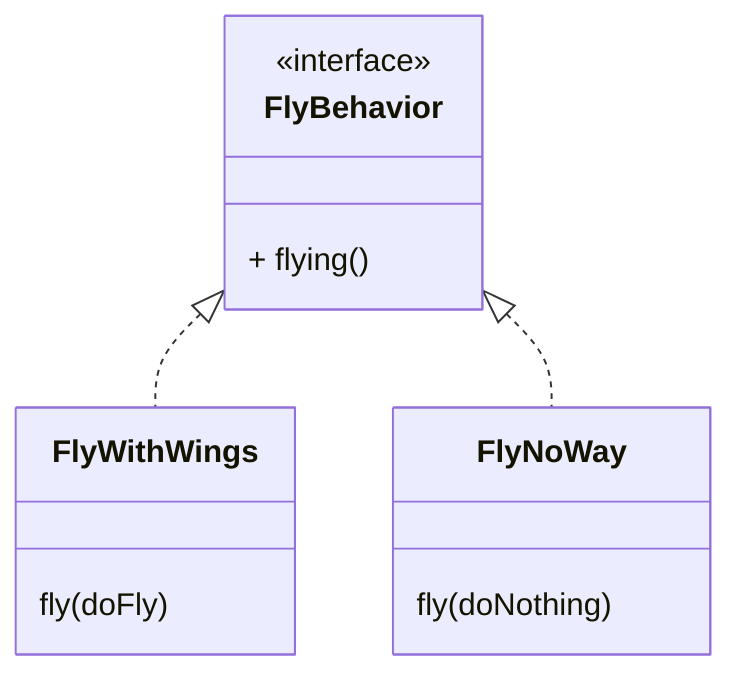
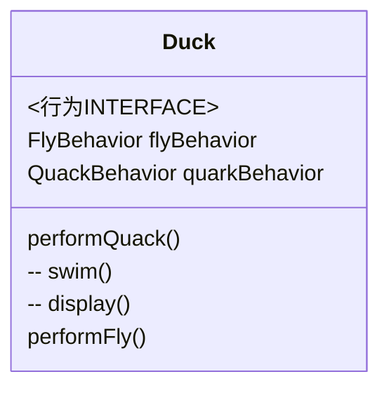
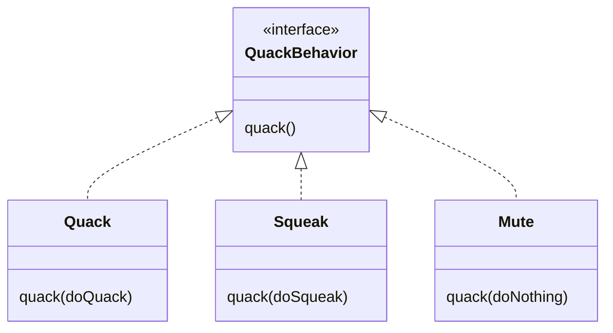
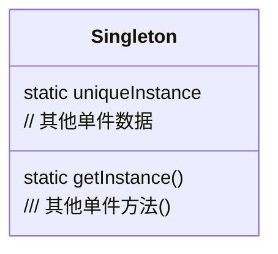
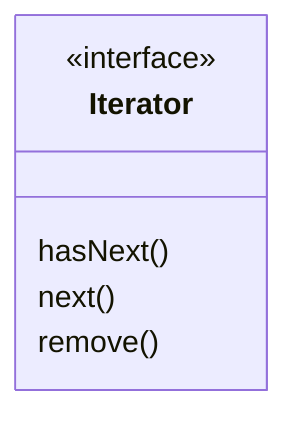

# Java设计模式

# 九个OO原则

OO原则是目的、设计模式是手段

**书中概念解释**

-   组合composition：两个对象组合在一起=HAS A的关系
-   在设计模式中。所谓的“实现一个接ロ”并不ー定表示“写一个类，并利用immplement关健词来实现基个java接口“。实现一个接ロ”泛指“实现个超类型(可以是类或接口)

#### 设计原则：多用组合，少用继承

继承：某些方法一部分子类有一部分没有时会出错

接口：可以解决上面的问题，但是造成代码无法复用

#### 设计原则：把会变化的部分封装起来，让其他部分不受影响

把fly和quark从Duck类中取出，作为新类代表Behavior

#### 设计原则：针对接口编程，而不是针对实现编程

Behavior类专门提供行为接口的实现，这样Duck类无需知道行为的实现细节

Duck子类实现接口FlyBehavior()中的不同方法



这样的实现既有继承的复用，又没有继承的负担

针对接口编程和针对实现编程的区别

这里的接口包括抽象类&接口

```java
Dog d = new Dog();
d.bark();// 我们必须针对具体实现编码

Animal dog= new Dog();
dog.makeSound();// 利用animal进行多态调用

a = getAnimal();
a.makeSound();// 运行时才指定具体实现的对象
```

> OO系统中，类代表的东西一般既有状态（变量），又有方法。如flyable接口可以记录飞行的属性（如速度等）

将接口整合进Duck类中

引入两个实例变量声明为接口类型



实现Duck对象使用quackBehavior接口的方法

```java
public class Duck{
  QuackBehavior quackBehavior;
    public void performQuack(){
        // 实现Duck对象使用quackBehavior接口的方法
        quarckBehavior.quack();
    }
}
```

实现一个子类MallardDuck

```java
public clkass MallardDuck extends Duck{
  public MallardDuck(){
        quackBehavior = new Quack();
        flyBehavior = new FlyWithWings();
    }
    public void display(){
        System.out.println("I'm a real Mallard duck");
    }
}
```



> 这里我们还是对具体实现进行编程了，实现了一个Quack类的实例，这导致初始化实例时不够弹性。这需要其他更多的设计模式修正

# 观察者模式

observer
自动更新/通知 监控对象感兴趣的事
可以用报纸订阅服务来比拟观察者模式
观察者模式定义了对象之间的**一对多**依赖，这 样一来，当一个对象改变状态时，它的所有依赖者都 会收到通知并自动更新。

因为主题是真正拥有数据的人，观察 者是主题的依赖者，在数据变化时更新，这样比 起让许多对象控制同一份数据来，可以得到更干

改变主题或观察者其中一方，并不会影响另一方。因为两者是松耦合的，所以只要他 们之间的接口仍被遵守，我们就可以自由地改变他们。

#### 设计原则：为了交互对象之间的松耦合设计而努力

java.util包(package)内包含最基本的Observer接口与Observable类。可以使用推(push)或拉(pull)的方式传送数据，推的方式'更好'。有多个观察者时，不可以依赖特定的通知次序。
其实在JavaBeans（propertyChangeListener和 Swing中，也都实现了观察者模式
java不支持多继承，但是支持实现多个接口

# 装饰者模式

decorator
不修改任何底层类代码的情况下，给你的或别人的对象**赋予新的职责**

继续讨论继承滥用问题

#### 设计原则：类应该对扩展开放，对修改关闭。

饮品加料计算价格的问题

通过摩卡、奶泡一层层的装饰DarkRoast来计算总价


注意

-   装饰者与被装饰者有相同的超类型
-   装饰者可以在被装饰者的行为**之前或之后**加上自己的行为
-   对象可以被在任何时候被装饰


ComdimentDecorator继承自Beaverage抽象类，是为了保持相同的超类，并不是通过继承获得行为。行为来自装饰着和基础组件或者与其他装饰者的组合关系

java.io中大量使用了装饰类。从InputStream抽象组件扩展出大量的具体的组件和具体的装饰者，从而扩展出适用的功能。

#### ==todoP124== 写出自己的I/O装饰者，如实现一个将输入流中的大写转为小写的装饰者。

# 工厂模式

new一个具体类会使代码更脆弱失去弹性。


以上代码违背了**对修改关闭**的设计原则，要在运行时才决定实现的具体类，这样扩展性和维护更新就很麻烦。

我们要把会改变的部分封装，就是把创建对象的部分封装起来，称之为“工厂”类，在工厂类SimplePizzaFactory中实现根据情况创建pizza的方法createPizza方法。

与上面的代码不同之处在于：SimplePizzaFactory可以有多个“客户”，不止为orderPizza一人服务

除了new创建对象，使用工厂模式制造对象能解决初始化实例造成的耦合问题。


**静态工厂**：使用静态方法定义一个静态工厂，这样不需要再使用创建对象的方法来实例化对象，但是缺点是不能通过继承改变创建方法的行为

**简单工厂**：简单工厂不是一种设计模式

接下来的需求是：由于不同的pizza店供应的pizza品种也不同。为不同的pizza店提供工厂以保证pizza 的流程一致。并且让制作过程局限于PizzaStore类中。

-   将createPizza()方法放回PizzaStore类中，并把createPizza设置成抽象方法。
-   PizzaStore作为超类创建不同的子店面，让不同的子类决定各自的pizza特色（createPizza()方法）

```java
public class ChicagoPizzaStore extends PizzaStore{
    public createPizza(String item){
        if(item.equals("cheese")){
            return new ChicagoPizzaStore();
        }else if 
          ......a
    }
}
```

**工厂方法**


```java
protected abstract Pizza createPizza(String type);
```

平行的类层级：Creator类 + Product类

框架：工厂方法将生产知识封装进各个具体的创建者


**工厂方法模式**

工厂方法模式定义了一个创建对象的接口，但**由子类决定要实例化的类是哪一个**。
工厂方法让类把实例化推迟到子类。

**抽象工厂模式**
提供一个接口，用于创建相关或依赖对象的家族而不明确指定具体类

抽象工厂的方法经常以工厂方法的方式实现

依赖倒置原则 Dependency Inversion Principle

#### 设计原则：要依赖抽象,不要依赖具体类。

依赖倒置原则的指导方针：

-   变量不可以持有具体类（不要使用new
-   不要让类派生自具体类（避免依赖具体类
-   不要覆盖类中已实现的方法（基累实现的方法应该有所有子类共享

> 应尽量遵循而非必需遵循

# 单件模式

常用来管理共享的资源。

只能有一个对象的情况：数据库连接池、线程池thread pool、缓存cache、对话框、处理偏好设置、注册表、日志、驱动程序

singleton  确保只有一个实例被创建，并提供一个全局访问点。（只有私有的构造器，使用`getInstance()`方法获得实例。）



**只有单线程时可用👇**

**延迟实现**

```java
public class Singleton{
  // 定义一个静态的实例
  private static Singleton uniqueinstance = new Singleton();
  // 把构造器设为私有函数private，禁止他人创建实例
  private Singleton(){}
  // 需要的时候返回这个静态实例
  public static Singleton getInstance(){
    if (uniqueInstance == null){
      uniqueInstance = new Singleton();
      return uniqueInstance;
  }
}
```

当**使用多线程**时👇

使用synchronized关键字在`getInstance`方法上加锁即可。synchronized关键字修饰的方法，迫使每个线程在进入方法之前, 要先等候别的线程离开该方法。确保了不会有两个线程可以同时进入这个方法。

```java
  ---
  public static synchronized Singleton getInstance(){
    if (uniqueInstance == null){
      uniqueInstance = new Singleton();
      return uniqueInstance;
  }
}
```

但是同步会降低性能，而且事实上只有第一次需要同步，一旦Instance设置好，同步就成了累赘

可以使用**双重检查加锁**👇，在`getInstance()`中减少同步

volatile 关健词：确保 `uniqueInstance`变量被初始化成 Singleton实例时,多个程正确地处理uniqueinstance变量。

```java
public class Singleton{
  private volatile static Singleton uniqueinstance;
  private Singleton(){}
  public static Singleton getinstance(){
    if(uniqueinstance == null){
      synchronized (Singleton.calss){
        if(uniqueinstance == null){
          uniqueinstance = new Singleton();
        }
      }
    }
    return uniqueinstance;
  }
}
```

#### ==推荐的方法一==：利用静态构造函数

可以通过使用**直接创建实例**而非”延迟实例化“，利用这个做法，我们依赖JVM在加载这个类时马上创建此唯一的单件实例。JVM保证在任何线程访问uniquelnstance静态变量之前，一定先创建此实例。

```java
public class Singleton{
  // 定义一个静态的实例
  private static Singleton uniqueinstance = new Singleton();
  // 把构造器设为私有函数private，禁止他人创建实例
  private Singleton(){}
  // 需要的时候返回这个静态实例
  public static Singleton getInstance(){
    return uniqueinstance;
  }
}
```

缺点：第一次用到Singleton类时JVM就会创建uniqueinstance实例，即在类被加载的时候就把Singleton实例给创建出来了。所以有可能过早的创建实例

#### ==推荐的方法二==：按需创建实例

通过静态内部类的方式实现单例模式是线程安全的，同时静态内部类不会在Singleton类加载时就加载，而是在调用getInstance()方法时才进行加载，达到了懒加载的效果。

```java
public class Singleton{
  private static class SingletonHolder {
      private static Singleton instance = new Singleton();
  }
  private Singleton(){}
  public static Singleton getInstance(){
    return SingletonHolder.instance;
  }
}
```

缺点：可能还存在反射攻击或者反序列化攻击。

#### 无懈可击的解法：通过枚举实现单例模式

利用枚举的特性，让JVM来帮我们保证线程安全和单一实例的问题，且可以防止反序列化

```java
public enum Singleton {

    INSTANCE;

    public void doSomething() {
        System.out.println("doSomething");
    }

}
```

调用方法：

```java
        Singleton.INSTANCE.doSomething();
```

[java单例模式详解](https://www.cnblogs.com/happy4java/p/11206105.html "java单例模式详解")

#### 关于枚举

int枚举模式

```java
class EnumByClass{
    public static final int RED=0;
    public static final int GREEN=1;
    public static final int BLUE=2;
}
```

缺点：当调用不在枚举范围内的数值时，需要额外的维护。另外 ，也不利于查看log和测试

Java的枚举类型

```java
enum Color{
    RED,GREEN,BLUE;
}
```

enum安全性好，用于switch case非常好用

[枚举如何实现的单例](https://www.cnblogs.com/cielosun/p/6596475.html "枚举如何实现的单例")

# 命令模式

将动作的“请求者”从”执行者“中解偶出来

命令模式将“请求”封装成对象,以便使用不同的**请求、 队列或者日志**来参数化其他对象。命令模式也支持可撤销的操作

Command：命令对象接口，只暴露一个execute()方法，也可以有撤销方法undo()

Client：能够创建一个具体的Command方法

Invoker：参数化Command对象，用不同的请求作为参数，持有一个Command对象，并可以调用其中的execute()方法。

Receiver：任何类都可以当接收者，receiver知道如何具体实现请求


《遥控器》


实现undo、一键party（宏命令）等功能

> 遥控器这个案例中的接受者Receiver是谁？（是风扇、电灯等？）
> 为什么不直接在命令对象中实现execute()方法等细节？（因为使用Receiver实现细节更解偶）

命令模式实现**队列请求**，应用：日程安排、线程池、工作队列等

> 工作队列类和进行计算的对象之间完全是解耦的。此刻线程可能在进行财务运算,下一刻却在读取网络数据。工作队列对象不在乎到底做些什么,它们只知道**取出命令对象,然后调用其 execute()方法**。类似地,它们**只要是实现命令模式的对象,就可以放入队列里**,当线程可用时,就调用此对象的execute()方法。

命令模式实现**日志请求**

命令模式新增store()、 load()方法，就能实现命令执行时记录在日志中、实现检查点之后记录和恢复；

命令模式也可以实现事务系统

> [Java对象序列化Serialization](https://www.cnblogs.com/kubixuesheng/p/10350523.html "Java对象序列化Serialization")
> 在保存对象时，会把其状态保存为一组字节，在未来再将这些字节组装成对象。对象序列化保存的是对象的"状态"，即它的成员变量。由此可知，对象序列化不会关注类中的静态变量
> 用途：对象序列化最好只用于持久化对象Persistence
> 持久化对象：可能要求在JVM停止运行之后能够保存指定的对象(持久化)，并在将来重新读取被保存的对象

总结

-   命令模式将发出请求的对象client和执行请求的对象 receiver解耦；
-   在被解耦的两者之间是通过命令对象进行沟通的。
-   命令对象封装了接收者和一组动作。
-   调用者通过调用命令对象的 execute()发出请求,这会使得接收者的动作被调用。
-   调用者可以接受命令当做参数,甚至在运行时动态地进行。
-   命令可以支持撤销, 做法是实现一个undo()方法来回到 execute()被执行前的状态
-   宏命令是命令的一种简单的延伸,允许调用多个命令。宏方法也可以支持撤销。
-   实际操作时,很常见使用“聪明”命令对象,也就是直接实现了请求, 而不是将工作委托给接收者

# 适配器模式

adapter


目的：将一个类的接口转换成另一个想要的接口

**🦆和🦃️**

```java
public interface Duck{
  public void quack();
  public void fly();
}
```

```java
public interface Turkey{
  public void gobble();
  public void fly();
}
```

如果它走起路来像只鸭子🦆,叫起来像鸭子,那么他~~必定~~可能是~~鸭子🦆~~包装了鸭子🦆适配器的火鸡🦃️…

**如何用🦃️冒充🦆？**


**如何用🦆冒充🦃️？**

```java
public class DuckAdapter implements Turkey{
  Duck duck;
  public DuckAdapter(Duck duck){
    this.duck = duck;
  }
  public void gobble(){
      quack();
  }
  public void fly(){
      fly();
  }
}
```

适配器模式遵循的OO设计原则：适用对象组合

除了对象适配器还有类适配器，但是类适配器的实现需要多继承

**适配器的例子**

-   以前遍历Collection类中的每个元素，是通过一个elements()方法返回一个Enumeration接口
-   而现在更多地使用Iterator接口，比Enumeration接口多出了删除元素的能力
-   问题是，当代码只有Enumeration接口而我们希望只使用Iteratot接口时，我们可以通过构造适配器


由于Enumeration无法实现remove()功能，所以只能在适配器中的抛出异常

**装饰者 & 适配器**

## 外观模式

-   为多个功能提供一个简化的接口，但依然可以直接使用子系统的类
-   可以为一个子系统创建多个外观
-   允许将客户实现从子系统中解偶出来

#### 设计原则：最少知识( Least Knowledge)原则告诉我们要减少对象之间的交互

只留下几个“密友”，只和这几个密友谈话，避免过多的类耦合在一起

实现这一原则的方针：只调用以下范围的方法

-   对象本身
-   作为方法参数传入的对象
-   方法创建或实例化的对象
-   对象的组件（实例变量引用的对象）


该原则的弊端：可能产生更多的包装类来处理组件间的沟通


# 封装算法

模版方法模式
模版方法定义了算法的步骤，允许子类重新实现某些步骤，同时又不改变算法结构

抽象方法：由子类实现
final方法：防止子类修改
钩子函数：什么都不做，由子类选择覆盖


当子类必须提供某个方法的实现时用抽象方法；当这部分是可选的，就用钩子，因为只有钩子可以让子类选择

#### 设计原则：好莱坞原则：只允许低层组件将自己挂钩到系统上，但由高层组件决定when\&how使用低层组件。用钩子函数实现

don't call me, I'll call you !0=
这个原则目的是防止高层组件和低层组件互相依赖导致的系统难以理解的问题

java源码中的模版方法
mergeSort实现了Comparable接口的compareTo方法，实现如何具体的进行比较

```java
public class Duck implements Comparable{
  ......
  punlic int compareTo(Object object){
    Duck otherDuck = (Duck)object;
    if (this.weight < otherDuck.weight){
      return -1;
    } else if (this.weight = otherDuck.weight){
      return 0;
    } else if (this.weight > otherDuck.weight){
      return 1;
    }
  }
  ......  
}
```

实现compareTo方法后才可以调用`Array.sort(ducks)` 对ducks数组进行排序。

其他的模版方法

-   java.io.InputStream类的read()方法是由子类实现，同时这个方法被read(byte b\[], int off, int len)模版方法使用
-   Swing的JFrame容器继承了paint()方法，paint()方法是个钩子方法，子类提供具体实现
-
    -   Applet类大量使用钩子

策略模式和模版方法都是对算法进行封装
策略用组合实现，封装可互换的行为然后使用委托来决定采用哪一个行为；
模版用继承实现，让子类可以在任何时候都可以将自己挂接进运算里
工厂模式：由子类决定实例化哪个具体类

# 迭代器

创建对象的super collection，遍历对象又不需要知道对象的存储方式

封装变化的部分
用迭代器封装遍历过程，避免暴露内部



把遍历的工作交给迭代器，而不是对象的集合内，简化了数据集合的接口。
迭代器的工作过程


Collection类，如ArrayList、HashMap都支持Iterator

```java
ArrayList 
HashMap menuItems = new HashMap();
public Iterator createIterator(){
  return menuItems.values().iterator();
}
```

client通过createIterator获得相应的迭代器就可以进行对集合的遍历

```java
pravate void printMenu(Iterator iterator){
  MenuItem menuItem = (MenuItem)iterator.next();
     System.out.print(menuItem.getPrice() +',');
System.out.print(menuItem.getName() +',');  System.out.print(menuItem.getDescription());
}
```

for/in语句可以在集合或数组中遍历，而且不需要显示创建迭代器

```java
for(Object obj: collection){
  ...
}
```

#### 设计原则：一个类应该只有一个引起变化的原因

这个原则告诉我们，尽量将一个责任指派给一个类，让类保持单一责任。

**内聚**：用来度量一个类或模块紧密地达到单一目的或责任
遵循单一责任设计原则的模块具有高内聚；当模块被设计成支持一组不相关功能时，我们说它具有低内聚
内聚是比单一责任原则更普遍的概念。

# 组合模式

组合模式允许将对象组合成树形结构来表现整体/部分 的层次结构，以便对这个树的个别对象和对象集合采取一致的处理方式

这意味着菜单、子菜单，甚至子菜单项的子菜单这些都是一种组合，组合意味着既可以包含菜单，又可以包含菜单项

print()操作能够忽略对象组合和对象之间的差别


实现：创建组件接口作为菜单和菜单项的共同接

-   使用组合迭代器，递归遍历树形集合
-   叶子结点返回**空迭代器**。    （返回迭代器的hasNext()方法永远返回false）

# 状态模式

strategy[策略模式](https://www.runoob.com/design-pattern/strategy-pattern.html "策略模式")是围绕可以互换的算法来创建成功业务

状态模式通过改变对象内部的状态来帮助对象控制自己的行为
状态图：圆圈⭕️是状态，箭头➡️是状态的转换行为
状态机

随着gumballMachine的状态通过setState方法被改变，对象的行为也跟着改变


状态模式：避免在对象中设置过多的条件判断
策略模式：通过组合、委托其他对象来改变行为

清理if的一种方式

# 代理模式

proxy
控制和管理对象访问。

### 远程代理

远程对象：在不同的JVM中的对象
远程代理：远程对象的本地代表，可以用本地方法调用对象，其行为转发到远程对象

方法调用的过程：


客户对象调用客户辅助对象的doBigThing()方法；客户辅助对象打包调用信息，通过网络运给服务辅助对象；服务辅助对象进行解包，然后调用真正的服务对象上的方法；服务辅助对象把方法调用的返回信息通过网络打包给客户辅助对象；客户辅助对象把返回值进行解包传给客户对象；

Remote Method Invocaion
RMI是实现**远程过程调用**RPC（Remote procedure call）的Java API
支持从一个JVM到另一个JVM的调用
RMI提供了客户辅助对象和服务辅助对象

**制作远程服务的过程**

-   制作远程接口
    ```java
    public interface MyRemote extends Remote{
      public String sayHello() throws RemoteException;
      // 调用方法的代码也必须处理这个声明的异常  
    }
    ```
    -   Remote是RMI的记号接口，无具体方法
    -   所有远程方法都要抛出RemoteException，所有调用也要处理或者声明异常
    -   返回值和变量必须是原语或可序列化。如果要传自己的类就要保证实现了**Serializable**
-   制作远程实现
    MyServiceImpl
    里面有关于远程服务的功能，但是它的构造器会抛出RemoteException异常，所以需要写一个无参构造器抛出异常
    java.rmi.Naming类的rebind()方法注册服务
    ```java
    public class MyRemoteImpl extends UnicastRemoteObject implements MyRemote{
      public MyRemoteImpl() throws RemoteException{  }
      public String sayHello(){
        return "Server say, 'Hey'";
      }
      
      try{//用RMI Registry注册此服务
        MyRemote service = new MyRemoteImpl();
        Naming.rebind("RemoteHello", service
      }catch(Exeption ex){...}  
      
      ...
    }
    ```
-   利用rmic产生stub和skeleton（rmic工具自动处理）
    将产生两个辅助对象：
    MyRemoteImpl\_Stub.class
    MyRemoteImpl\_Skel.class
    stub：客户辅助类； skeleton：服务辅助类
    ```bash
     $rmic MyRemoteImpl
    ```
-   启动RMI registry
    客户通过rmiregistery查到代理的位置（即stub helper对象的位置）
    ```bash
    $rmiregistry
    ```
-   开始远程服务
    MyServiceImpl实例化一个服务的实例，并将这个服务注册到RMI registry，供客户调用
    ```bash
    $java MyRemoteImpl
    ```

客户进行远程调用

```java
MyRemote service = (MyRemote) Naming.lookup("rmi://127.0.0.1/RemoteHello");
```

lookup()返回Object类型


使用代理模式创建代表 (representative)
对象，让代表对象控制某对象的访问。被代理的对象可以是远程的对象、创建开销大的对象或需要安全控制的对象．


代理模式的其他用法

### 虚拟代理 Virtual Proxy

虚拟代理在必要时才创建RealSubject。在RealSubject创建之前都由虚拟代理来扮演对象的替身，在对象创建之后，代理就会将请求直接委托给对象
虚拟代理经常用于创建开销大的对象

网页图片下载可能需要一些时间，所以在等待图像加载的时候，应该显示一些东西

### 保护代理

Java技术：动态代理
java.lang.reflect包可以在运行时动态地创建一个代理类，实现接口，并将方法的调用转发到指定的类


创建动态代理

-   为两个角色创建两个java.lang.reflect包内的InvocationHandler接口
    -   都包含invoke()方法，重写方法控制bean的调用
    -   实现了代理行为，java会创建真实的代理类
-   创建动态代理类
    -   将方法调用转发给InvocationHandler
    -   代理和bean有相同的接口
    -   getXxxProxy() 方法接收一个bean对象为参数，返回这个对象的代理类


结构上类似装饰者，但目的不同
\==P486==

# 复合模式

composite
同时使用多个设计模式

MVC


]

-   模型
    -   模型持有所有的数据、状态和程序逻辑。
    -   它提供了操纵和检索状态的接口
    -   发送状态改变通知给观察者。
-   视图
    -   直接从模型中取得需要的数据
-   控制器
    -   从视图取得用户的输入，并解读对模型的意思


MVC和Web

你发出一个会被Servlet收到的HTTP请求。
你利用网页浏览器，发出HTTP请求。这通常车涉到送出表单数据，例如用户名
和密码。Servler收到这样的数据，并解析数据。
Servlet扮演控制器。
Servlet扮演控制器的角色，处理你的请求，通常会向模型（一般是数据库）发出
请求。处理结果往往以JavaBean的形式打包。
控制器将控制权交给枧图。
视图就是ISP，而JSP唯-
一的工作就是产生页面，表现横型的视图（④ 模型通过
JavaBean中取得）以及进一步动作所需要的所有控件。
视图通过HTTP将页面返回浏览器。
页面返回浏览器，作为视图显示出来。用户提出进一步的请求，以同样的方式处
理。

观察者
视图不再是经典意义上的模型的
观察者，它没有向模型注册以接
收状态改变通知。
但是当模型改变时，视图的确
间接地从控制器收到了相当于
通知的东西。控制器甚至把
Bean送给视图，这允许视图可
以取得模型的状态。
如果你考虑到浏览器模型，视图
在HTTP响应返回到浏览器时只
需要一个状态信息的更新，随时
的通知是没有意义的。只有当页
面被创建和返回时，创建视图并
结合模型状态才有意义。
策略
在Model 2中，策略对象依然
是控制器Servlet，但它不像
传统的做法那样直接和视图
结合。就是说，策略对象为
视图实现行为，当我们想要
有不同的行为时，可以直接
把控制器换掉。


组合
像我们的Swing
GUI， 视
图是利用许多图形组件一
层一层叠起来的。但是在
这里，则是由网页浏览器
呈现HTML描述。尽管如
此，内部还是很类似一个
形成组合的对象系统。

# 真实世界 设计模式

一个问题&一个情景&一个解决方案不足以定义一个模式。模式应该是由通用价值的，能够被共享的，有'名字'的
模式类目

# 其他模式

state, iterator, template method, facade, factory method, abstract
Bridge. Builder, chain of responsibility, flyweight, interpreter, mediator, memento, prototype, visitor
