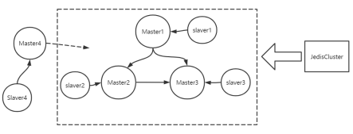
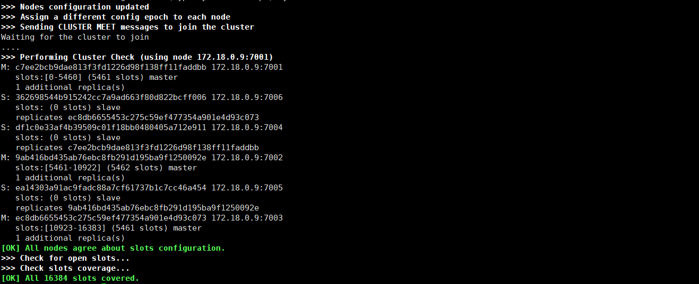
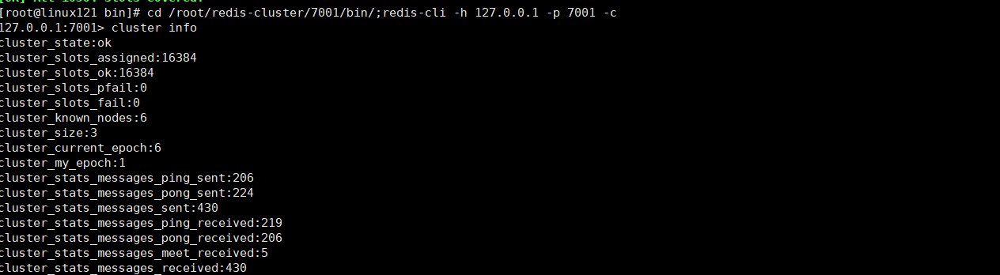

# RedisCluster的安装、部署、扩容和使用Jedis调用集群

## 1.需求描述

如图： &#x20;
1、搭建Redis5.0集群，要求三主三从，记录下安装步骤； &#x20;
2、能够添加一主一从（Master4和Slaver4），记录下安装步骤； &#x20;
3、能够通过JedisCluster向RedisCluster添加数据和取出数据。



## 2.单机版搭建步骤

#### 2.1 安装c语言所需环境

```powershell
yum install -y gcc-c++
yum install -y wget 
```

#### 2.2 下载redis-5.0.5并进行解压，编译，安装

```powershell
## 编译
wget http://download.redis.io/releases/redis-5.0.5.tar.gz
tar -zxf redis-5.0.5.tar.gz
cd redis-5.0.5/src
make 
## 安装，后续直接安装即可，用现成编译好的包
mkdir /usr/redis -p
make install PREFIX=/usr/redis 
```

#### 2.3 配置redis，关闭保护模式and后台启动

```powershell
cp redis-5.0.5/redis.conf /usr/redis/bin/ 
vi usr/redis/bin/redis.conf

# 将`daemonize`由`no`改为`yes`
daemonize yes
 
# 默认绑定的是回环地址，默认不能被其他机器访问
# bind 127.0.0.1
 
# 是否开启保护模式，由yes该为no
protected-mode no

```

#### 2.4 启动redis的几种方式

```powershell
# 后端模式启动服务
cd /usr/redis;bin/redis-server bin/redis.conf
 
# 进入命令行模式
cd /usr/redis;bin/redis-cli -h hostname -p 端口号
cd /usr/redis;bin/redis-cli -h 127.0.0.1 -p 6379 #默认
# 退出命令行模式
exit
 
# 后端模式关闭服务（推荐）
cd /usr/redis;bin/redis-cli shutdown
 
# 前端模式启动服务（不推荐）
cd /usr/redis;bin/redis-server
```

#### 2.4 api的方式来调用

```java
// 1.导入依赖包
<dependency>
    <groupId>redis.clients</groupId>
    <artifactId>jedis</artifactId>
    <version>2.9.0</version>
</dependency> 
// 2.示例代码
package com.lagou.redis;
 
import org.junit.Test;
import redis.clients.jedis.Jedis;
 
public class JedisDemo {
 
    @Test
    public void testConn() {
        //与Redis建立连接 IP+port
        Jedis redis = new Jedis("linux121", 6379);
        //在Redis中写字符串 key value
        redis.set("jedis:name:1", "hoult");
        //获得Redis中字符串的值
        System.out.println(redis.get("jedis:name:1"));
        //在Redis中写list
        redis.lpush("jedis:list:1", "1", "2", "3", "4", "5");
        //获得list的长度
        System.out.println(redis.llen("jedis:list:1"));
    }
} 
//输出
hoult
5

```

## 3.三主三从搭建步骤

#### 3.1 集群规划

伪集群方式，单机上多个端口来模拟，即三台主服务器，三台从服务器，端口从7001-7006 ，安装位置`mkdir -p /root/redis-cluster`

#### 3.2 创建实例并配置redis.conf文件

```java
# 编译安装
cd /opt/hoult/software/redis-5.0.5/src
make install PREFIX=/root/redis-cluster/7001
 
# 复制redis.conf文件
cp /opt/hoult/software/redis-5.0.5/redis.conf /root/redis-cluster/7001/bin/
vi /root/redis-cluster/7001/bin/redis.conf
 
# 修改port为7001
port 7001
 
# 打开cluster-enable yes
cluster-enable yes
 
# ----------------------------------------------
# 配置后端开启模式
# 将`daemonize`由`no`改为`yes`
daemonize yes
 
# 默认绑定的是回环地址，默认不能被其他机器访问
# bind 127.0.0.1
# 所有机器可以访问
# bind 0.0.0.0
# 建议注释掉 bind x.x.x.x
 
# 是否开启保护模式，由yes该为no
protected-mode no 
```

#### 3.3 将7001复制六份，注意修改端口

```java
# 拷贝7001-->7002,7003,7004,7005,7006
cp -r /root/redis-cluster/7001 /root/redis-cluster/7002
 
# 重新修改：先删除再复制新的redis.conf文件
# 好处：只需要先修改7001的配置文件，再复制，再修改port即可
# rm -rf /root/redis-cluster/7002/bin/redis.conf
# cp /root/redis-cluster/7002/bin/redis.conf /root/redis-cluster/7002/bin/redis.conf
# 修改对应的端口号
vi /root/redis-cluster/7002/bin/redis.conf
```

#### 3.4  使用启动脚本，启动所有实例

```java
cd /root/redis-cluster/ 
vim start-redis-cluster.sh
 # 启动7001
cd /root/redis-cluster/7001/bin;redis-server redis.conf
# 启动7002
cd /root/redis-cluster/7002/bin;redis-server redis.conf
# 启动7003
cd /root/redis-cluster/7003/bin;redis-server redis.conf
# 启动7004
cd /root/redis-cluster/7004/bin;redis-server redis.conf
# 启动7005
cd /root/redis-cluster/7005/bin;redis-server redis.conf
# 启动7006
cd /root/redis-cluster/7006/bin;redis-server redis.conf
# 启动7007
cd /root/redis-cluster/7007/bin;redis-server redis.conf
# 启动7008
cd /root/redis-cluster/7008/bin;redis-server redis.conf
# 启动
cd /root/redis-cluster/
sh start-redis-cluster.sh

## 登录客户端
/root/redis-cluster/7001/bin/redis-cli -h linux121 -p 7001 
```

#### 3.5 使用关闭脚本，关闭所有实例

```java

# stop脚本
cd /root/redis-cluster/;
vim stop-redis-cluster.sh
 
# 关闭7001
cd /root/redis-cluster/7001/bin;redis-cli -h linux121 -p 7001 shutdown
# 关闭7002
cd /root/redis-cluster/7002/bin;redis-cli -h linux121 -p 7002 shutdown
# 关闭7003
cd /root/redis-cluster/7003/bin;redis-cli -h linux121 -p 7003 shutdown
# 启关闭7004
cd /root/redis-cluster/7004/bin;redis-cli -h linux121 -p 7004 shutdown
# 关闭7005
cd /root/redis-cluster/7005/bin;redis-cli -h linux121 -p 7005 shutdown
# 关闭7006
cd /root/redis-cluster/7006/bin;redis-cli -h linux121 -p 7006 shutdown
# 关闭7007
cd /root/redis-cluster/7007/bin;redis-cli -h linux121 -p 7007 shutdown
# 关闭7008
cd /root/redis-cluster/7008/bin;redis-cli -h linux121 -p 7008 shutdown
```

#### 3.6 删除集群原始数据,并创建集群

```java
# 删除集群遗留任何数据

cd /root/redis-cluster/7001/bin/;rm -rf dump.rdb nodes.conf appendonly.aof
cd /root/redis-cluster/7002/bin/;rm -rf dump.rdb nodes.conf appendonly.aof
cd /root/redis-cluster/7003/bin/;rm -rf dump.rdb nodes.conf appendonly.aof
cd /root/redis-cluster/7004/bin/;rm -rf dump.rdb nodes.conf appendonly.aof
cd /root/redis-cluster/7005/bin/;rm -rf dump.rdb nodes.conf appendonly.aof
cd /root/redis-cluster/7006/bin/;rm -rf dump.rdb nodes.conf appendonly.aof
cd /root/redis-cluster/7007/bin/;rm -rf dump.rdb nodes.conf appendonly.aof
cd /root/redis-cluster/7008/bin/;rm -rf dump.rdb nodes.conf appendonly.aof
 
# 创建集群
# 注：必须写172.18.0.9（而不是linux121），否则出现：
# 1)ERR Invalid node address specified: linux121:7001;
# 2)jedis-2.9.0：Exception in thread "main" redis.clients.jedis.exceptions.JedisConnectionException: Could not get a resource from the pool. Caused by: redis.clients.jedis.exceptions.JedisConnectionException: java.net.ConnectException: Connection refused: connect;
# 3)jedis-2.9.3：redis.clients.jedis.exceptions.JedisClusterMaxRedirectionsException: Too many Cluster redirections?
cd /root/redis-cluster/7001/bin;./redis-cli --cluster create 172.18.0.9:7001 172.18.0.9:7002 172.18.0.9:7003 172.18.0.9:7004 172.18.0.9:7005 172.18.0.9:7006 --cluster-replicas 1
 
# 输入yes继续部署
```



#### 3.7  登录客户端进行验证

```java

# 集群模式：-c必不可少
cd /root/redis-cluster/7001/bin/;redis-cli -h 127.0.0.1 -p 7001 -c
```



## 4.集群扩容

> 为集群添加一主一从

### 4.1 添加主节点

```java
## 跟前面一样，先复制好redis，配置好端口，但是注意，还是删除数据，再重新启动
cp -r /root/redis-cluster/7001 /root/redis-cluster/7007
vi /root/redis-cluster/7007/bin/redis.conf

# 启动node7007
cd /root/redis-cluster/7007/bin;redis-server redis.conf
 
# 添加node7007为集群主节点
cd /root/redis-cluster/7007/bin/;redis-cli --cluster add-node 172.18.0.9:7007 172.18.0.9:7001
```

### 4.2 为新添加的主节点分配slots槽

```java
cd /root/redis-cluster/7007/bin/;redis-cli --cluster reshard 172.18.0.9:7007
 
# How many slots do you want to move(from 1 to 16384)?
# 输入3000（数值不超过18364）
3000
 
# 输入分slots的主节点ID（新添加的主节点ID）
04969194dd9b051d16dc41ef8cd4a72a71f03c51
# 通过cluster nodes可查看
 
# 选择分槽方式
# 选择all
all
# 一直输入yes继续完成
yes
```

### 4.3  为7007添加从节点

```java
# 启动node7008
cd /root/redis-cluster/7008/bin;redis-server redis.conf
 
# 为新添加的主节点添加从节点
cd /root/redis-cluster/7007/bin/;redis-cli --cluster add-node 172.18.0.9:7008 172.18.0.9:7007 --cluster-slave --cluster-master-id 04969194dd9b051d16dc41ef8cd4a72a71f03c51
```

## 5.使用Jedis来访问RedisCluster

### 5.1 导入依赖包

```java
<dependency>
    <groupId>redis.clients</groupId>
    <artifactId>jedis</artifactId>
    <version>2.9.3</version>
</dependency>
```

### 5.2 代码demo

```java
package com.hoult.redis;

import redis.clients.jedis.HostAndPort;
import redis.clients.jedis.JedisCluster;
import redis.clients.jedis.JedisPoolConfig;

import java.io.IOException;
import java.util.HashSet;

public class JedisClusterDemo {
    public static void main(String[] args) throws IOException {
        JedisPoolConfig config = new JedisPoolConfig();
        HashSet<HostAndPort> jedisClusterNodes = new HashSet<>();

        //添加集群节点
        jedisClusterNodes.add(new HostAndPort("centos",7001));
        jedisClusterNodes.add(new HostAndPort("centos",7002));
        jedisClusterNodes.add(new HostAndPort("centos",7003));
        jedisClusterNodes.add(new HostAndPort("centos",7004));
        jedisClusterNodes.add(new HostAndPort("centos",7005));
        jedisClusterNodes.add(new HostAndPort("centos",7006));
        jedisClusterNodes.add(new HostAndPort("centos",7007));
        jedisClusterNodes.add(new HostAndPort("centos",7008));

        //获取集群连接
        JedisCluster jedisCluster = new JedisCluster(jedisClusterNodes, config);

        //设置值
        jedisCluster.set("name:001","zhangfei");

        //获取值
        String value = jedisCluster.get("name:001");
        System.out.println(value);

        //关闭连接
        jedisCluster.close();
    }

}

```

### 5.3 结果

`zhangfei`
