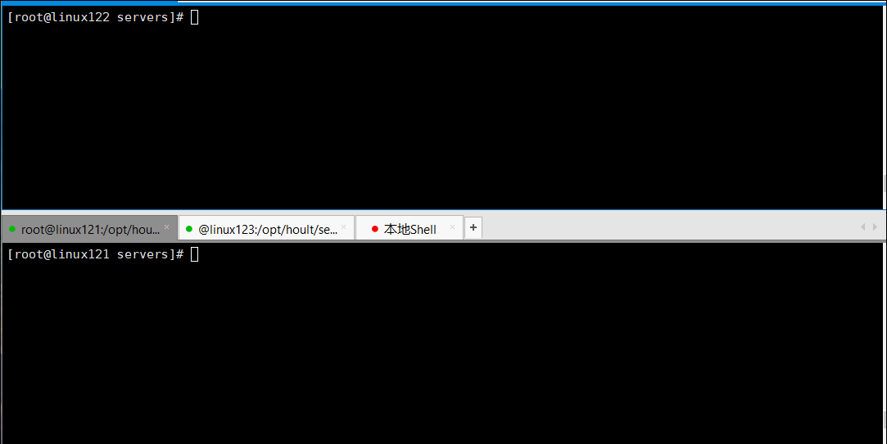

# 使用Nginx做页面采集, Kafka收集到对应Topic

# 0.架构简介

模拟线上的实时流，比如用户的操作日志，采集到数据后，进行处理，暂时只考虑数据的采集，使用`Html+Jquery+Nginx+Ngx_kafka_module+Kafka`来实现，其中[Ngx\_kafka\_module](https://github.com/brg-liuwei/ngx_kafka_module "Ngx_kafka_module") 是开源的专门用来对接Nginx和`Kafka`的一个组件。

# 1.需求描述

### 1.1 用`html`和`jquery` 模拟用户请求日志

其中包括下面下面几项：

用户id:user\_id, 访问时间:act\_time, 操作: (action,包括click,job\_collect,cv\_send,cv\_upload)

企业编码job\_code

### 1.2 用Nginx接受1.1中的请求

### 1.3 接受完请求后，使用ngx\_kafka\_module将数据发送到Kafka的主题tp\_individual 中。

### 1.4 在kafka中使用一个消费者消费该主题，观察

# 2.搭建步骤

### 2.1 Kafka安装

由于使用现成的已安装好的[docker-kafka](https://github.com/hulichao/docker-bigdata "docker-kafka")镜像，所以直接启动即可.

### 2.2 安装Nginx，并启动

```bash
$ cd /usr/local/src
$ git clone git@github.com:edenhill/librdkafka.git
# 进入到librdkafka，然后进行编译
$  cd librdkafka
$  yum install -y gcc gcc-c++ pcre-devel zlib-devel
$  ./configure
$  make && make install

$ yum -y install make zlib-devel gcc-c++ libtool openssl openssl-devel
$ cd /opt/hoult/software
# 1.下载
$ wget http://nginx.org/download/nginx-1.18.0.tar.gz
# 2.解压
$ tar -zxf nginx-1.18.0.tar.gz -C /opt/hoult/servers
# 3. 下载模块源码
$ cd /opt/hoult/software
$ git clone git@github.com:brg-liuwei/ngx_kafka_module.git
# 4. 编译
$ cd /opt/hoult/servers/nginx-1.18.0
$ ./configure --add-module=/opt/hoult/software/ngx_kafka_module/
$ make && make install 
# 5.删除Nginx安装包
$ rm /opt/hoult/software/nginx-1.18.0.tar.gz
# 6.启动nginx
$ cd /user/local/nginx
$ sbin/nginx 
```

# 3.相关配置

### 3.1 nginx配置nginx.conf

```bash
#pid        logs/nginx.pid;


events {
    worker_connections  1024;
}


http {
    include       mime.types;
    default_type  application/octet-stream;

    #log_format  main  '$remote_addr - $remote_user [$time_local] "$request" '
    #                  '$status $body_bytes_sent "$http_referer" '
    #                  '"$http_user_agent" "$http_x_forwarded_for"';

    #access_log  logs/access.log  main;

    sendfile        on;
    #tcp_nopush     on;

    #keepalive_timeout  0;
    keepalive_timeout  65;

    #gzip  on;

    kafka;
    kafka_broker_list linux121:9092;

    server {
        listen       9090;
        server_name  localhost;

        #charset koi8-r;

        #access_log  logs/host.access.log  main;

        #------------kafka相关配置开始------------
        location = /kafka/log {
                #跨域相关配置
                add_header 'Access-Control-Allow-Origin' $http_origin;
                add_header 'Access-Control-Allow-Credentials' 'true';
                add_header 'Access-Control-Allow-Methods' 'GET, POST, OPTIONS';

                kafka_topic tp_individual;
        }

        #error_page  404              /404.html;
    }

}

```

### 3.2 启动kafka 生产者和消费者

```bash
# 创建topic
kafka-topics.sh --zookeeper linux121:2181/myKafka --create --topic tp_individual --partitions 1 --replication-factor 1
# 创建消费者
kafka-console-consumer.sh --bootstrap-server linux121:9092 --topic tp_individual --from-beginning
# 创建生产者测试
kafka-console-producer.sh --broker-list linux121:9092 --topic tp_individual 
```

### 3.3 编写Html + Jquery代码

```html
<!DOCTYPE html>
    <head>
        <meta http-equiv="Content-Type" content="text/html; charset=UTF-8">
        <meta name="viewport" content="width=device-width, initial-scale=1,shrink-to-fit=no">
        <title>index</title>
        <!-- jquery cdn, 可换其他 -->
        <script src="https://cdn.bootcdn.net/ajax/libs/jquery/3.5.1/jquery.js"></script>
    </head>
    <body>
        <input id="click" type="button" value="点击" onclick="operate('click')" />
        <input id="collect" type="button" value="收藏" onclick="operate('job_collect')" />
        <input id="send" type="button" value="投简历" onclick="operate('cv_send')" />
        <input id="upload" type="button" value="上传简历" onclick="operate('cv_upload')" />
    </body>

    <script>

        function operate(action) {

            var json = {'user_id': 'u_donald', 'act_time': current().toString(), 'action': action, 'job_code': 'donald'};

            $.ajax({
                url:"http://linxu121:8437/kafka/log",
                type:"POST" ,
                crossDomain: true,
                data: JSON.stringify(json),
                // 下面这句话允许跨域的cookie访问
                xhrFields: {
                    withCredentials: true
                },
                success:function (data, status, xhr) {

                    // console.log("操作成功：'" + action)
                },
                error:function (err) {

                    // console.log(err.responseText);
                }
            });
        };

        function current() {
            var d   = new Date(),
                str = '';
            str += d.getFullYear() + '-';
            str += d.getMonth() + 1 + '-';
            str += d.getDate() + ' ';
            str += d.getHours() + ':';
            str += d.getMinutes() + ':';
            str += d.getSeconds();
            return str;
        }
    </script>

</html>

```

将`a.html `放在nginx的目录下，浏览器访问192.168.18.128:9090

# 4.演示

4.1 首先启动zk集群，kafka集群

4.2 然后创建topic, 创建消费者，创建生产者，测试topic

4.3 启动nginx访问页面，进行点击，观察消费者状态

整个过程如下图：


