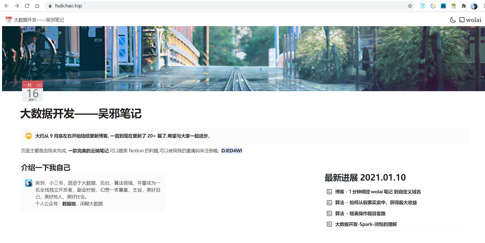
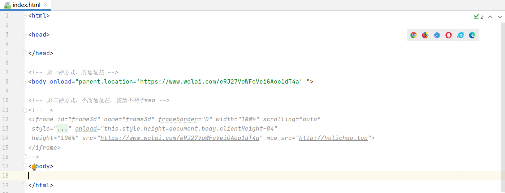

# 博客 - 1分钟绑定wolai笔记 到自定义域名

# 1.效果

首先，将笔记分享，分享方式可以点右上角分享按钮，分享范围现在只支持页面及其子页面，引用的页面是没有权限的，可以访问[hulichao.top](hulichao.top "hulichao.top") 来看看效果哦, 由于采用的是frame 跳转，所以可以实现地址栏一直保持域名的状态，另外也可以跳转而不改变地址栏的地址。下面来简单介绍两种方式如何实现

# 2.第一种实现-地址栏是使用我来的地址栏

这种方式，大概会有利于Seo吧，地址`uri` 应该可以被百度收录（如果不是用github pages来转发的话），其实等我来支持自定义域名后 可能更有利于seo，本人在这里不是很care收录，只是将自己笔记给他人看的一种方式，顺便呈现博客，笔记尽量不承载更多的使用，让我来更纯粹地云端笔记会比较好。要达到上图1的效果只需要下面三步。、

## 2.1 fork 仓库

[https://github.com/hulichao/hulichao.github.io](https://github.com/hulichao/hulichao.github.io "https://github.com/hulichao/hulichao.github.io") fork 一下，修改仓库名位自己名字.github.io,搭建过静态博客的，应该很熟悉这个操作，如果自己之前有同名仓库，先rename一下，这一步的作用就是为了将域名映射到我来的某个分享地址，因为域名映射是只能到域名的，不能到域名下的某个子页面，所以只是转发

## 2.2 修改仓库根目录下的index.html

按需注释或者留下自己想要的方式即可，第一种方式onload转发，第二种方式是frame跳转

## 3.绑定域名到你的名字.github.io

我这里使用的阿里云的域名服务器，修改如下图即可，最后就可以访问啦。

# 3.第二种实现-地址栏一直显示自定义域名

除了第二部分index.html的内容，其他完全一样，另外有小伙伴问到我能否地址栏是hulichao.top/xxxx1  hulichao.top/xxxx2 ,去找个前端人员帮你写一段转发代码把，不过感觉这样不是很好，还是期待一下我来官方的支持把，另外笔记就是笔记，总觉得拿来做博客，不是很好，你觉得呢?🚴🏼‍♂️🚴🏼‍♂️🚴🏼‍♂️🚴🏼‍♂️🚴🏼‍♂️🚴🏼‍♂️🚴🏼‍♂️🚴🏼‍♂️

