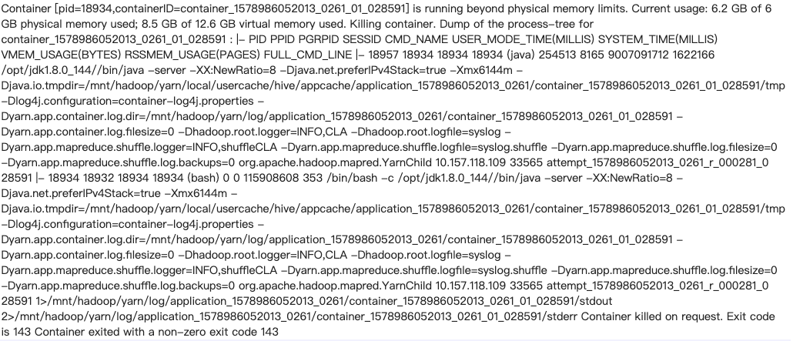

# 大数据实战-Hive-技巧实战

# 1.union 和 union all&#x20;

-   前者可以去重
    ```sql
    select sex,address from test where dt='20210218' union all select sex,address from test where dt='20210218';
    +------+----------+--+
    | sex  | address  |
    +------+----------+--+
    | m    | A        |
    | m    | A        |
    | m    | B        |
    | m    | B        |
    | m    | B        |
    | m    | B        |
    +------+----------+--+ 
    ```
-   后者不会去重
    ```sql
    select sex,address from test where dt='20210218' union select sex,address from test where dt='20210218';
    +------+----------+--+
    | sex  | address  |
    +------+----------+--+
    | m    | A        |
    | m    | B        |
    +------+----------+--+ 
    ```

# 2.sql后面的distribute by , sort by的作用

# 3.分桶表

clustered by (sno) sorted by (age desc) into 4 buckets

传入数据只能用insert into /overwrite&#x20;

2.1.1版本设置了强制分桶操作，因此人为的修改reduce的个数不会影响最终文件的个数(文件个数由桶数决定) &#x20;
–1. 在2.1.1版本里，底层实现了强制分桶，强制排序策略 &#x20;
– 即： 正规写法要带上distribute by(分桶字段)\[sort by 排序字段]，如果没有带上，也会分桶和排序。 &#x20;
–2. 使用insert into时可以不加关键字table. 使用insert overwrite时必须带关键字table. &#x20;
–3. 因为底层实行了强制分桶策略，所以修改mapreduce.job.reduces的个数，不会影响桶文件数据。但是会影响真正执行时reduceTask的数量。是真正的reduceTask的数量是最接近mapreduce.job.reduces的数量的因子。如果是素数，就使用本身

# 4.动态分区小文件和OOM优化

```sql
INSERT OVERWRITE TABLE ris_relation_result_prod partition(rel_id)
SELECT get_json_object(relation, '$.relationHashcode') AS relation_hashcode,
get_json_object(relation, '$.targetVariableValue') AS target_variable_value,
get_json_object(relation, '$.relId') AS rel_id
FROM ris_relation_old_prod733 where get_json_object(relation, '$.relId') in (**********)
```

`set hive.optimize.sort.dynamic.partition=true;`

[https://blog.csdn.net/lzw2016/article/details/97818080](https://blog.csdn.net/lzw2016/article/details/97818080 "https://blog.csdn.net/lzw2016/article/details/97818080")

# 5.hive 需要开辟很多内存的问题解决

[https://blog.csdn.net/qq\_26442553/article/details/89343579](https://blog.csdn.net/qq_26442553/article/details/89343579 "https://blog.csdn.net/qq_26442553/article/details/89343579")

问题1: Hive/MR 任务报内存溢出



running beyond physical memory limits. Current usage: 2.0 GB of 2 GB physical memory used; 3.9 GB of 4.2 GB virtual memory used. Killing container。

内存调优参数：[https://blog.csdn.net/sn\_zzy/article/details/43115681](https://blog.csdn.net/sn_zzy/article/details/43115681 "https://blog.csdn.net/sn_zzy/article/details/43115681")

# 6.hive的一些sql优化

[https://blog.csdn.net/kwu\_ganymede/article/details/51365002](https://blog.csdn.net/kwu_ganymede/article/details/51365002 "https://blog.csdn.net/kwu_ganymede/article/details/51365002")

map join优化

# 7.Hive插入小文件被kill现象

在hive 插入数据动态分区时候会产生很多小文件，被kill, 如下图1, 另外在GC overhead limit execded&#x20;


# 8.Hive处于Block状态，超时

mapreduce.task.timeout

如果一个task在一定时间内没有任何进入，即不会读取新的数据，也没有输出数据，则认为该 task 处于 block 状态，可能是临时卡住，也许永远会卡住。为了防止因为用户程序永远 block 不退出，则强制设置了一个超时时间（单位毫秒），默认是600000，值为 0 将禁用超时

# 9.Hive窗口函数不能大小写混乱

max( ) over ( partition by prcid order by b.occurtime desc ) 不能大小写混乱

# 10.hive客户端日志

hive --verbos=true
hive --hiveconf hive.root.logger=DEBUG,console

# 11.\~/.beeline/history && \~/.hivehistory在2.1版本下，会oom

导致客户端执行命令时候直接卡住，解决方式删除或者移动备份这个文件
