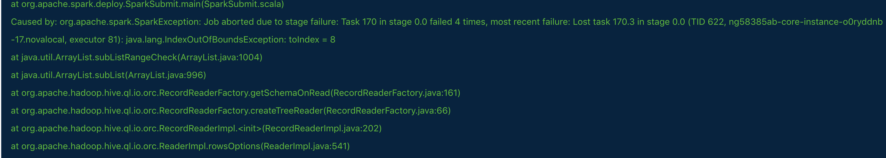

# 大数据实战-Spark实战技巧

# 1.连接mysql

\--driver-class-path mysql-connector-java-5.1.21.jar

在数据库中，SET GLOBAL binlog\_format=mixed;

# 2.Spark中 使用Hive的udf

同样使用—jars 才行

# 3.Spark jupyter使用

[https://www.jb51.net/article/163641.htm](https://www.jb51.net/article/163641.htm "https://www.jb51.net/article/163641.htm")

[https://my.oschina.net/albert2011/blog/754174](https://my.oschina.net/albert2011/blog/754174 "https://my.oschina.net/albert2011/blog/754174")

使用jupyter-notebook --ip `hostname -i`来启动

# 4.Spark使用hive的orc解析格式

spark.sql.hive.convertMetastoreOrc=true

使用spark写入hive表中的数据，可能会出现空指针问题或者数据越界问题，问题原因是spark的元数据解析问题，而不是hive的元数据解析问题



# 5.row\_number排序算子的使用

```scala
import org.apache.spark.sql.expressions.Window
import org.apache.spark.sql.functions.row_number
import org.apache.spark.sql.functions._

```

1.spark.sql(sql).withColumn("rn", row\_number().over(Window\.partitionBy('f\_trans\_id).orderBy(col("f\_modify\_time").desc)))
2.spark.sql(sql).withColumn("rn", row\_number().over(Window\.partitionBy('f\_trans\_id).orderBy(-col("f\_modify\_time"))))

3.val df = spark.sql(sql)

df.withColumn("rn", row\_number().over(Window\.partitionBy('f\_trans\_id).orderBy(-df("f\_modify\_time"))))

4.spark.sql(sql).withColumn("rn", row\_number().over(Window\.partitionBy('f\_trans\_id).orderBy(-'f\_modify\_time)))

**注意**：-的方式，经过测试，不稳定，有时可以，有时不可以

# 6.broadcast广播表

sc.broadcast是广播数据，一般用于rdd广播，而下面的方式用于广播表

import org.apache.spark.sql.functions.broadcast

broadcast(tableData).createOrReplaceTempView
