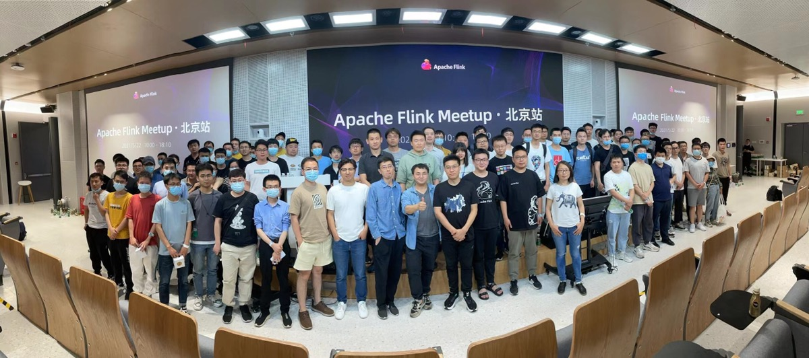

# 大数据开发-Flink-1.13新特性

# 介绍

大概4月，Flink1.13就发布了，参加 了Flink1.13 的Meetup，收获还是挺多，从大的方面讲就是FlingSql的改进和优化，资源调度管理方面的优化，以及流批一体Flink在运行时与DataStream API的优化，另外就是State backend 模块的优化，本篇文章既是当时做的笔记，又是在后续查阅官网等做的补充,

Flink 的一个主要目标取得了重要进展，即让流处理应用的使用像普通应用一样简单和自然。Flink 1.13 新引入的被动扩缩容使得流作业的扩缩容和其它应用一样简单，使用者仅需要修改并行度即可。

这个版本还包括一系列重要改动使使用者可以更好理解流作业的效能。当流作业的效能不及预期的时候，这些改动可以使使用者可以更好的分析原因。这些改动包括用于识别瓶颈节点的负载和反压视觉化、分析运算元热点程式码的 CPU 火焰图和分析 State Backend 状态的 State 存取效能指标

# 深入解读 Flink SQL 1.13

在刚刚发布的 1.13 版本中，Flink SQL 带来了许多新 feature 和功能提升，在这里围绕 Winddow TVF，时区支持，DataStream & Table API 交互，hive 兼容性提升，SQL Client 改进 五个方面

-   flip-145 window tvf
    -   完整关系代数表达
    -   输入是一个关系，输出是一个关系
    -   每个关系对应一个数据集
    -   cumulater window eg: 每10分钟一次统计uv,,结果准确，不会有跳变
    -   window 性能优化
        -   内存，切片，算子，迟到数据
        -   benchmark 测试 2x提升
    -   多维数据分析：grouping sets ,rollup,cube等
-   flip-162时区分析
    -   时区问题：proctime未考虑时区，timestamp 也没有时区，各种current\_time，now未考虑时区
    -   时间函数：current\_timestamp 返回utc+0
    -   支持 tiestamp——ltz类型 timestamp vs timestamp\_ltz
    -   纠正proctime()函数
    -   夏令时支持-同timestamp\_ltz
-   flip-163 改进sql-client，hive兼容性
    -   支持更多实用配置
    -   支持statement set&#x20;
-   flip-136 增强datastrem 和 table的转换
    -   支持ds 和table转换时传递 event time 和 watermark
    -   支持changelog数据流在table和datastream间相互转换

# Flink 1.13: Towards Scalable Cloud Native Application

Flink 1.13 新增了被动资源管理模式与自适应调度模式，具备灵活的伸缩能力，与云原生的自动伸缩技术相结合，能够更好地发挥云环境下弹性计算资源的优势，是 Flink 全面拥抱云原生技术生态的又一重要里程碑。本次议题将对 Flink 1.13 中的被动资源管理、自适应调度、自定义容器模板等新特性，我觉得这个的扩展才是Flink此次版本特别重要的一个feature

-   云原生 时代 flink，k8s,声明api，可弹性扩展
-   k8s高可用-（zk，k8s可选）
-   Rescale （reactive mode → adaptive mdoe → autoscaling mode(TBD，还未支持)）[https://ci.apache.org/projects/flink/flink-docs-release-1.13/docs/deployment/elastic\_scaling/](https://ci.apache.org/projects/flink/flink-docs-release-1.13/docs/deployment/elastic_scaling/ "https://ci.apache.org/projects/flink/flink-docs-release-1.13/docs/deployment/elastic_scaling/")
-   Flip-158 generalized incremental checkpoints 让checkpoint更短时间
-   Pod Template 自定义Pod模板支持
-   Fine-细粒度资源管理-featrue 大概1.14支持
-   纵向扩展资源和横向扩展资源，tm cpu → k8s, mem→no

# 面向流批一体的 Flink 运行时与 DataStream API 优化

在 1.13 中，针对流批一体的目标，Flink 优化了大规模作业调度以及批执行模式下网络 Shuffle 的性能，从而进一步提高了流作业与批作业的执行性能；同时，在 DataStream API 方面，Flink也正在完善有限流作业的退出语义，从而进一步提高不同执行模式下语义与结果的一致性

api下面的shuffle架构实现

-   有限作业和无限作业，和预期结果一致
-   大规模作业优化 consumerVetexGroup partitionGroup
-   有限流作业结束一致性，2pc😁😁
-   流批-数据回流
-   piplien and block-缓存主要是，离线处理

# State backend Flink-1.13 优化及生产实践

-   统一savepoint 可以 切换rocksdb
-   state-backend 内存管控，
-   checkpoint save point [https://zhuanlan.zhihu.com/p/79526638](https://zhuanlan.zhihu.com/p/79526638 "https://zhuanlan.zhihu.com/p/79526638")
-   更快速的checkpoint & falover

# flink1.14 的展望

-   删除legacy planner
-   完善window tvf
-   提升 schema handing
-   增强cdc

# 参考

更多可以查看Flink官网 [https://ci.apache.org/projects/flink/flink-docs-release-1.13/release-notes/flink-1.13/](https://ci.apache.org/projects/flink/flink-docs-release-1.13/release-notes/flink-1.13/ "https://ci.apache.org/projects/flink/flink-docs-release-1.13/release-notes/flink-1.13/")

参考部分：[https://tw511.com/a/01/34869.html](https://tw511.com/a/01/34869.html "https://tw511.com/a/01/34869.html")

