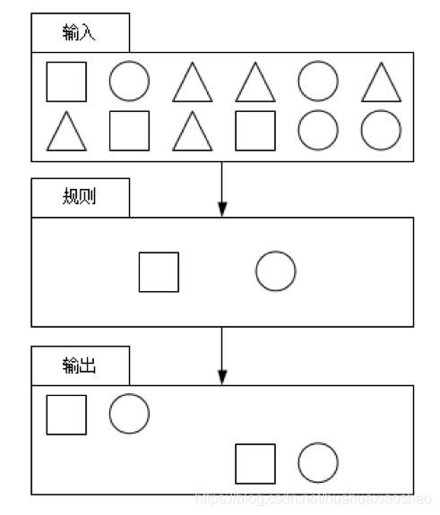
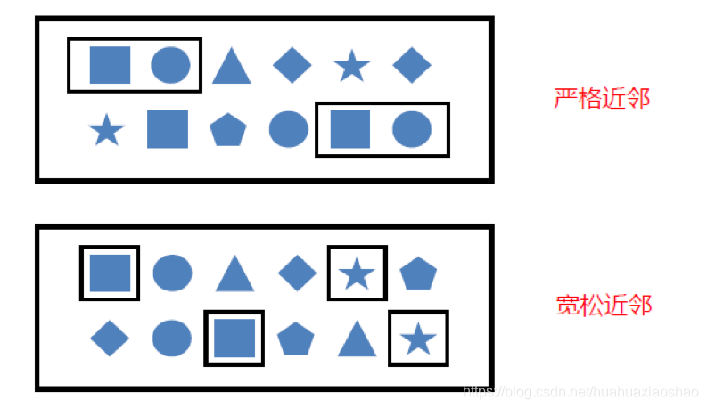
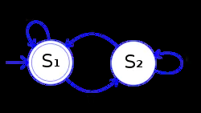

# 大数据开发-Flink-CEP的主要原理和使用

总结就是：输入-规则-输出

就是单事件的自关联，其实匹配的也是时间序列的



## 定义基础

（1）定义 复合事件处理（Complex Event Processing，CEP）是一种基于动态环境中事件流的分析技术，事件在这
里通常是有意义的状态变化，通过分析事件间的关系，利用过滤、关联、聚合等技术，根据事件间的时序关系和聚合
关系制定检测规则，持续地从事件流中查询出符合要求的事件序列，最终分析得到更复杂的复合事件

（2）特征
CEP的特征如下： 目标：从有序的简单事件流中发现一些高阶特征； 输入：一个或多个简单事件构成的事件流； 处
理：识别简单事件之间的内在联系，多个符合一定规则的简单事件构成复杂事件； 输出：满足规则的复杂事件

（3）功能&#x20;

CEP用于分析低延迟、频繁产生的不同来源的事件流。CEP可以帮助在复杂的、不相关的时间流中找出有
意义的模式和复杂的关系，以接近实时或准实时的获得通知或组织一些行为。 CEP支持在流上进行模式匹配，根据模
式的条件不同，分为连续的条件或不连续的条件；模式的条件允许有时间的限制，当条件范围内没有达到满足的条件
时，会导致模式匹配超时。 看起来很简单，但是它有很多不同的功能： ① 输入的流数据，尽快产生结果； ② 在2个
事件流上，基于时间进行聚合类的计算； ③ 提供实时/准实时的警告和通知； ④ 在多样的数据源中产生关联分析模
式； ⑤ 高吞吐、低延迟的处理 市场上有多种CEP的解决方案，例如Spark、Samza、Beam等，但他们都没有提供专
门的库支持。然而，Flink提供了专门的CEP库。&#x20;

（4）主要组件 Flink为CEP提供了专门的Flink CEP library

它包含如下组件：Event Stream、Pattern定义、Pattern检测和生成Alert。 首先，开发人员要在DataStream流上定义出模
式条件，之后Flink CEP引擎进行模式检测，必要时生成警告。

## CEP里面的模式API

（1）个体模式（Individual Patterns） 组成复杂规则的每一个单

独的模式定义，就是个体模式。

```java
start.times(3).where(_.behavior.startsWith(‘fav’))
```

（2）组合模式（Combining Patterns，也叫模式序列） 很多个体模式组合起来，就形成了整个的模式序列。 模式序列

必须以一个初始模式开始：

```java
val start = Pattern.begin(‘start’)
```

（3）模式组（Group of Pattern） 将一个模式序列作为条件嵌套在个体模式里，成为一组模式

### 个体模式

个体模式包括单例模式和循环模式。单例模式只接收一个事件，而循环模式可以接收多个事件，

（1）量词 可以在一个个体模式后追加量词，也就是指定循环次数。

```java
// 匹配出现4次
start.time(4)
// 匹配出现0次或4次
start.time(4).optional
// 匹配出现2、3或4次
start.time(2,4)
// 匹配出现2、3或4次，并且尽可能多地重复匹配
start.time(2,4).greedy
// 匹配出现1次或多次
start.oneOrMore
// 匹配出现0、2或多次，并且尽可能多地重复匹配
start.timesOrMore(2).optional.greedy
```

（2）条件 每个模式都需要指定触发条件，作为模式是否接受事件进入的判断依据。CEP中的个体模式主要通过调
用.where()、.or()和.until()来指定条件。按不同的调用方式，可以分成以下几类： ① 简单条件 通过.where()方法对事
件中的字段进行判断筛选，决定是否接收该事件

```java
start.where(event=>event.getName.startsWith(“foo”))
```

② 组合条件 将简单的条件进行合并；or()方法表示或逻辑相连，where的直接组合就相当于与and。
Pattern.where(event => …/*some condition*/).or(event => /*or condition*/)
③ 终止条件 如果使用了oneOrMore或者oneOrMore.optional，建议使用.until()作为终止条件，以便清理状态。 ④
迭代条件 能够对模式之前所有接收的事件进行处理；调用.where((value,ctx) => {…})，可以调用
ctx.getEventForPattern(“name”)

### 模式序列



（1）严格近邻&#x20;

所有事件按照严格的顺序出现，中间没有任何不匹配的事件，由.next()指定。例如对于模式“a next
b”，事件序列“a,c,b1,b2”没有匹配。 （2）宽松近邻 允许中间出现不匹配的事件，由.followedBy()指定。例如对于模
式“a followedBy b”，事件序列“a,c,b1,b2”匹配为{a,b1}。 （3）非确定性宽松近邻 进一步放宽条件，之前已经匹配过
的事件也可以再次使用，由.followedByAny()指定。例如对于模式“a followedByAny b”，事件序列“a,c,b1,b2”匹配为
{ab1}，{a,b2}。 除了以上模式序列外，还可以定义“不希望出现某种近邻关系”： .notNext()：不想让某个事件严格紧
邻前一个事件发生。 .notFollowedBy()：不想让某个事件在两个事件之间发生。 需要注意：

-   所有模式序列必须以.begin()开始；
-   模式序列不能以.notFollowedBy()结束；
-   “not”类型的模式不能被optional所修饰；
-   可以为模式指定时间约束，用来要求在多长时间内匹配有效。
    `next.within(Time.seconds(10))`

### 模式的检测

定要查找的模式序列后，就可以将其应用于输入流以检测潜在匹配。调用CEP.pattern()，给定输入流和模式，就能
得到一个PatternStream。

```java
val input:DataStream[Event] = …
val pattern:Pattern[Event,_] = …
val patternStream:PatternStream[Event]=CEP.pattern(input,pattern)
```

### 匹配事件的提取

创建PatternStream之后，就可以应用select或者flatSelect方法，从检测到的事件序列中提取事件了。 select()方法
需要输入一个select function作为参数，每个成功匹配的事件序列都会调用它。 select()以一个
Map\[String,Iterable\[IN]]来接收匹配到的事件序列，其中key就是每个模式的名称，而value就是所有接收到的事件的
Iterable类型。

```java
def selectFn(pattern : Map[String,Iterable[IN]]):OUT={
  val startEvent = pattern.get(“start”).get.next
  val endEvent = pattern.get(“end”).get.next
  OUT(startEvent, endEvent)
}
```

flatSelect通过实现PatternFlatSelectFunction实现与select相似的功能。唯一的区别就是flatSelect方法可以返回多条
记录，它通过一个Collector\[OUT]类型的参数来将要输出的数据传递到下游

### 超时事件的提取

当一个模式通过within关键字定义了检测窗口时间时，部分事件序列可能因为超过窗口长度而被丢弃；为了能够处理

这些超时的部分匹配，select和flatSelect API调用允许指定超时处理程序。

Flink CEP 开发流程：

1.  DataSource 中的数据转换为 DataStream；
2.  定义 Pattern，并将 DataStream 和 Pattern 组合转换为 PatternStream；
3.  PatternStream 经过 select、process 等算子转换为 DataStraem；
4.  再次转换的 DataStream 经过处理后，sink 到目标库。&#x20;

```java
select方法：

SingleOutputStreamOperator<PayEvent> result = patternStream.select(orderTimeoutOutput, new

  PatternTimeoutFunction<PayEvent, PayEvent>() {
  
  @Override
  
  public PayEvent timeout(Map<String, List<PayEvent>> map, long l) throws Exception {
  
  return map.get("begin").get(0);
  
  }

}, new PatternSelectFunction<PayEvent, PayEvent>() {

@Override

public PayEvent select(Map<String, List<PayEvent>> map) throws Exception {

return map.get("pay").get(0);

}

});
```

对检测到的模式序列应用选择函数。对于每个模式序列，调用提供的{@link PatternSelectFunction}。模式选择函数

只能产生一个结果元素。

对超时的部分模式序列应用超时函数。对于每个部分模式序列，调用提供的{@link PatternTimeoutFunction}。模式

超时函数只能产生一个结果元素。

您可以在使用相同的{@link OutputTag}进行select操作的{@link SingleOutputStreamOperator}上获得由{@link

SingleOutputStreamOperator}生成的{@link SingleOutputStreamOperator}生成的超时数据流。

@param timedOutPartialMatchesTag 标识端输出超时模式的@link OutputTag}

@param patternTimeoutFunction 为超时的每个部分模式序列调用的模式超时函数。

@param patternSelectFunction 为每个检测到的模式序列调用的模式选择函数。

@param 产生的超时元素的类型

@param 结果元素的类型

return {@link DataStream}，其中包含产生的元素和在边输出中产生的超时元素。

```java
DataStream<PayEvent> sideOutput = result.getSideOutput(orderTimeoutOutput);
```

获取{@link DataStream}，该{@link DataStream}包含由操作发出到指定{@link OutputTag}的边输出的元素

# Flink CEP 开发流程

1.  DataSource 中的数据转换为 DataStream；watermark、keyby
2.  定义 Pattern，并将 DataStream 和 Pattern 组合转换为 PatternStream；
3.  PatternStream 经过 sele ct、process 等算子转换为 DataStream；
4.  再次转换的 DataStream 经过处理后，sink 到目标库

# CEP实现的主要原理

FlinkCEP在运行时会将用户的逻辑转化成这样的一个NFA Graph (nfa对象)
所以有限状态机的工作过程，就是从开始状态，根据不同的输入，自动进行状态转换的过程



上图中的状态机的功能，是检测二进制数是否含有偶数个 0。从图上可以看出，输入只有 1 和 0 两种。从 S1 状态开
始，只有输入 0 才会转换到 S2 状态，同样 S2 状态下只有输入 0 才会转换到 S1。所以，二进制数输入完毕，如果满
足最终状态，也就是最后停在 S1 状态，那么输入的二进制数就含有偶数个 0

