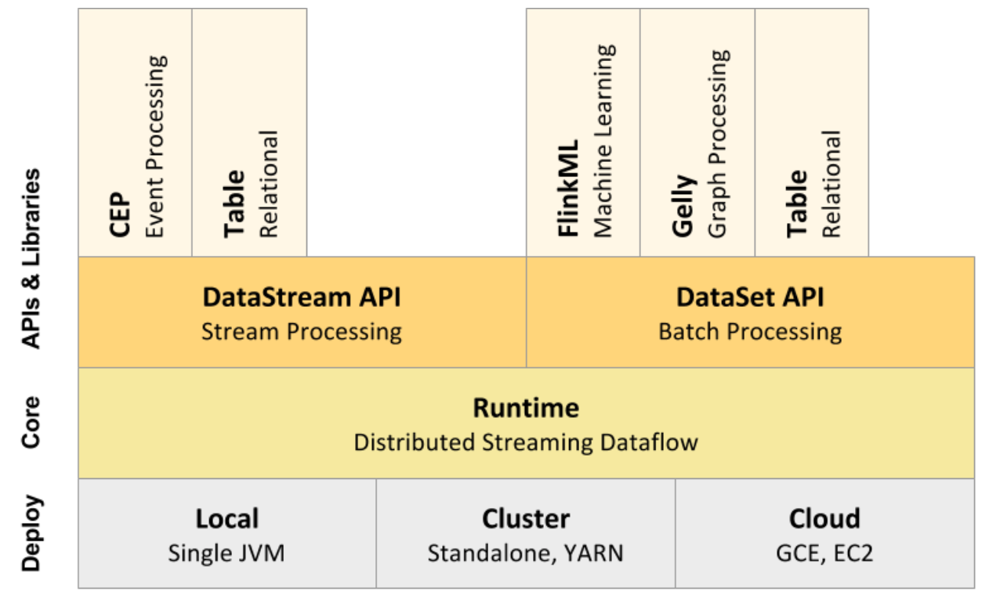
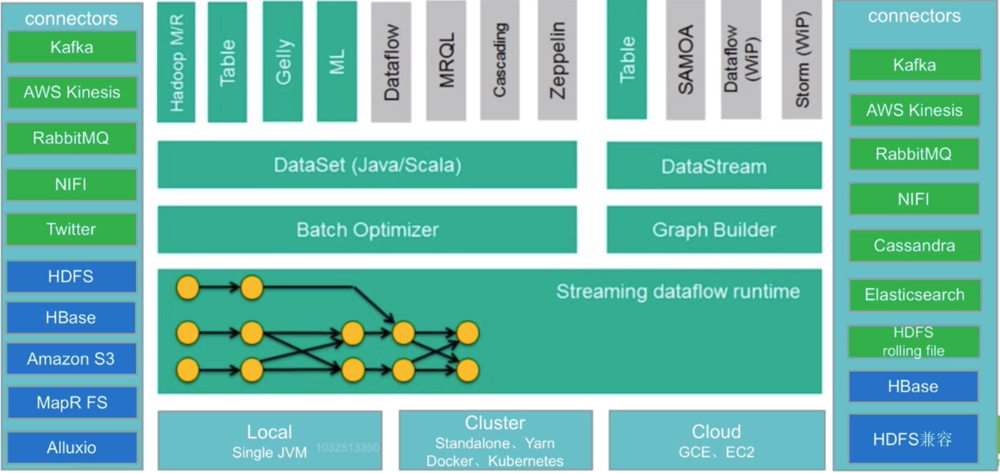
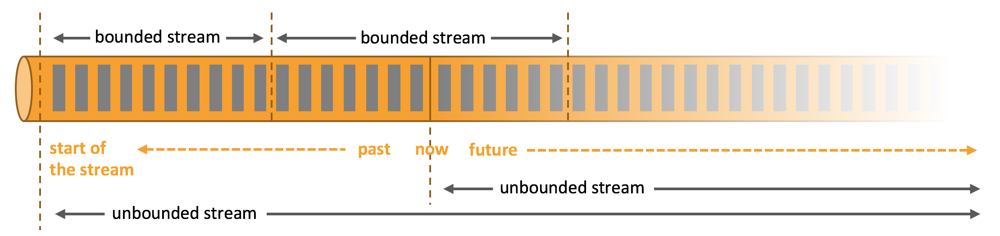
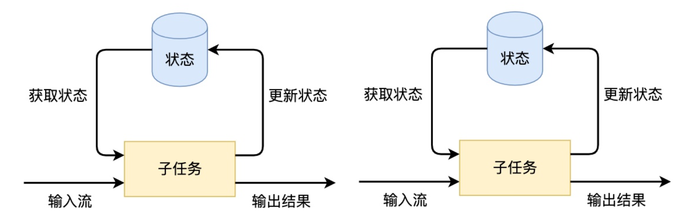

# 大数据开发-Flink-Flink简介和入门

Flink作为大数据生态中重要的一个组件，现在在实时流处理方面占据着很重要的地位，其实时流处理方面支持基于事件的时间流处理方式，另外也推荐流批一体化，而现在处理实时数据较常用的架构 Flink + Kafka，当然市面上的流处理引擎不止Flink一种，其他的比如Storm、SparkStreaming、Trident等，实际应用时如何进行选型，下面是一些建议参考

-   流数据要进行状态管理，选择使用Trident、Spark Streaming或者Flink
-   消息投递需要保证At-least-once（至少一次）或者Exactly-once（仅一次）不能选择Storm
-   对于小型独立项目，有低延迟要求，可以选择使用Storm，更简单
-   如果项目已经引入了大框架Spark，实时处理需求可以满足的话，建议直接使用Spark中的Spark Streaming
-   消息投递要满足Exactly-once（仅一次），数据量大、有高吞吐、低延迟要求，要进行状态管理或窗口统计，建
    议使用Flink，也越来越被各大公司所实践

# 1.Flink简介

Apache Flink是一个框架和分布式处理引擎，用于对无界和有界数据流进行有状态计算。Flink被设计在所有常见的集群环境中运行，以内存执行速度和任意规模来执行计算，Flink 是一个开源的流处理框架，它具有以下特点


-   批流一体：统一批处理、流处理
-   分布式：Flink程序可以运行在多台机器上
-   高性能：处理性能比较高
-   高可用：Flink支持高可用性（HA）
-   准确：Flink可以保证数据处理的准确性

# 2.Flink核心模块组成

首先，类比Spark, 我们来看Flink的模块划分



## Deploy层

可以启动单个JVM，让Flink以Local模式运行Flink也可以以Standalone 集群模式运行，同时也支持Flink ON YARN，Flink应用直接提交到YARN上面运行Flink还可以运行在GCE（谷歌云服务）和EC2（亚马逊云服务）

## Core层（Runtime）

在Runtime之上提供了两套核心的API，DataStream API（流处理）和DataSet API（批处理）

## APIs & Libraries层

核心API之上又扩展了一些高阶的库和API

-   CEP流处理
-   Table API和SQL
-   Flink ML机器学习库
-   Gelly图计算

# 3.Flink生态组成

Flink作为大数据生态的一员，除了本身外，可以很好地与生态中的其他组件进行结合使用，大的概况方面来讲，就有输入方面和输出方面，



其中中间的部分，上面已经介绍，主页看看两边的，其中绿色背景是流处理方式的场景，蓝色背景是批处理方式的场景

## 输入Connectors（左侧部分）

-   流处理方式：包含Kafka（消息队列）、AWS kinesis（实时数据流服务）、RabbitMQ（消息队列）、NIFI（数
    据管道）、Twitter（API）
-   批处理方式：包含HDFS（分布式文件系统）、HBase（分布式列式数据库）、Amazon S3（文件系统）、
    MapR FS（文件系统）、ALLuxio（基于内存分布式文件系统）

## 输出Connectors（右侧部分）

-   流处理方式：包含Kafka（消息队列）、AWS kinesis（实时数据流服务）、RabbitMQ（消息队列）、NIFI（数
    据管道）、Cassandra（NOSQL数据库）、ElasticSearch（全文检索）、HDFS rolling file（滚动文件）
-   批处理方式：包含HBase（分布式列式数据库）、HDFS（分布式文件系统）

# 4.Flink流处理模式介绍

Spark中的流处理主要有两种，一种是Spark Streamin是维批处理，如果对事件内的时间没有要求，这种方式可以满足很多需求，另外一种是Structed Streaming 是基于一张无界的大表，核心API就是Spark Sql的，而Flink是专注于无限流，把有界流看成是无限流的一种特殊情况，另外两个框架都有状态管理。



## 无限流处理

输入的数据没有尽头，像水流一样源源不断，数据处理从当前或者过去的某一个时间 点开始，持续不停地进行。

## 有限流处理

从某一个时间点开始处理数据，然后在另一个时间点结束输入数据可能本身是有限的（即输入数据集并不会随着时间增长），也可能出于分析的目的被人为地设定为有限集（即只分析某一个时间段内的事件）Flink封装了DataStream API进行流处理，封装了DataSet API进行批处理。同时，Flink也是一个批流一体的处理引擎，提供了Table API / SQL统一了批处理和流处理。

## 有状态的流处理应用

基于SubTask,每个SubTask处理时候，都会获取状态并更新状态，



# 5.Flink入门实践

以经典的WordCount为例，来看Flink的两个批流处理案例，案例以`nc -lp` 来作为Source, 以控制台输出为Sink, 分为Java和Scala版本哦，

## Scala版本之批处理

```scala
import org.apache.flink.api.scala._

object WordCountScalaBatch {
  def main(args: Array[String]): Unit = {

    val inputPath = "E:\\hadoop_res\\input\\a.txt"
    val outputPath = "E:\\hadoop_res\\output2"

    val environment: ExecutionEnvironment = ExecutionEnvironment.getExecutionEnvironment
    val text: DataSet[String] = environment.readTextFile(inputPath)
    text
      .flatMap(_.split("\\s+"))
      .map((_, 1))
      .groupBy(0)
      .sum(1)
      .setParallelism(1)
      .writeAsCsv(outputPath, "\n", ",")


    //setParallelism(1)很多算子后面都可以调用
    environment.execute("job name")

  }

}

```

## Scala版本之流处理

```scala
import org.apache.flink.streaming.api.scala._

object WordCountScalaStream {
  def main(args: Array[String]): Unit = {
    //处理流式数据
    val environment: StreamExecutionEnvironment = StreamExecutionEnvironment.getExecutionEnvironment

    val streamData: DataStream[String] = environment.socketTextStream("linux121", 7777)

    val out: DataStream[(String, Int)] = streamData
      .flatMap(_.split("\\s+"))
      .map((_, 1))
      .keyBy(0)
      .sum(1)

    out.print()

    environment.execute("test stream")
  }

}

```

## Java版本之批处理

```java
package com.hoult.demo;

import org.apache.flink.api.common.functions.FlatMapFunction;
import org.apache.flink.api.java.ExecutionEnvironment;
import org.apache.flink.api.java.operators.AggregateOperator;
import org.apache.flink.api.java.operators.DataSource;
import org.apache.flink.api.java.operators.FlatMapOperator;
import org.apache.flink.api.java.operators.UnsortedGrouping;
import org.apache.flink.api.java.tuple.Tuple2;
import org.apache.flink.util.Collector;

public class WordCountJavaBatch {
    public static void main(String[] args) throws Exception {

        String inputPath = "E:\\hadoop_res\\input\\a.txt";
        String outputPath = "E:\\hadoop_res\\output";

        //获取flink的运行环境
        ExecutionEnvironment executionEnvironment = ExecutionEnvironment.getExecutionEnvironment();
        DataSource<String> text = executionEnvironment.readTextFile(inputPath);
        FlatMapOperator<String, Tuple2<String, Integer>> wordsOne = text.flatMap(new SplitClz());

        //hello,1  you,1 hi,1  him,1
        UnsortedGrouping<Tuple2<String, Integer>> groupWordAndOne = wordsOne.groupBy(0);
        AggregateOperator<Tuple2<String, Integer>> wordCount = groupWordAndOne.sum(1);

        wordCount.writeAsCsv(outputPath, "\n", "\t").setParallelism(1);

        executionEnvironment.execute();
    }

    static class SplitClz implements FlatMapFunction<String, Tuple2<String, Integer>> {

        public void flatMap(String s, Collector<Tuple2<String, Integer>> collector) throws Exception {
            String[] strs = s.split("\\s+");
            for (String str : strs) {
                collector.collect(new Tuple2<String, Integer>(str, 1));
            }
        }
    }
}

```

## Java版本之流处理

```java
package com.hoult.demo;

import org.apache.flink.api.common.functions.FlatMapFunction;
import org.apache.flink.api.java.tuple.Tuple2;
import org.apache.flink.streaming.api.datastream.DataStreamSource;
import org.apache.flink.streaming.api.datastream.SingleOutputStreamOperator;
import org.apache.flink.streaming.api.environment.StreamExecutionEnvironment;
import org.apache.flink.util.Collector;

public class WordCountJavaStream {
    public static void main(String[] args) throws Exception {
        StreamExecutionEnvironment executionEnvironment = StreamExecutionEnvironment.getExecutionEnvironment();
        DataStreamSource<String> dataStream = executionEnvironment.socketTextStream("linux121", 7777);
        SingleOutputStreamOperator<Tuple2<String, Integer>> sum = dataStream.flatMap(new FlatMapFunction<String, Tuple2<String, Integer>>() {
            public void flatMap(String s, Collector<Tuple2<String, Integer>> collector) throws Exception {
                for (String word : s.split(" ")) {
                    collector.collect(new Tuple2<String, Integer>(word, 1));
                }
            }
        }).keyBy(0).sum(1);
        sum.print();
        executionEnvironment.execute();
    }
}

```

## 总结

注意点，其中流处理是`keyBy` 算子，而批处理是`groupBy` 算子，`ExecutionEnvironment` 是批处理的入口类，而`StreamExecutionEnvironment` 是流处理的入口类，至于算子的操作跟Spark类似，后面再详细讲解。
