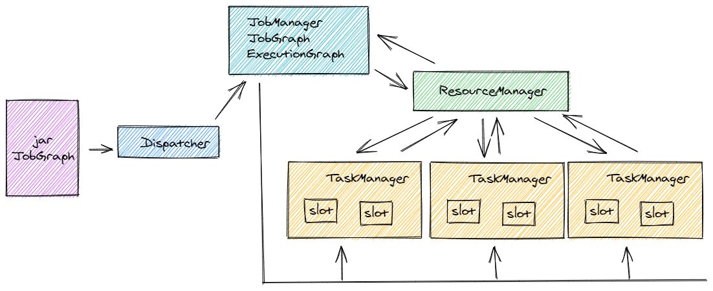
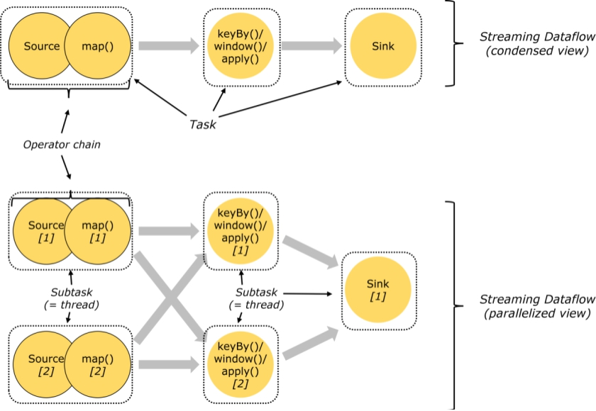
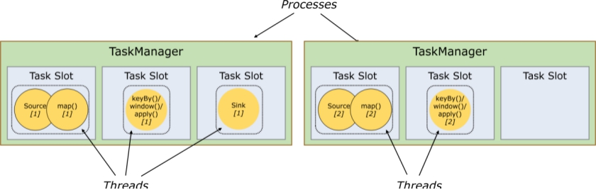
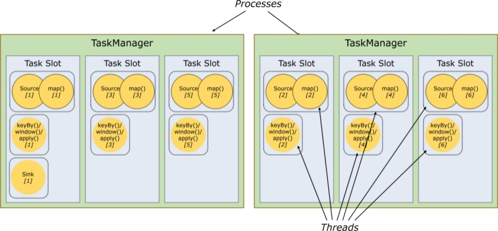

# 大数据开发-Flink-体系结构 && 运行架构

# Flink体系结构以及主要组成

像大多数大数据框架一样，Flink是非常经典的Master/Slave结构实现，JobManager是Master，TaskManager是Slave。

### JobManager处理器（Master）

协调分布式执行，它们用来调度task，协调检查点(CheckPoint)，协调失败时恢复等，Flink运行时至少存在一个master处理器，如果配置高可用模式则会存在多个master处理器，它们其中有一个是leader，而其他的都是standby。JobManager接收的应用包括jar和JobGraph。

### TaskManager处理器（Slave）

处理器也称之为Worker，主要职责是从JobManager处接收任务, 并部署和启动任务, 接收上游的数据并处理，Task Manager 是在 JVM 中的一个或多个线程中执行任务的工作节点，TaskManager在启动的时候会向ResourceManager注册自己的资源信息（Slot的数量等）。

## ResourceManager

针对不同的环境和资源提供者，如（YARN，Me搜索，Kubernetes或独立部署），Flink提供了不同的ResourceManager,其作用是负责Flink的资源处理单元：slot, 可以理解为cpu和内存资源

## Dispatcher

提供一个REST接口来让我们提交需要执行的应用。一旦一个应用提交执行，Dispatcher会启动一个JobManager，并将应用转交给他。Dispatcher还会启动一个webUI来提供有关作业执行信息
**注意**：某些应用的提交执行的方式，有可能用不到Dispatcher。

上面各个组件的关系，可以参考下图：

# Flink运行架构

运行架构与体系结构的区别是，体系结构主要指Flink在实体机器上的体现，是由什么进程，整个流程体系如何，而运行架构指的是一个程序提交后，走了哪些抽象流程

## Flink程序结构

Flink程序的基本构建块是流和转换（请注意，Flink的DataSet API中使用的DataSet也是内部流 ）。从概念上讲，流是（可能永无止境的）数据记录流，而转换是将一个或多个流输入，并产生一个或多个输出流

## Task和SubTask

-   Task 是一个阶段多个功能相同 SubTask 的集合，类似于 Spark 中的 TaskSet。
-   SubTask（子任务）
    SubTask 是 Flink 中任务最小执行单元，是一个 Java 类的实例，这个 Java 类中有属性和方法，完成具体的计算
    逻辑，比如一个执行操作map，分布式的场景下会在多个线程中同时执行，每个线程中执行的都叫做一个
    SubTask

## Operator chain(操作器链)

Flink的所有操作都称之为Operator，客户端在提交任务的时候会对Operator进行优化操作，能进行合并的Operator
会被合并为一个Operator，合并后的Operator称为Operator chain，实际上就是一个执行链，每个执行链会在
TaskManager上一个独立的线程中执行。shuffle

## Flink中的数据传输

在运行过程中，应用中的任务会持续进行数据交换。为了有效利用网络资源和提高吞吐量，Flink在处理任务间的数据传输过程中，采用了缓冲区机制

## 任务槽和槽共享

任务槽也叫做task-slot、槽共享也叫做slot sharing

每个TaskManager是一个JVM的进程, 可以在不同的线程中执行一个或多个子任务。为了控制一个worker能接收多少个task。worker通过task slot来进行控制（一个worker至少有一个task slot）

-   任务槽
    -   每个task slot表示TaskManager拥有资源的一个固定大小的子集。 一般来说:我们分配槽的个数都是和CPU的核
        数相等,比如6核,那么就分配6个槽.
        Flink将进程的内存进行了划分到多个Slot中。假设一个TaskManager机器有3个slot，那么每个slot占有1/3的内
        存（平分）。
    -   内存被划分到不同的slot之后可以获得如下好处:
        TaskManager最多能同时并发执行的任务是可以控制的，那就是3个，因为不能超过slot的数量
        slot有独占的内存空间，这样在一个TaskManager中可以运行多个不同的作业，作业之间不受影
-   槽共享

    默认情况下，Flink允许子任务subtast（map\[1] map\[2] keyby\[1] keyby\[2] 共享插槽，即使它们是不同任务的
    子任务，只要它们来自同一个作业。结果是一个槽可以保存作业的整个管道

