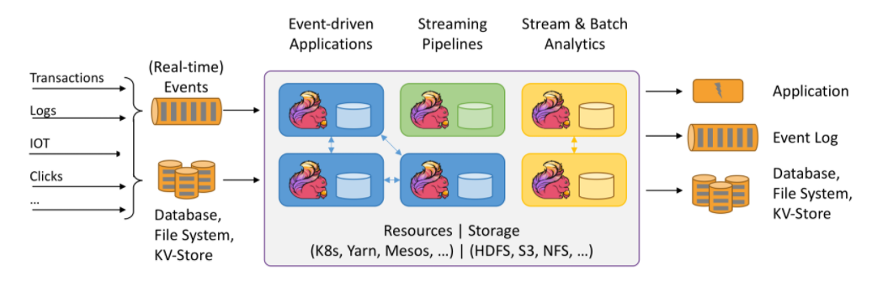
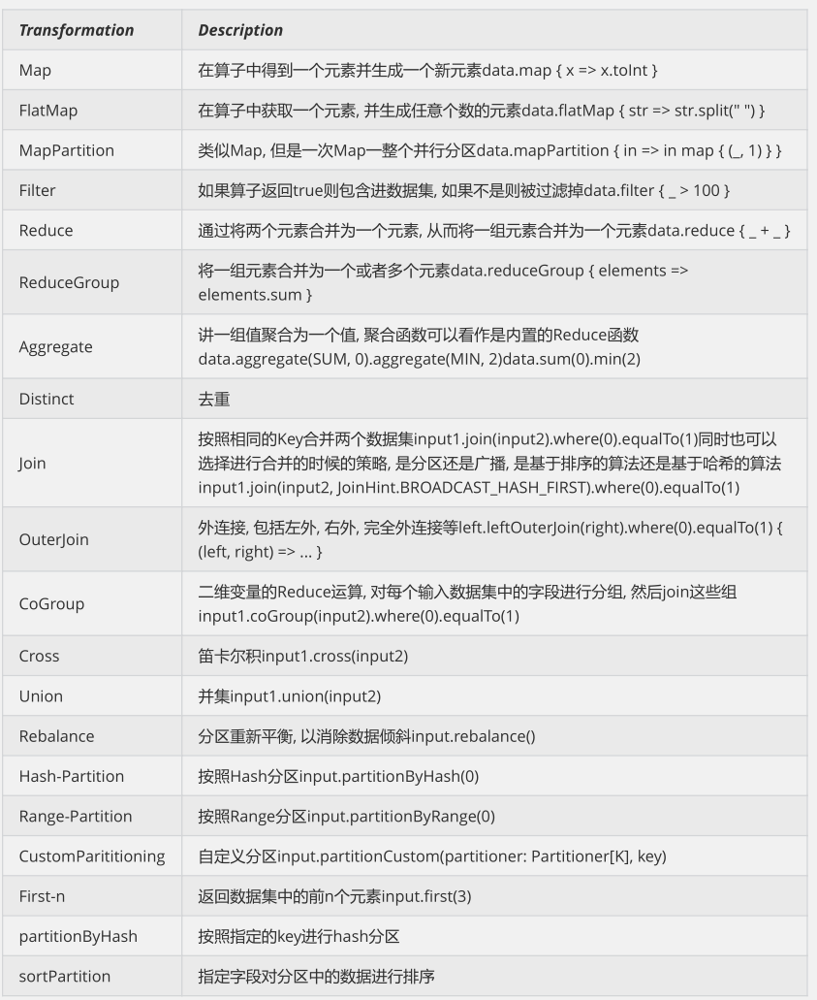

# 大数据开发-Flink-数据流DataStream和DataSet

Flink主要用来处理数据流，所以从抽象上来看就是对数据流的处理，正如前面[大数据开发-Flink-体系结构 && 运行架构](<大数据开发-Flink-体系结构 && 运行架构_p7J5kySGMKQfntnoq7LP4Y.md> "大数据开发-Flink-体系结构 && 运行架构")提到写Flink程序实际上就是在写DataSource、Transformation、Sink.

-   DataSource是程序的数据源输入，可以通过StreamExecutionEnvironment.addSource(sourceFuntion)为程序
    添加一个数据源
-   Transformation是具体的操作，它对一个或多个输入数据源进行计算处理，比如Map、FlatMap和Filter等操作
-   Sink是程序的输出，它可以把Transformation处理之后的数据输出到指定的存储介质中

# DataStream的三种流处理Api

## DataSource

Flink针对DataStream提供了两种实现方式的数据源，可以归纳为以下四种：

-   基于文件&#x20;

    `readTextFile(path)`  读取文本文件，文件遵循TextInputFormat逐行读取规则并返回
-   基于Socket

    `socketTextStream` 从Socket中读取数据，元素可以通过一个分隔符分开
-   基于集合

    `fromCollection(Collection)` 通过Java的Collection集合创建一个数据流，集合中的所有元素必须是相同类型的，需要注意的是，如果集合里面的元素要识别为POJO，需要满足下面的条件
    -   该类有共有的无参构造方法
    -   该类是共有且独立的（没有非静态内部类）
    -   类（及父类）中所有的不被static、transient修饰的属性要么有公有的（且不被final修饰），要么是包含公有的getter和setter方法，这些方法遵循java bean命名规范
    总结：上面的要求其实就是为了让Flink可以方便地序列化和反序列化这些对象为数据流
-   自定义Source

    使用`StreamExecutionEnvironment.addSource(sourceFunction)`将一个流式数据源加到程序中，具体这个`sourceFunction` 是为非并行源`implements SourceFunction`，或者为并行源 `implements ParallelSourceFunction`接口，或者`extends RichParallelSourceFunction`，对于自定义Source，Sink, Flink内置了下面几种Connector
    | 连接器                  | 是否提供Source支持 | 是否提供Sink支持 |
    | -------------------- | ------------ | ---------- |
    | Apache Kafka         | 是            | 是          |
    | ElasticSearch        | 否            | 是          |
    | HDFS                 | 否            | 是          |
    | Twitter Streaming PI | 是            | 否          |

对于Source的使用，其实较简单，这里给一个较常用的自定义Source的KafaSource的使用例子。更多相关源码可以查看：

```java
package com.hoult.stream;


public class SourceFromKafka {
    public static void main(String[] args) throws Exception {
        StreamExecutionEnvironment env = StreamExecutionEnvironment.getExecutionEnvironment();

        String topic = "animalN";
        Properties props = new Properties();
        props.put("bootstrap.servers", "linux121:9092");

        FlinkKafkaConsumer<String> consumer = new FlinkKafkaConsumer<>(topic, new SimpleStringSchema(), props);

        DataStreamSource<String> data = env.addSource(consumer);

        SingleOutputStreamOperator<Tuple2<Long, Long>> maped = data.map(new MapFunction<String, Tuple2<Long, Long>>() {
            @Override
            public Tuple2<Long, Long> map(String value) throws Exception {
                System.out.println(value);

                Tuple2<Long,Long> t = new Tuple2<Long,Long>(0l,0l);
                String[] split = value.split(",");

                try{
                    t = new Tuple2<Long, Long>(Long.valueOf(split[0]), Long.valueOf(split[1]));
                } catch (Exception e) {
                    e.printStackTrace();
                }
                return t;


            }
        });
        KeyedStream<Tuple2<Long,Long>, Long> keyed = maped.keyBy(value -> value.f0);
        //按照key分组策略，对流式数据调用状态化处理
        SingleOutputStreamOperator<Tuple2<Long, Long>> flatMaped = keyed.flatMap(new RichFlatMapFunction<Tuple2<Long, Long>, Tuple2<Long, Long>>() {
            ValueState<Tuple2<Long, Long>> sumState;

            @Override
            public void open(Configuration parameters) throws Exception {
                //在open方法中做出State
                ValueStateDescriptor<Tuple2<Long, Long>> descriptor = new ValueStateDescriptor<>(
                        "average",
                        TypeInformation.of(new TypeHint<Tuple2<Long, Long>>() {
                        }),
                        Tuple2.of(0L, 0L)
                );

                sumState = getRuntimeContext().getState(descriptor);
//                super.open(parameters);
            }

            @Override
            public void flatMap(Tuple2<Long, Long> value, Collector<Tuple2<Long, Long>> out) throws Exception {
                //在flatMap方法中，更新State
                Tuple2<Long, Long> currentSum = sumState.value();

                currentSum.f0 += 1;
                currentSum.f1 += value.f1;

                sumState.update(currentSum);
                out.collect(currentSum);


                /*if (currentSum.f0 == 2) {
                    long avarage = currentSum.f1 / currentSum.f0;
                    out.collect(new Tuple2<>(value.f0, avarage));
                    sumState.clear();
                }*/

            }
        });

        flatMaped.print();

        env.execute();
    }
}

```

## Transformation

对于Transformation ，Flink提供了很多的算子，

-   map

    DataStream → DataStream Takes one element and produces one element. A map function that doubles the values of the input stream:
    ```java
    DataStream<Integer> dataStream = //...
    dataStream.map(new MapFunction<Integer, Integer>() {
        @Override
        public Integer map(Integer value) throws Exception {
          return 2 * value;
        }
    });
    ```
-   flatMap

    DataStream → DataStream Takes one element and produces zero, one, or more elements. A flatmap function that splits sentences to words:
    ```java
    dataStream.flatMap(new FlatMapFunction<String, String>() {
      @Override
      public void flatMap(String value, Collector<String> out) throws Exception {
        for(String word: value.split(" ")){
          out.collect(word);
        }
      }
    });
    ```
-   filter

    DataStream → DataStream Evaluates a boolean function for each element and retains those for which the function returns true. A filter that filters out zero values:
    ```java
    dataStream.filter(new FilterFunction<Integer>() {
      @Override
      public boolean filter(Integer value) throws Exception {
        return value != 0;
      }
    });
    ```
-   keyBy

    DataStream → KeyedStream Logically partitions a stream into disjoint partitions. All records with the same key are assigned to the same partition. Internally, keyBy() is implemented with hash partitioning. There are different ways to specify keys.
    This transformation returns a KeyedStream, which is, among other things, required to use keyed state.

    Attention A type cannot be a key if:
-   fold
-   aggregation
-   window/windowAll/window\.apply/window\.reduce/window\.fold/window\.aggregation

```java
dataStream.keyBy(value -> value.getSomeKey()) // Key by field "someKey"
dataStream.keyBy(value -> value.f0) // Key by the first element of a Tuple
```

更多算子操作可以查看官网，官网写的很好：[https://ci.apache.org/projects/flink/flink-docs-release-1.13/docs/dev/datastream/operators/overview/](https://ci.apache.org/projects/flink/flink-docs-release-1.13/docs/dev/datastream/operators/overview/ "https://ci.apache.org/projects/flink/flink-docs-release-1.13/docs/dev/datastream/operators/overview/")

## Sink

Flink针对DataStream提供了大量的已经实现的数据目的地（Sink），具体如下所示

-   writeAsText()：讲元素以字符串形式逐行写入，这些字符串通过调用每个元素的toString()方法来获取
-   print()/printToErr()：打印每个元素的toString()方法的值到标准输出或者标准错误输出流中
-   自定义输出：addSink可以实现把数据输出到第三方存储介质中, Flink提供了一批内置的Connector，其中有的Connector会提供对应的Sink支持

这里举一个常见的例子，下层到Kafka

```java
import org.apache.flink.api.common.serialization.SimpleStringSchema;
import org.apache.flink.streaming.api.datastream.DataStreamSource;
import org.apache.flink.streaming.api.environment.StreamExecutionEnvironment;
import org.apache.flink.streaming.connectors.kafka.FlinkKafkaProducer;
public class StreamToKafka {
  public static void main(String[] args) throws Exception {
    StreamExecutionEnvironment env = StreamExecutionEnvironment.getExecutionEnvironment();
    DataStreamSource<String> data = env.socketTextStream("teacher2", 7777);
    String brokerList = "teacher2:9092";
    String topic = "mytopic2";
    FlinkKafkaProducer producer = new FlinkKafkaProducer(brokerList, topic, new SimpleStringSchema());
    data.addSink(producer);
    env.execute();
  }
}
```

# DataSet的常用Api



## DataSource

对DataSet批处理而言，较为频繁的操作是读取HDFS中的文件数据，因为这里主要介绍两个DataSource组件

-   基于集合 ，用来测试和DataStream类似
-   基于文件 readTextFile....

## Transformation



更多算子可以查看官网：[https://ci.apache.org/projects/flink/flink-docs-release-1.13/docs/dev/dataset/overview/](https://ci.apache.org/projects/flink/flink-docs-release-1.13/docs/dev/dataset/overview/ "https://ci.apache.org/projects/flink/flink-docs-release-1.13/docs/dev/dataset/overview/")

## Sink

Flink针对DataStream提供了大量的已经实现的数据目的地（Sink），具体如下所示

-   writeAsText()：将元素以字符串形式逐行写入，这些字符串通过调用每个元素的toString()方法来获取
-   writeAsCsv()：将元组以逗号分隔写入文件中，行及字段之间的分隔是可配置的，每个字段的值来自对象的
-   toString()方法
-   print()/pringToErr()：打印每个元素的toString()方法的值到标准输出或者标准错误输出流中
    Flink提供了一批内置的Connector，其中有的Connector会提供对应的Sink支持，如1.1节中表所示
