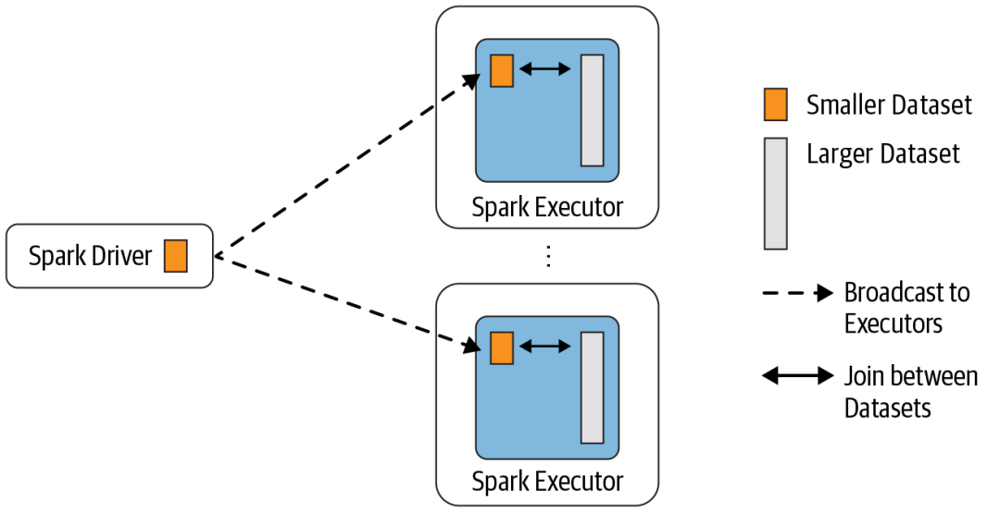
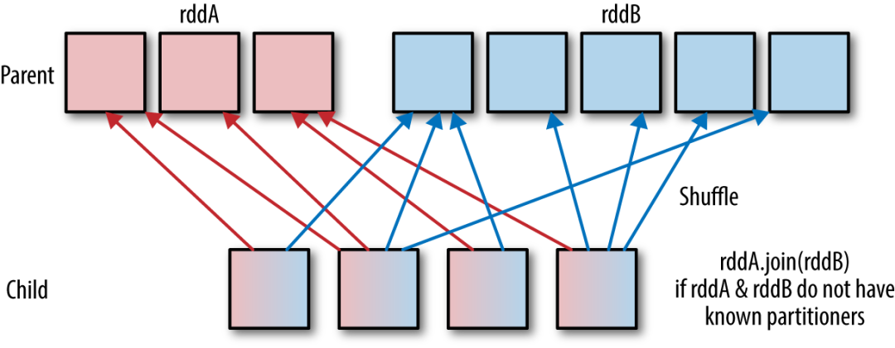
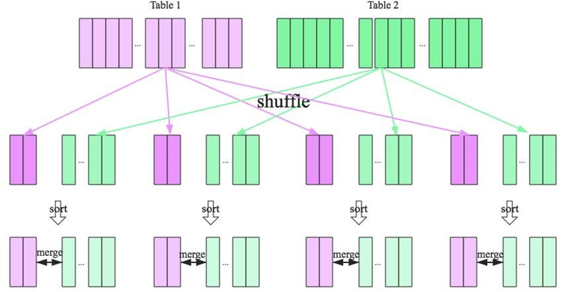

# 大数据开发-Spark Join原理详解

数据分析中将两个数据集进行 Join 操作是很常见的场景。在 Spark 的物理计划阶段，Spark 的 Join Selection 类会根
据 Join hints 策略、Join 表的大小、 Join 是等值 Join 还是不等值以及参与 Join 的 key 是否可以排序等条件来选择最
终的 Join 策略，最后 Spark 会利用选择好的 Join 策略执行最终的计算。当前 Spark 一共支持五种 Join 策略：

-   `Broadcast hash join (BHJ)`
-   `Shuffle hash join（SHJ）`
-   `Shuffle sort merge join (SMJ)`
-   `Shuffle-and-replicate nested loop join，又称笛卡尔积（Cartesian product join)`
-   `Broadcast nested loop join (BNLJ)`

其中 `BHJ `和 `SMJ `这两种 Join 策略是我们运行 Spark 作业最常见的。`JoinSelection `会先根据 `Join `的 Key 为等值 Join
来选择` Broadcast hash join`、`Shuffle hash join` 以及` Shuffle sort merge join` 中的一个；如果 Join 的 Key 为不等值
Join 或者没有指定 Join 条件，则会选择 `Broadcast nested loop join` 或 `Shuffle-and-replicate nested loop join`。
不同的 Join 策略在执行上效率差别很大，了解每种 Join 策略的执行过程和适用条件是很有必要的。

## 1、Broadcast Hash Join

`Broadcast Hash Join` 的实现是将小表的数据广播到 `Spark `所有的 `Executor `端，这个广播过程和我们自己去广播数
据没什么区别：

利用 collect 算子将小表的数据从 Executor 端拉到 Driver 端
在 Driver 端调用 sparkContext.broadcast 广播到所有 Executor 端
在 Executor 端使用广播的数据与大表进行 Join 操作（实际上是执行map操作）

这种 Join 策略避免了 Shuffle 操作。一般而言，Broadcast Hash Join 会比其他 Join 策略执行的要快。

使用这种 Join 策略必须满足以下条件：
小表的数据必须很小，可以通过 `spark.sql.autoBroadcastJoinThreshold `参数来配置，默认是 10MB
如果内存比较大，可以将阈值适当加大
将 `spark.sql.autoBroadcastJoinThreshold `参数设置为 -1，可以关闭这种连接方式
只能用于等值 Join，不要求参与 Join 的 keys 可排序

# 2、Shuffle Hash Join

当表中的数据比较大，又不适合使用广播，这个时候就可以考虑使用 `Shuffle Hash Join`。
`Shuffle Hash Join `同样是在大表和小表进行 Join 的时候选择的一种策略。它的计算思想是：把大表和小表按照相同
的分区算法和分区数进行分区（根据参与 Join 的 keys 进行分区），这样就保证了 hash 值一样的数据都分发到同一
个分区中，然后在同一个 Executor 中两张表 hash 值一样的分区就可以在本地进行 hash Join 了。在进行 Join 之
前，还会对小表的分区构建 Hash Map。`Shuffle hash join `利用了分治思想，把大问题拆解成小问题去解决。

要启用 `Shuffle Hash Join `必须满足以下条件：
仅支持等值 Join，不要求参与 Join 的 Keys 可排序
`spark.sql.join.preferSortMergeJoin` 参数必须设置为 false，参数是从 Spark 2.0.0 版本引入的，默认值为
true，也就是默认情况下选择 Sort Merge Join
小表的大小（`plan.stats.sizeInBytes`）必须小于 `spark.sql.autoBroadcastJoinThreshold` \*
`spark.sql.shuffle.partitions`（默认值200）
而且小表大小（stats.sizeInBytes）的三倍必须小于等于大表的大小（stats.sizeInBytes），也就是
`a.stats.sizeInBytes * 3 < = b.stats.sizeInBytes`

# 3、Shuffle Sort Merge Join

前面两种 Join 策略对表的大小都有条件的，如果参与 Join 的表都很大，这时候就得考虑用 Shuffle Sort Merge Join
了。
`Shuffle Sort Merge Join` 的实现思想：
将两张表按照 `join key` 进行`shuffle`，保证`join key`值相同的记录会被分在相应的分区
对每个分区内的数据进行排序
排序后再对相应的分区内的记录进行连接
无论分区有多大，`Sort Merge Join`都不用把一侧的数据全部加载到内存中，而是即用即丢；因为两个序列都有序。从
头遍历，碰到key相同的就输出，如果不同，左边小就继续取左边，反之取右边。从而大大提高了大数据量下`sql join`
的稳定性。

要启用 `Shuffle Sort Merge Join` 必须满足以下条件：

仅支持等值 `Join`，并且要求参与 `Join `的 Keys 可排序

# 4、Cartesian product join

如果 Spark 中两张参与 `Join `的表没指定连接条件，那么会产生 `Cartesian product join，`这个 Join 得到的结果其实

就是两张表行数的乘积。

# 5、Broadcast nested loop join

可以把 Broadcast nested loop join 的执行看做下面的计算：

`for record_1 in relation_1`:

`for record_2 in relation_2:`

`join condition is executed`

可以看出 Broadcast nested loop join 在某些情况会对某张表重复扫描多次，效率非常低下。从名字可以看出，这种

join 会根据相关条件对小表进行广播，以减少表的扫描次数。

`Broadcast nested loop join` 支持等值和不等值 Join，支持所有的 Join 类型。
