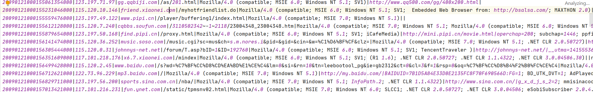
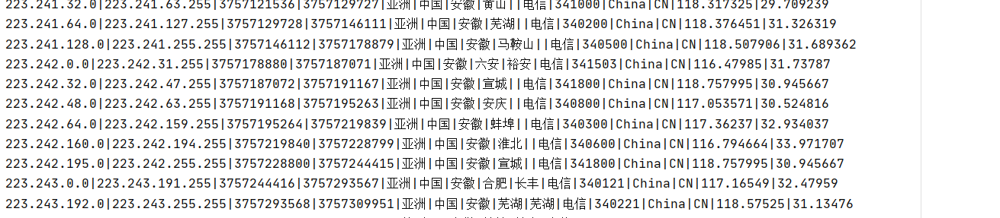
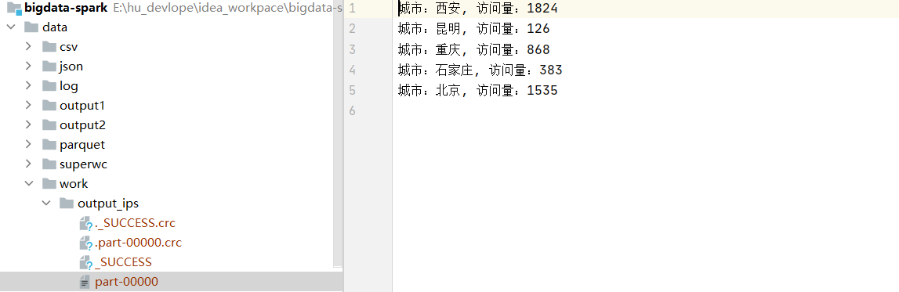
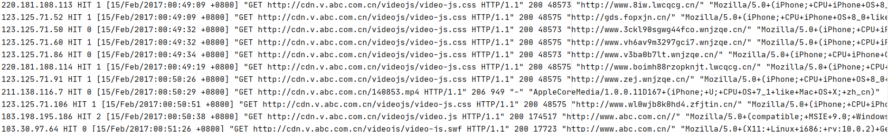
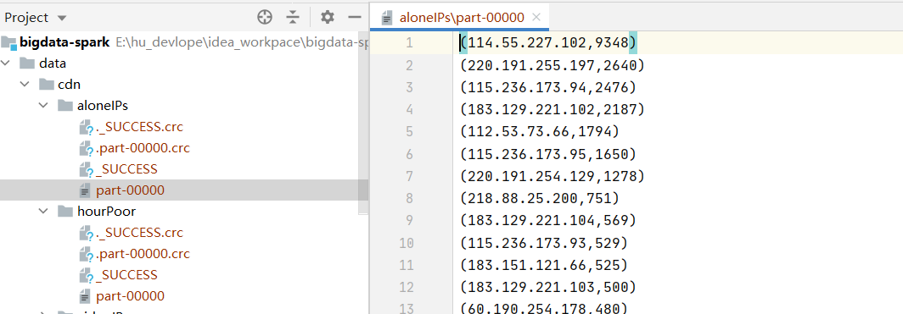
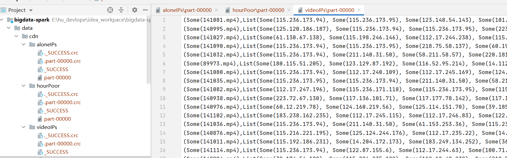
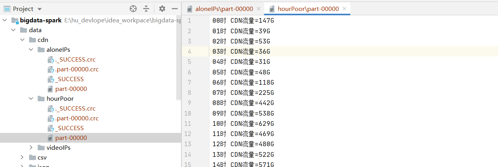
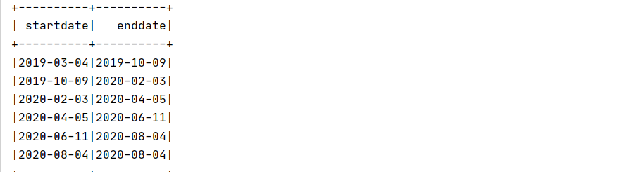

# 大数据开发-Spark-RDD实操案例-http日志分析

# 1.在生产环境下，如何处理配置文件 && 表的数据处理

配置文件，或者配置表，一般是放在在线db，比如mysql等关系型数据库，或者后台rd直接丢给你一份文件，数据量比起整个离线数据仓库的大表来说算很小，所以这种情况下，一般的做法是将小表，或者小文件广播出去，那么下面一个例子来看，广播表的使用解决ip地址映射问题

数据地址：链接：[https://pan.baidu.com/s/1FmFxSrPIynO3udernLU0yQ](https://pan.baidu.com/s/1FmFxSrPIynO3udernLU0yQ "https://pan.baidu.com/s/1FmFxSrPIynO3udernLU0yQ")提取码：hell

# 2.日志分析案例1

## 2.1 数据说明

**http.log**：

用户访问网站所产生的日志。日志格式为：时间戳、IP地址、访问网址、访问数据、浏览器信息等，样例如下：



**ip.dat**：ip段数据，记录着一些ip段范围对应的位置，总量大概在11万条，数据量也算很小的，样例如下



**文件位置**：data/http.log、data/ip.dat

链接：[https://pan.baidu.com/s/1FmFxSrPIynO3udernLU0yQ](https://pan.baidu.com/s/1FmFxSrPIynO3udernLU0yQ "https://pan.baidu.com/s/1FmFxSrPIynO3udernLU0yQ")提取码：hell

**要求**：将 http.log 文件中的 ip 转换为地址。如将 122.228.96.111 转为温州，并统计各城市的总访问量

## 2.2.实现思路和代码如下

有三个关键点，http.log的关键信息是ip地址，所以根据数据的精简原则，只读取ip即可，另外ip映射比对的时候 ，ip地址映射文件是排序的，所以为了提高查找效率，采用将ip地址转为long类型，然后再用二分法来查找，找到地址后映射为地址。

```scala
package com.hoult.work

import org.apache.spark.broadcast.Broadcast
import org.apache.spark.rdd.RDD
import org.apache.spark.sql.SparkSession

/**
 * 数据源：1.ip地址的访问日志 2.ip地址映射表
 * 需要把映射表广播，地址转换为long类型进行比较
 */
object FindIp {
  def main(args: Array[String]): Unit = {
    val spark = SparkSession
      .builder()
      .master("local[*]")
      .appName(this.getClass.getCanonicalName)
      .getOrCreate()
    val sc = spark.sparkContext

    import spark.implicits._
    val ipLogsRDD = sc.textFile("data/http.log")
      .map(_.split("\\|")(1))


    val ipInfoRDD = sc.textFile("data/ip.dat").map {
      case line: String => {
        val strSplit: Array[String] = line.split("\\|")
        Ip(strSplit(0), strSplit(1), strSplit(7))
      }
    }


    val brIPInfo = sc.broadcast(ipInfoRDD.map(x => (ip2Long(x.startIp), ip2Long(x.endIp), x.address))collect())

    //关联后的结果rdd
    ipLogsRDD
      .map(x => {
        val index  = binarySearch(brIPInfo.value, ip2Long(x))
        if (index != -1 )
          brIPInfo.value(index)._3
        else
          "NULL"
      }).map(x => (x, 1))
      .reduceByKey(_ + _)
      .map(x => s"城市：${x._1}, 访问量：${x._2}")
      .saveAsTextFile("data/work/output_ips")

  }

  //ip转成long类型
  def ip2Long(ip: String): Long = {
    val fragments = ip.split("[.]")
    var ipNum = 0L
    for (i <- 0 until fragments.length) {
      ipNum = fragments(i).toLong | ipNum << 8L
    }
    ipNum
  }

  //二分法匹配ip规则
  def binarySearch(lines: Array[(Long, Long, String)], ip: Long): Int = {
    var low = 0
    var high = lines.length - 1
    while (low <= high) {
      val middle = (low + high) / 2
      if ((ip >= lines(middle)._1) && (ip <= lines(middle)._2))
        return middle
      if (ip < lines(middle)._1)
        high = middle - 1
      else {
        low = middle + 1
      }
    }
    -1
  }

}

case class Ip(startIp: String, endIp: String, address: String)

```

**结果截图如下：**



# 3.日志分析案例2

## 3.1 数据说明

**日志格式**：IP命中率(Hit/Miss)响应时间请求时间请求方法请求URL请求协议状态码响应大小referer 用户代理

**日志文件位置**：data/cdn.txt

**数据case**:



**任务**：

2.1、计算独立IP数

2.2、统计每个视频独立IP数（视频的标志：在日志文件的某些可以找到 \*.mp4，代表一个视频文件）

2.3、统计一天中每个小时的流量

**分析**：刚开始去找格林时间的jod-time解析，找了一圈不知道该怎么写， 后面发现只需要小时即可，使用正则来提取, 注意在求video的访问ip时候，可以用`aggregateByKey`来提高性能

## 3.2 实现代码

```scala
package com.hoult.work

import org.apache.spark.rdd.RDD
import org.apache.spark.sql.SparkSession

/**
 * 读取日志表到rdd
 * 拿到需要的字段：ip, 访问时间：小时即可, 视频名video_name (url中的xx.mp4),
 * 分析：
 * 1.计算独立IP数
 * 2.统计每个视频独立IP数（视频的标志：在日志文件的某些可以找到 *.mp4，代表一个视频文件）
 * 3.统计一天中每个小时的流量
 */
object LogAnaylse {
  def main(args: Array[String]): Unit = {
    val spark = SparkSession
      .builder()
      .master("local[*]")
      .appName(this.getClass.getCanonicalName)
      .getOrCreate()
    val sc = spark.sparkContext


    val cdnRDD = sc.textFile("data/cdn.txt")

    //计算独立ips
//    aloneIPs(cdnRDD.repartition(1))

    //每个视频独立ip数
//    videoIPs(cdnRDD.repartition(1))

    //每小时流量
    hourPoor(cdnRDD.repartition(1))
  }


  /**
   * 独立ip数
   */
  def aloneIPs(cdnRDD: RDD[String]) = {
    //匹配ip地址
    val IPPattern = "((?:(?:25[0-5]|2[0-4]\\d|((1\\d{2})|([1-9]?\\d)))\\.){3}(?:25[0-5]|2[0-4]\\d|((1\\d{2})|([1-9]?\\d))))".r

    val ipnums = cdnRDD
      .flatMap(x => (IPPattern findFirstIn x))
      .map(y => (y,1))
      .reduceByKey(_+_)
      .sortBy(_._2,false)

    ipnums.saveAsTextFile("data/cdn/aloneIPs")
  }

  /**
   * 视频独立ip数
   */
  def videoIPs(cdnRDD: RDD[String]) = {
    //匹配 http 响应码和请求数据大小
    val httpSizePattern = ".*\\s(200|206|304)\\s([0-9]+)\\s.*".r


    //[15/Feb/2017:11:17:13 +0800]  匹配 2017:11 按每小时播放量统计
    val timePattern = ".*(2017):([0-9]{2}):[0-9]{2}:[0-9]{2}.*".r

    import scala.util.matching.Regex

    // Entering paste mode (ctrl-D to finish)

    def isMatch(pattern: Regex, str: String) = {
      str match {
        case pattern(_*) => true
        case _ => false
      }
    }

    def getTimeAndSize(line: String) = {
      var res = ("", 0L)
      try {
        val httpSizePattern(code, size) = line
        val timePattern(year, hour) = line
        res = (hour, size.toLong)
      } catch {
        case ex: Exception => ex.printStackTrace()
      }
      res
    }

    val IPPattern = "((?:(?:25[0-5]|2[0-4]\\d|((1\\d{2})|([1-9]?\\d)))\\.){3}(?:25[0-5]|2[0-4]\\d|((1\\d{2})|([1-9]?\\d))))".r

    val videoPattern = "([0-9]+).mp4".r

    val res = cdnRDD
      .filter(x => x.matches(".*([0-9]+)\\.mp4.*"))
      .map(x => (videoPattern findFirstIn x toString,IPPattern findFirstIn x toString))
      .aggregateByKey(List[String]())(
        (lst, str) => (lst :+ str),
        (lst1, lst2) => (lst1 ++ lst2)
      )
      .mapValues(_.distinct)
      .sortBy(_._2.size,false)

      res.saveAsTextFile("data/cdn/videoIPs")
  }

  /**
   * 一天中每个小时的流量
   *
   */
  def hourPoor(cdnRDD: RDD[String]) = {
    val httpSizePattern = ".*\\s(200|206|304)\\s([0-9]+)\\s.*".r
    val timePattern = ".*(2017):([0-9]{2}):[0-9]{2}:[0-9]{2}.*".r
    import scala.util.matching.Regex

    def isMatch(pattern: Regex, str: String) = {
      str match {
        case pattern(_*) => true
        case _ => false
      }
    }

    def getTimeAndSize(line: String) = {
      var res = ("", 0L)
      try {
        val httpSizePattern(code, size) = line
        val timePattern(year, hour) = line
        res = (hour, size.toLong)
      } catch {
        case ex: Exception => ex.printStackTrace()
      }
      res
    }

    cdnRDD
      .filter(x=>isMatch(httpSizePattern,x))
      .filter(x=>isMatch(timePattern,x))
      .map(x=>getTimeAndSize(x))
      .groupByKey()
      .map(x=>(x._1,x._2.sum))
      .sortByKey()
      .map(x=>x._1+"时 CDN流量="+x._2/(102424*1024)+"G")
      .saveAsTextFile("data/cdn/hourPoor")
  }
}

```

运行结果截图：







# 4. 广告曝光分析案例

假设点击日志文件(click.log)和曝光日志imp.log, 中每行记录格式如下

```scala
//点击日志
INFO 2019-09-01 00:29:53 requestURI:/click?app=1&p=1&adid=18005472&industry=469&adid=31
INFO 2019-09-01 00:30:31 requestURI:/click?app=2&p=1&adid=18005472&industry=469&adid=31
INFO 2019-09-01 00:31:03 requestURI:/click?app=1&p=1&adid=18005472&industry=469&adid=32
INFO 2019-09-01 00:31:51 requestURI:/click?app=1&p=1&adid=18005472&industry=469&adid=33

//曝光日志
INFO 2019-09-01 00:29:53 requestURI:/imp?app=1&p=1&adid=18005472&industry=469&adid=31
INFO 2019-09-01 00:29:53 requestURI:/imp?app=1&p=1&adid=18005472&industry=469&adid=31
INFO 2019-09-01 00:29:53 requestURI:/imp?app=1&p=1&adid=18005472&industry=469&adid=34 
```

用Spark-Core实现统计每个adid的曝光数与点击数，思路较简单，直接上代码

代码：

```scala
package com.hoult.work

import org.apache.spark.sql.SparkSession

object AddLog {
  def main(args: Array[String]): Unit = {
    val spark = SparkSession
      .builder()
      .master("local[*]")
      .appName(this.getClass.getCanonicalName)
      .getOrCreate()
    val sc = spark.sparkContext

    val clickRDD = sc.textFile("data/click.log")
    val impRDD = sc.textFile("data/imp.log")

    val clickRes = clickRDD.map{line => {
      val arr = line.split("\\s+")
      val adid = arr(3).substring(arr(3).lastIndexOf("=") + 1)
      (adid, 1)
    }}.reduceByKey(_ + _)

    val impRes = impRDD.map { line =>
      val arr = line.split("\\s+")
      val adid = arr(3).substring(arr(3).lastIndexOf("=") + 1)
      (adid, 1)
    }.reduceByKey(_ + _)

    //保存到hdfs
    clickRes.fullOuterJoin(impRes)
      .map(x => x._1 + "," + x._2._1.getOrElse(0) + "," + x._2._2.getOrElse(0))
      .repartition(1)
//      .saveAsTextFile("hdfs://linux121:9000/data/")
      .saveAsTextFile("data/add_log")

    sc.stop()
  }
}

```

分析：共有两次`shuffle`, `fulljon`可以修改为`union + reduceByKey`，将`shuffle`减少到一次

# 5.使用spark-sql完成下面的转换

A表有三个字段：ID、startdate、enddate，有3条数据：

1 2019-03-04 2020-02-03

2 2020-04-05 2020-08-04

3 2019-10-09 2020-06-11

写SQL（需要SQL和DSL）将以上数据变化为：

2019-03-04  2019-10-09

2019-10-09  2020-02-03

2020-02-03  2020-04-05

2020-04-05  2020-06-11

2020-06-11  2020-08-04

2020-08-04  2020-08-04

**分析**：观察，可以得到，第一列实际上是startdate 和 enddate两列叠加的结果，而第二列是下一个，可以用lead

窗口函数

**代码如下**：

```scala
package com.hoult.work

import org.apache.spark.sql.{DataFrame, SparkSession}

object DataExchange {
  def main(args: Array[String]): Unit = {
    val spark = SparkSession
      .builder()
      .appName("DateSort")
      .master("local[*]")
      .getOrCreate()
    spark.sparkContext.setLogLevel("warn")

    // 原数据
    val tab = List((1, "2019-03-04", "2020-02-03"),(2, "2020-04-05", "2020-08-04"),(3, "2019-10-09", "2020-06-11"))
    val df: DataFrame = spark.createDataFrame(tab).toDF("ID", "startdate", "enddate")

    val dateset: DataFrame = df.select("startdate").union(df.select("enddate"))
    dateset.createOrReplaceTempView("t")

    val result: DataFrame = spark.sql(
      """
        |select tmp.startdate, nvl(lead(tmp.startdate) over(partition by col order by tmp.startdate), startdate) enddate from
        |(select "1" col, startdate from t) tmp
        |""".stripMargin)

    result.show()
  }

}

```

**运行结果**：


