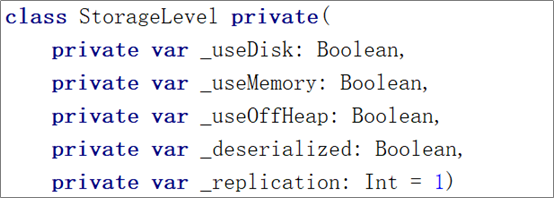
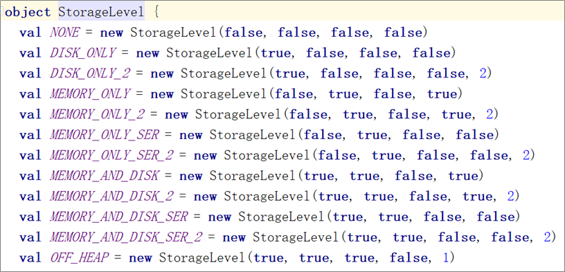
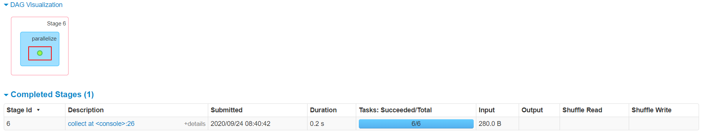

# 大数据开发-Spark-RDD的持久化和缓存

# 1.RDD缓存机制 cache, persist

Spark 速度非常快的一个原因是 RDD 支持缓存。成功缓存后，如果之后的操作使用到了该数据集，则直接从缓存中获取。虽然缓存也有丢失的风险，但是由于 RDD 之间的依赖关系，如果某个分区的缓存数据丢失，只需要重新计算该分区即可。

**涉及到的算子：persist、cache、unpersist；都是 Transformation**

缓存是将计算结果写入不同的介质，用户定义可定义存储级别（存储级别定义了缓存存储的介质，目前支持内存、堆
外内存、磁盘）；

> 🚴🏼‍♂️通过缓存，Spark避免了RDD上的重复计算，能够极大地提升计算速度；
> RDD持久化或缓存，是Spark最重要的特征之一。可以说，缓存是Spark构建迭代式算法和快速交互式查询的关键因
> 素；

> Spark速度非常快的原因之一，就是在内存中持久化（或缓存）一个数据集。当持久化一个RDD后，每一个节点都将
> 把计算的分片结果保存在内存中，并在对此数据集（或者衍生出的数据集）进行的其他动作（Action）中重用。这使
> 得后续的动作变得更加迅速；使用persist()方法对一个RDD标记为持久化。之所以说“标记为持久化”，是因为出现persist()语句的地方，并不会马
> 上计算生成RDD并把它持久化，而是要等到遇到第一个行动操作触发真正计算以后，才会把计算结果进行持久化；通过persist()或cache()方法可以标记一个要被持久化的RDD，持久化被触发，RDD将会被保留在计算节点的内存中
> 并重用；

什么时候缓存数据，需要对空间和速度进行权衡。一般情况下，如果多个动作需要用到某个 RDD，而它的计算代价
又很高，那么就应该把这个 RDD 缓存起来；

缓存有可能丢失，或者存储于内存的数据由于内存不足而被删除。RDD的缓存的容错机制保证了即使缓存丢失也能保
证计算的正确执行。通过基于RDD的一系列的转换，丢失的数据会被重算。RDD的各个Partition是相对独立的，因此
只需要计算丢失的部分即可，并不需要重算全部Partition。

> 启动堆外内存需要配置两个参数：
> \+ **spark.memory.offHeap.enabled** ：是否开启堆外内存，默认值为 false，需要设置为 true；
> \+ **spark.memory.offHeap.size** : 堆外内存空间的大小，默认值为 0，需要设置为正值。

### 1.1 缓存级别

Spark 速度非常快的一个原因是 RDD 支持缓存。成功缓存后，如果之后的操作使用到了该数据集，则直接从缓存中获取。虽然缓存也有丢失的风险，但是由于 RDD 之间的依赖关系，如果某个分区的缓存数据丢失，只需要重新计算该分区即可。





Spark 支持多种缓存级别 ：

| Storage Level（存储级别）                  | Meaning（含义）                                                                                         |
| ------------------------------------ | --------------------------------------------------------------------------------------------------- |
| `MEMORY_ONLY`                        | 默认的缓存级别，将 RDD 以反序列化的 Java 对象的形式存储在 JVM 中。如果内存空间不够，则部分分区数据将不再缓存。                                     |
| `MEMORY_AND_DISK`                    | 将 RDD 以反序列化的 Java 对象的形式存储 JVM 中。如果内存空间不够，将未缓存的分区数据存储到磁盘，在需要使用这些分区时从磁盘读取。                            |
| `MEMORY_ONLY_SER`                    | 将 RDD 以序列化的 Java 对象的形式进行存储（每个分区为一个 byte 数组）。这种方式比反序列化对象节省存储空间，但在读取时会增加 CPU 的计算负担。仅支持 Java 和 Scala 。 |
| `MEMORY_AND_DISK_SER`                | 类似于 `MEMORY_ONLY_SER`，但是溢出的分区数据会存储到磁盘，而不是在用到它们时重新计算。仅支持 Java 和 Scala。                               |
| `DISK_ONLY`                          | 只在磁盘上缓存 RDD                                                                                         |
| `MEMORY_ONLY_2`, `MEMORY_AND_DISK_2` | 与上面的对应级别功能相同，但是会为每个分区在集群中的两个节点上建立副本。                                                                |
| `OFF_HEAP`                           | 与 `MEMORY_ONLY_SER` 类似，但将数据存储在堆外内存中。这需要启用堆外内存。                                                      |

> 启动堆外内存需要配置两个参数：
> \+ **spark.memory.offHeap.enabled** ：是否开启堆外内存，默认值为 false，需要设置为 true；
> \+ **spark.memory.offHeap.size** : 堆外内存空间的大小，默认值为 0，需要设置为正值。

### 1.2 使用缓存

缓存数据的方法有两个：`persist` 和 `cache` 。`cache` 内部调用的也是 `persist`，它是 `persist` 的特殊化形式，等价于 `persist(StorageLevel.MEMORY_ONLY)`。示例如下：

```scala
// 所有存储级别均定义在 StorageLevel 对象中
fileRDD.persist(StorageLevel.MEMORY_AND_DISK)
fileRDD.cache()
```

被缓存的RDD在DAG图中有一个绿色的圆点。



### 1.3 移除缓存

Spark 会自动监视每个节点上的缓存使用情况，并按照最近最少使用（LRU）的规则删除旧数据分区。当然，你也可以使用 `RDD.unpersist()` 方法进行手动删除。

# 2.RDD容错机制Checkpoint

## 2.1 涉及到的算子：checkpoint；也是 Transformation

Spark中对于数据的保存除了持久化操作之外，还提供了检查点的机制；检查点本质是通过将RDD写入高可靠的磁盘，主要目的是为了容错。检查点通过将数据写入到HDFS文件系统实现了

RDD的检查点功能。Lineage过长会造成容错成本过高，这样就不如在中间阶段做检查点容错，如果之后有节点出现问题而丢失分区，从

做检查点的RDD开始重做Lineage，就会减少开销。

## 2.2 cache 和 checkpoint 区别

cache 和 checkpoint 是有显著区别的，缓存把 RDD 计算出来然后放在内存中，但是 RDD 的依赖链不能丢掉， 当某个点某个 executor 宕了，上面 cache 的RDD就会丢掉， 需要通过依赖链重放计算。不同的是，checkpoint 是把

RDD 保存在 HDFS中，是多副本可靠存储，此时依赖链可以丢掉，所以斩断了依赖链。

## 2.3 checkpoint适合场景

以下场景适合使用检查点机制：

1\) DAG中的Lineage过长，如果重算，则开销太大

2\) 在宽依赖上做 Checkpoint 获得的收益更大

与cache类似 checkpoint 也是 lazy 的。

```scala
val rdd1 = sc.parallelize(1 to 100000)
// 设置检查点目录

sc.setCheckpointDir("/tmp/checkpoint")

val rdd2 = rdd1.map(_*2)

rdd2.checkpoint

// checkpoint是lazy操作

rdd2.isCheckpointed

// checkpoint之前的rdd依赖关系

rdd2.dependencies(0).rdd

rdd2.dependencies(0).rdd.collect

// 执行一次action，触发checkpoint的执行

rdd2.count

rdd2.isCheckpointed

// 再次查看RDD的依赖关系。可以看到checkpoint后，RDD的lineage被截断，变成从checkpointRDD开始

rdd2.dependencies(0).rdd

rdd2.dependencies(0).rdd.collect

//查看RDD所依赖的checkpoint文件

rdd2.getCheckpointFile 
```

> 🐇备注：checkpoint的文件作业执行完毕后不会被删除
