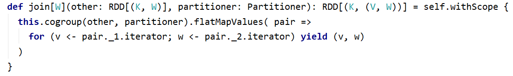

# 大数据开发-Spark-一文理解常见RDD

# 1.五个基本Properties

-   &#x20;A list of partitions
-   A function for computing each split
-   A list of dependencies on other RDDs
-   Optionally, a Partitioner for key-value RDDs (e.g. to say that the RDD is hash-partitioned)
-   Optionally, a list of preferred locations to compute each split on (e.g. block locations for an HDFS file)

这是RDD的源码中注释中写到的，下面介绍这五种特征属性

## 1.1 分区

一组分片（Partition），即数据集的基本组成单位。对于RDD来说，每个分片都会被一个计算任务处理，并决
定并行计算的粒度。用户可以在创建RDD时指定RDD的分片个数，如果没有指定，那么就会采用默认值

## 1.2 计算的函数

一个对分区数据进行计算的函数。Spark中RDD的计算是以分片为单位的，每个RDD都会实现 compute 函数以
达到该目的。compute函数会对迭代器进行组合，不需要保存每次计算的结果

## 1.3 依赖关系

RDD之间的存在依赖关系。RDD的每次转换都会生成一个新的RDD，RDD之间形成类似于流水线一样的前后依
赖关系（lineage）。在部分分区数据丢失时，Spark可以通过这个依赖关系重新计算丢失的分区数据，而不是
对RDD的所有分区进行重新计算

## 1.4 分区器

对于 `key-value` 的RDD而言，可能存在分区器（`Partitioner`）。Spark 实现了两种类型的分片函数，一个是基于
哈希的`HashPartitioner`，另外一个是基于范围的RangePartitioner。只有 key-value 的RDD，才可能有
`Partitioner`，非key-value的RDD的`Parititioner`的值是None。`Partitioner`函数决定了`RDD`本身的分片数量，也
决定了`parent RDD Shuffle`输出时的分片数量

## 1.5 优先存储位置

一个列表，存储存储每个`Partition`的优先位置（preferred location）。对于一个`HDFS`文件来说，这个列表保
存的就是每个`Partition`所在的块的位置。按照“移动数据不移动计算”的理念，`Spark`在任务调度的时候，会尽可
能地将计算任务分配到其所要处理数据块的存储位置

# 2. RDD转换之间的常见算子

从前面的`RDD`的基本特征入手，在工作中常编写的程序是，创建`RDD`，`RDD`的转换，`RDD`的算子的执行，创建对应着外部系统的数据流入Spark集群的必选步骤，至于之间从集合创建的数据，一般在测试时候使用，所以不细述，`RDD`的转换对应一个专门的算子叫`Transformation`其是惰性加载使用的, 而行动对应着触发`Transformation`执行的操作，一般是输出到集合，或者打印出来，或者返回一个值，另外就是从集群输出到别的系统，这有一个专业词叫`Action`.

## 2.1 常见转换算子

转换算子，即从一个RDD到另外一个RDD的转换操作，对应一些内置的Compute函数，但是这些函数被有没有shuffle来分为宽依赖算子和窄依赖算子

### 2.1.1 宽依赖和窄依赖的区别

一般网上文章有两种，一种是搬运定义的，即是否一个父`RDD`分区会被多个子分区依赖，另外一种是看有没有`Shuffle`，有`Shuffle`就是宽依赖，没有则是窄依赖，第一种还靠谱点，第二种就是拿本身来说本身，所以没有参考价值，2.1.3 如何区别宽依赖和窄依赖，可以之间看这个

### 2.1.2 宽依赖和窄依赖的常见算子

#### **窄依赖常见算子**

`map(func)`：对数据集中的每个元素都使用func，然后返回一个新的RDD
`filter(func)`：对数据集中的每个元素都使用func，然后返回一个包含使func为true的元素构成的RDD
`flatMap(func)`：与 map 类似，每个输入元素被映射为0或多个输出元素
`mapPartitions(func)`：和map很像，但是map是将func作用在每个元素上，而mapPartitions是func作用在整个分
区上。假设一个RDD有N个元素，M个分区（N >> M），那么map的函数将被调用N次，而mapPartitions中的函数
仅被调用M次，一次处理一个分区中的所有元素
`mapPartitionsWithIndex(func)`：与 mapPartitions 类似，多了分区的索引值的信息

`glom()`：将每一个分区形成一个数组，形成新的RDD类型 RDD\[Array\[T]]
`sample(withReplacement, fraction, seed)`：采样算子。以指定的随机种子(seed)随机抽样出数量为fraction的数
据，withReplacement表示是抽出的数据是否放回，true为有放回的抽样，false为无放回的抽样

`coalesce(numPartitions,false)`：无shuffle，一般用来减少分区

`union(otherRDD) `: 求两个RDD的并集

`cartesian(otherRDD)`：笛卡尔积

`zip(otherRDD)`：将两个RDD组合成 key-value 形式的RDD，默认两个RDD的partition数量以及元素数量都相同，否
则会抛出异常。

**map 与 mapPartitions 的区别**
`map`：每次处理一条数据
`mapPartitions`：每次处理一个分区的数据，分区的数据处理完成后，数据才能释放，资源不足时容易导致
OOM
**最佳实践**：当内存资源充足时，建议使用`mapPartitions`，以提高处理效率

#### **宽依赖常见算子**

`groupBy(func)`：按照传入函数的返回值进行分组。将key相同的值放入一个迭代器

`distinct([numTasks]))`：对RDD元素去重后，返回一个新的RDD。可传入numTasks参数改变RDD分区数

`coalesce(numPartitions, true)`：有shuffle，无论增加分区还是减少分区，一般用repartition来代替

`repartition(numPartitions)`：增加或减少分区数，有shuffle

`sortBy(func, [ascending], [numTasks])`：使用 func 对数据进行处理，对处理后的结果进行排序

`intersection(otherRDD) `: 求两个RDD的交集

`subtract (otherRDD) `: 求两个RDD的差集

### 2.1.3 如何区别宽依赖和窄依赖

`ShuffleDependency`和 `RangeDependency`如何区分，这里我建议理解不了的算子，直接从`Spark`的`history`的依赖图来看，有没有划分`Stage`,如果划分了就是宽依赖，没有划分就是窄依赖，当然这是实战派的做法，可以在同事或者同学说明问题的时候，`show your code` 给他，然后把依赖图拿给他 ,当然作为理论加实践的并行者，我这里再拿一种来判别，是从理解定义开始的，定义说是父RDD分区有没有被多个子分区依赖，那可以从这个角度想一下，父分区单个分区数据，有没有可能流向不同的子RDD的分区，比如想一想distinct算子，或者sortBy算子，全局去重和全局排序，假设刚开始1，2，3在一个分区，经过`map(x => (x, null)).reduceByKey((x, y) => x).map(_._1)` 去重后，虽然分区数量没有变，但是**每个分区数据必然要看别的分区的数据**，才能知道最后自己要不要保留，从输入分区，到输出分区，必然经过**汇合重组**，所以必然有`shuffle`的。`sortBy`同理，另外怎么查看依赖，

## 2.2 常见行动算子

Action触发Job。一个Spark程序(Driver程序)包含了多少 Action 算子，那么就有多少Job；
典型的Action算子: collect / count
collect() => sc.runJob() => ... => dagScheduler.runJob() => 触发了Job

`collect() / collectAsMap()
stats / count / mean / stdev / max / min
reduce(func) / fold(func) / aggregate(func)`

`first()`：Return the first element in this RDD
`take(n)`：Take the first num elements of the RDD
`top(n)`：按照默认（降序）或者指定的排序规则，返回前num个元素。
`takeSample(withReplacement, num, [seed])`：返回采样的数据
`foreach(func) / foreachPartition(func)`：与map、mapPartitions类似，区别是 foreach 是 Action
`saveAsTextFile(path) / saveAsSequenceFile(path) / saveAsObjectFile(path)`

`reduce(func)`：通过函数func聚集集合中的所有的元素。func函数接收2个同构的元素，返回一个值。这个函数必须是关联性的，确保可以被正确地并发执行。这个算子不像reduceByKey一样通过key进行分组，所以其是一个全量的操作.

`countByKey`：和`reduceByKey`效果相同，只是`reduceByKey`是一个`Transformation`算子

# 3. PairRDD常见操作

RDD整体上分为 Value 类型和 Key-Value 类型。
前面介绍的是 Value 类型的RDD的操作，实际使用更多的是 key-value 类型的RDD，也称为 PairRDD。
Value 类型RDD的操作基本集中在 RDD.scala 中；
key-value 类型的RDD操作集中在 PairRDDFunctions.scala 中；

前面介绍的大多数算子对 Pair RDD 都是有效的，RDD的值为key-value的时候即可隐式转换为PairRDD, Pair RDD还有属于自己的 Transformation、Action 算子；


## 3.1 常见PairRDD的Transformation操作

### 3.1.1 类似 map 操作

mapValues / flatMapValues / keys / values，这些操作都可以使用 map 操作实现，是简化操作。

### 3.1.2 聚合操作【重要、难点】

PariRDD(k, v)使用范围广，聚合
groupByKey / reduceByKey / foldByKey / aggregateByKey
combineByKey（OLD） / combineByKeyWithClassTag （NEW） => 底层实现
subtractByKey：类似于subtract，删掉 RDD 中键与 other RDD 中的键相同的元素

**结论**：效率相等用最熟悉的方法；groupByKey在一般情况下效率低，尽量少用

### 3.1.3 排序操作

sortByKey：sortByKey函数作用于PairRDD，对Key进行排序

### 3.1.4 join操作

cogroup / join / leftOuterJoin / rightOuterJoin / fullOuterJoin



```scala
val rdd1 = sc.makeRDD(Array((1,"Spark"), (2,"Hadoop"), (3,"Kylin"), (4,"Flink")))
val rdd2 = sc.makeRDD(Array((3,"李四"), (4,"王五"), (5,"赵六"), (6,"冯七")))
val rdd3 = rdd1.cogroup(rdd2)
rdd3.collect.foreach(println)
rdd3.filter{case (_, (v1, v2)) => v1.nonEmpty & v2.nonEmpty}.collect
// 仿照源码实现join操作
rdd3.flatMapValues( pair =>
for (v <- pair._1.iterator; w <- pair._2.iterator) yield (v, w)
)
val rdd1 = sc.makeRDD(Array(("1","Spark"),("2","Hadoop"),("3","Scala"),("4","Java")))
val rdd2 = sc.makeRDD(Array(("3","20K"),("4","18K"),("5","25K"),("6","10K")))
rdd1.join(rdd2).collect
rdd1.leftOuterJoin(rdd2).collect
rdd1.rightOuterJoin(rdd2).collect
rdd1.fullOuterJoin(rdd2).collect
```

### 3.1.5 Action操作

`collectAsMap / countByKey / lookup(key)`


`lookup(key)`：高效的查找方法，只查找对应分区的数据（如果RDD有分区器的话

## 4.寄语

实战出真知，想要某种实现的时候，假设恰好你想到某个算子，那么去使用它，不懂的地方看源码，大业可成！
