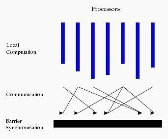
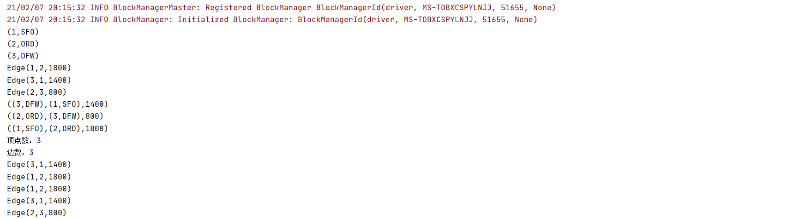

# 大数据开发-Spark-初识Spark-Graph && 快速入门

# 1.Spark Graph简介

GraphX 是 Spark 一个组件，专门用来表示图以及进行图的并行计算。GraphX 通过重新定义了图的抽象概念来拓展了 RDD： 定向多图，其属性附加到每个顶点和边。为了支持图计算， GraphX 公开了一系列基本运算符（比如：mapVertices、mapEdges、subgraph）以及优化后的 Pregel API 变种。此外，还包含越来越多的图算法和构建器，以简化图形分析任务。GraphX在图顶点信息和边信息存储上做了优化，使得图计算框架性能相对于原生RDD实现得以较大提升，接近或到达 GraphLab 等专业图计算平台的性能。GraphX最大的贡献是，在Spark之上提供一栈式数据解决方案，可以方便且高效地完成图计算的一整套流水作业。

**图计算的模式**：

基本图计算是基于BSP的模式，BSP即整体同步并行，它将计算分成一系列超步的迭代。从纵向上看，它是一个串行模式，而从横向上看，它是一个并行的模式，每两个超步之间设置一个栅栏（barrier），即整体同步点，确定所有并行的计算都完成后再启动下一轮超步。

每一个超步包含三部分内容：
**计算compute**：每一个processor利用上一个超步传过来的消息和本地的数据进行本地计算
**消息传递**：每一个processor计算完毕后，将消息传递个与之关联的其它processors
**整体同步点**：用于整体同步，确定所有的计算和消息传递都进行完毕后，进入下一个超步



# 2.来看一个例子

**图描述**

```powershell
## 顶点数据
1, "SFO"
2, "ORD"
3, "DFW"
## 边数据
1, 2,1800
2, 3, 800
3, 1, 1400
```

计算所有的顶点，所有的边，所有的triplets,顶点数，边数，顶点距离大于1000的有那几个，按顶点的距离排序，降序输出

**代码实现**

```scala
package com.hoult.Streaming.work

import org.apache.spark.{SparkConf, SparkContext}
import org.apache.spark.graphx.{Edge, Graph, VertexId}
import org.apache.spark.rdd.RDD

object GraphDemo {
  def main(args: Array[String]): Unit = {
    // 初始化
    val conf = new SparkConf().setAppName(this.getClass.getCanonicalName.init).setMaster("local[*]")
    val sc = new SparkContext(conf)
    sc.setLogLevel("warn")

    //初始化数据
    val vertexArray: Array[(Long, String)] = Array((1L, "SFO"), (2L, "ORD"), (3L, "DFW"))
    val edgeArray: Array[Edge[Int]] = Array(
      Edge(1L, 2L, 1800),
      Edge(2L, 3L, 800),
      Edge(3L, 1L, 1400)
    )

    //构造vertexRDD和edgeRDD
    val vertexRDD: RDD[(VertexId, String)] = sc.makeRDD(vertexArray)
    val edgeRDD: RDD[Edge[Int]] = sc.makeRDD(edgeArray)

    //构造图
    val graph: Graph[String, Int] = Graph(vertexRDD, edgeRDD)

    //所有的顶点
    graph.vertices.foreach(println)

    //所有的边
    graph.edges.foreach(println)

    //所有的triplets
    graph.triplets.foreach(println)

    //求顶点数
    val vertexCnt = graph.vertices.count()
    println(s"顶点数：$vertexCnt")

    //求边数
    val edgeCnt = graph.edges.count()
    println(s"边数：$edgeCnt")

    //机场距离大于1000的
    graph.edges.filter(_.attr > 1000).foreach(println)

    //按所有机场之间的距离排序（降序）
    graph.edges.sortBy(-_.attr).collect().foreach(println)
  }
}

```

**输出结果**



# 3.图的一些相关知识

例子是demo级别的，实际生产环境下，如果使用到必然比这个复杂很多，但是总的来说，一定场景才会使用到吧，要注意图计算情况下，要注意缓存数据，RDD默认不存储于内存中，所以可以尽量使用显示缓存，迭代计算中，为了获得最佳性能，也可能需要取消缓存。默认情况下，缓存的RDD和图保存在内存中，直到内存压力迫使它们按照LRU【最近最少使用页面交换算法】逐渐从内存中移除。对于迭代计算，先前的中间结果将填满内存。经过它们最终被移除内存，但存储在内存中的不必要数据将减慢垃圾回收速度。因此，一旦不再需要中间结果，取消缓存中间结果将更加有效。这涉及在每次迭代中实现缓存图或RDD，取消缓存其他所有数据集，并仅在以后的迭代中使用实现的数据集。但是，由于图是有多个RDD组成的，因此很难正确地取消持久化。对于迭代计算，建议使用Pregel API，它可以正确地保留中间结果。
