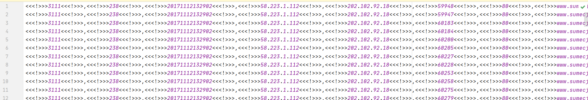
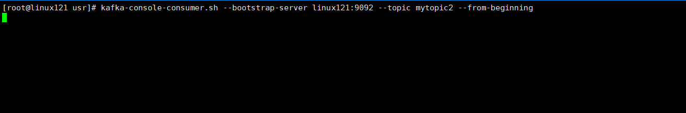
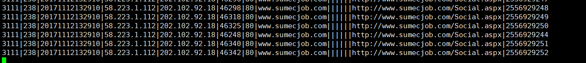

# 大数据开发-Spark-开发Streaming处理数据 && 写入Kafka

## 1.Spark Streaming简介

Spark Streaming从各种输入源中读取数据，并把数据分组为小的批次。新的批次按均匀的时间间隔创建出来。在每个时间区间开始的时候，一个新的批次就创建出来，在该区间内收到的数据都会被添加到这个批次中。在时间区间结束时，批次停止增长，时间区间的大小是由批次间隔这个参数决定的。批次间隔一般设在500毫秒到几秒之间，由开发者配置。每个输入批次都形成一个RDD，以 Spark 作业的方式处理并生成其他的 RDD。 处理的结果可以以批处理的方式传给外部系统，Spark Streaming的编程抽象是离散化流，也就是DStream。它是一个 RDD 序列，每个RDD代表数据流中一个时间片内的数据。另外加入了窗口操作和状态转化，其他和批次处理类似。

**与StructedStreaming的区别**

StructedStreaming诞生于2.x后，主要用于处理结构化数据，除了实现与Spark Streaming的批处理，还实现了long-running的task，主要理解为处理的时机可以是数据的生产时间，而非收到数据的时间，可以细看下表：

| 流处理模式          | SparkStreaming                              | Structed Streaming                |
| -------------- | ------------------------------------------- | --------------------------------- |
| 执行模式           | Micro Batch                                 | Micro batch / Streaming           |
| API            | Dstream/streamingContext                    | Dataset/DataFrame,SparkSession    |
| Job 生成方式       | Timer定时器定时生成job                             | Trigger触发                         |
| 支持数据源          | Socket,filstream,kafka,zeroMq,flume,kinesis | Socket,filstream,kafka,ratesource |
| executed-based | Executed based on dstream api               | Executed based on sparksql        |
| Time based     | Processing Time                             | ProcessingTime & eventTIme        |
| UI             | Built-in                                    | No                                |
|                |                                             |                                   |

对于流处理，现在生产环境下使用Flink较多，数据源方式，现在基本是以kafka为主，所以本文对Spark Streaming的场景即ETL流处理结构化日志，将结果输入Kafka队列

# 2.Spark Sreaming的运行流程

1、客户端提交Spark Streaming作业后启动Driver，Driver启动Receiver，Receiver接收数据源的数据

2、每个作业包含多个Executor，每个Executor以线程的方式运行task，SparkStreaming至少包含一个receiver task（一般情况下）

3、Receiver接收数据后生成Block，并把BlockId汇报给Driver，然后备份到另外一个 Executor 上

4、ReceiverTracker维护 Reciver 汇报的BlockId

5、Driver定时启动JobGenerator，根据Dstream的关系生成逻辑RDD，然后创建Jobset，交给JobScheduler

6、JobScheduler负责调度Jobset，交给DAGScheduler，DAGScheduler根据逻辑RDD，生成相应的Stages，每个stage包含一到多个Task，将TaskSet提交给TaskSchedule

7、TaskScheduler负责把 Task 调度到 Executor 上，并维护 Task 的运行状态

**常用数据源的读取方式**

常数据流：

```scala
    val rdd: RDD[String] = ssc.sparkContext.makeRDD(strArray)
    val wordDStream: ConstantInputDStream[String] = new ConstantInputDStream(ssc, rdd)
```

Socket:

```scala
    val rdd: RDD[String] = ssc.sparkContext.makeRDD(strArray)
    val wordDStream: ConstantInputDStream[String] = new ConstantInputDStream(ssc, rdd)
```

RDD队列：

```scala
    val queue = new Queue[RDD[Int]]()
    val queueDStream: InputDStream[Int] = ssc.queueStream(queue)
```

文件夹：

```scala
    val lines: DStream[String] = ssc.textFileStream("data/log/")

```

# 3.案例说明

生产上，常用流程如下，批处理原始Kafka日志，比如请求打点日志等，使用Spark Streaming来将数据清洗转变为一定格式再导入Kafka中,为了保证exact-once，会将offer自己来保存，主要保存在redis-offset中

数据地址：链接：[https://pan.baidu.com/s/1FmFxSrPIynO3udernLU0yQ](https://pan.baidu.com/s/1FmFxSrPIynO3udernLU0yQ "https://pan.baidu.com/s/1FmFxSrPIynO3udernLU0yQ")提取码：hell

# 3.1 原始Kafka日志

sample.log格式如下：



我们将它先放到文件里，模拟生产环境下xx.log

# 3.2 创建两个topic，并创建KafkaProducer来嫁给你数据写入mytopic1

一个用来放原始的日志数据，一个用来放处理过后的日志

```markdown
kafka-topics.sh --zookeeper localhost:2181/myKafka --create --topic mytopic1 --partitions 1 --replication-factor 1
kafka-topics.sh --zookeeper localhost:2181/myKafka --create --topic mytopic2 --partitions 1 --replication-factor 1  
```

启动redis服务：

```markdown
./redis-server redis.conf
```

查看mytopic1数据

```markdown
kafka-console-consumer.sh --bootstrap-server linux121:9092 --topic mytopic1 --from-beginning
```

# 3.3 代码实现

**第一部分，处理原始文件数据写入mytopic1**

```markdown
package com.hoult.Streaming.work

import java.util.Properties

import org.apache.kafka.clients.producer.{KafkaProducer, ProducerConfig, ProducerRecord}
import org.apache.kafka.common.serialization.StringSerializer
import org.apache.log4j.{Level, Logger}
import org.apache.spark.rdd.RDD
import org.apache.spark.{SparkConf, SparkContext}

object FilerToKafka {
  def main(args: Array[String]): Unit = {
    Logger.getLogger("org").setLevel(Level.ERROR)
    val conf = new SparkConf().setAppName(this.getClass.getCanonicalName.init).setMaster("local[*]")
    val sc = new SparkContext(conf)

    // 定义 kafka producer参数
    val lines: RDD[String] = sc.textFile("data/sample.log")

    // 定义 kafka producer参数
    val prop = new Properties()
    prop.put(ProducerConfig.BOOTSTRAP_SERVERS_CONFIG, "linux121:9092")
    prop.put(ProducerConfig.KEY_SERIALIZER_CLASS_CONFIG, classOf[StringSerializer])
    prop.put(ProducerConfig.VALUE_SERIALIZER_CLASS_CONFIG, classOf[StringSerializer])

    // 将读取到的数据发送到mytopic1
    lines.foreachPartition{iter =>
      // KafkaProducer
      val producer = new KafkaProducer[String, String](prop)
      iter.foreach{line =>
        val record = new ProducerRecord[String, String]("mytopic1", line)
        producer.send(record)
      }
      producer.close()
    }
  }
}

```

**第二部分，streaming读取mytopic1的数据，写入mytopic2**

```markdown
package com.hoult.Streaming.work

import java.util.Properties

import com.hoult.Streaming.kafka.OffsetsWithRedisUtils
import org.apache.kafka.clients.consumer.{ConsumerConfig, ConsumerRecord}
import org.apache.kafka.clients.producer.{KafkaProducer, ProducerConfig, ProducerRecord}
import org.apache.kafka.common.serialization.{StringDeserializer, StringSerializer}
import org.apache.log4j.{Level, Logger}
import org.apache.spark.SparkConf
import org.apache.spark.streaming.dstream.InputDStream
import org.apache.spark.streaming.kafka010.{ConsumerStrategies, HasOffsetRanges, KafkaUtils, LocationStrategies, OffsetRange}
import org.apache.spark.streaming.{Seconds, StreamingContext}


/**
 * 每秒处理Kafka数据，生成结构化数据，输入另外一个Kafka topic
 */
object KafkaStreamingETL {
  val log = Logger.getLogger(this.getClass)

  def main(args: Array[String]): Unit = {
    Logger.getLogger("org").setLevel(Level.ERROR)
    val conf = new SparkConf().setAppName(this.getClass.getCanonicalName).setMaster("local[*]")
    val ssc = new StreamingContext(conf, Seconds(5))

    // 需要消费的topic
    val topics: Array[String] = Array("mytopic1")
    val groupid = "mygroup1"
    // 定义kafka相关参数
    val kafkaParams: Map[String, Object] = getKafkaConsumerParameters(groupid)
    // 从Redis获取offset
    val fromOffsets = OffsetsWithRedisUtils.getOffsetsFromRedis(topics, groupid)

    // 创建DStream
    val dstream: InputDStream[ConsumerRecord[String, String]] = KafkaUtils.createDirectStream(
      ssc,
      LocationStrategies.PreferConsistent,
      // 从kafka中读取数据
      ConsumerStrategies.Subscribe[String, String](topics, kafkaParams, fromOffsets)
    )

    // 转换后的数据发送到另一个topic
    dstream.foreachRDD{rdd =>
      if (!rdd.isEmpty) {
        val offsetRanges: Array[OffsetRange] = rdd.asInstanceOf[HasOffsetRanges].offsetRanges
        rdd.foreachPartition(process)
        // 将offset保存到Redis
        OffsetsWithRedisUtils.saveOffsetsToRedis(offsetRanges, groupid)
      }
    }

    // 启动作业
    ssc.start()
    ssc.awaitTermination()
  }

  def process(iter: Iterator[ConsumerRecord[String, String]]) = {
    iter.map(line => parse(line.value))
      .filter(!_.isEmpty)
//      .foreach(println)
      .foreach(line =>sendMsg2Topic(line, "mytopic2"))
  }

  def parse(text: String): String = {
    try{
      val arr = text.replace("<<<!>>>", "").split(",")
      if (arr.length != 15) return ""
      arr.mkString("|")
    } catch {
      case e: Exception =>
        log.error("解析数据出错！", e)
        ""
    }
  }

  def getKafkaConsumerParameters(groupid: String): Map[String, Object] = {
    Map[String, Object](
      ConsumerConfig.BOOTSTRAP_SERVERS_CONFIG -> "linux121:9092",
      ConsumerConfig.KEY_DESERIALIZER_CLASS_CONFIG -> classOf[StringDeserializer],
      ConsumerConfig.VALUE_DESERIALIZER_CLASS_CONFIG -> classOf[StringDeserializer],
      ConsumerConfig.GROUP_ID_CONFIG -> groupid,
      ConsumerConfig.ENABLE_AUTO_COMMIT_CONFIG -> (false: java.lang.Boolean),
      ConsumerConfig.AUTO_OFFSET_RESET_CONFIG -> "earliest"
    )
  }

  def getKafkaProducerParameters(): Properties = {
    val prop = new Properties()
    prop.put(ProducerConfig.BOOTSTRAP_SERVERS_CONFIG, "linux121:9092")
    prop.put(ProducerConfig.KEY_SERIALIZER_CLASS_CONFIG, classOf[StringSerializer])
    prop.put(ProducerConfig.VALUE_SERIALIZER_CLASS_CONFIG, classOf[StringSerializer])
    prop
  }

  def sendMsg2Topic(msg: String, topic: String): Unit = {
    val producer = new KafkaProducer[String, String](getKafkaProducerParameters())
    val record = new ProducerRecord[String, String](topic, msg)
    producer.send(record)
  }
}

```

**第三部分，从redis中读写offset的工具**

```markdown
package com.hoult.Streaming.kafka

import java.util

import org.apache.kafka.common.TopicPartition
import org.apache.spark.streaming.kafka010.OffsetRange
import redis.clients.jedis.{Jedis, JedisPool, JedisPoolConfig}

import scala.collection.mutable

object OffsetsWithRedisUtils {
  // 定义Redis参数
  private val redisHost = "linux121"
  private val redisPort = 6379

  // 获取Redis的连接
  private val config = new JedisPoolConfig
  // 最大空闲数
  config.setMaxIdle(5)
  // 最大连接数
  config.setMaxTotal(10)

  private val pool = new JedisPool(config, redisHost, redisPort, 10000)
  private def getRedisConnection: Jedis = pool.getResource

  private val topicPrefix = "kafka:topic"

  // Key：kafka:topic:TopicName:groupid
  private def getKey(topic: String, groupid: String) = s"$topicPrefix:$topic:$groupid"

  // 根据 key 获取offsets
  def getOffsetsFromRedis(topics: Array[String], groupId: String): Map[TopicPartition, Long] = {
    val jedis: Jedis = getRedisConnection

    val offsets: Array[mutable.Map[TopicPartition, Long]] = topics.map { topic =>
      val key = getKey(topic, groupId)

      import scala.collection.JavaConverters._

      jedis.hgetAll(key)
        .asScala
        .map { case (partition, offset) => new TopicPartition(topic, partition.toInt) -> offset.toLong }
    }

    // 归还资源
    jedis.close()

    offsets.flatten.toMap
  }

  // 将offsets保存到Redis中
  def saveOffsetsToRedis(offsets: Array[OffsetRange], groupId: String): Unit = {
    // 获取连接
    val jedis: Jedis = getRedisConnection

    // 组织数据
    offsets.map{range => (range.topic, (range.partition.toString, range.untilOffset.toString))}
        .groupBy(_._1)
      .foreach{case (topic, buffer) =>
        val key: String = getKey(topic, groupId)

        import scala.collection.JavaConverters._
        val maps: util.Map[String, String] = buffer.map(_._2).toMap.asJava

        // 保存数据
        jedis.hmset(key, maps)
      }

    jedis.close()
  }

  def main(args: Array[String]): Unit = {
    val topics = Array("mytopic1")
    val groupid = "mygroup1"
    val x: Map[TopicPartition, Long] = getOffsetsFromRedis(topics, groupid)
    x.foreach(println)
  }
}

```

# 3.4 演示

-   启动redis `./redis-server ./redis.conf`
-   启动kafka并创建topic `sh scripts/kafka.sh start` 3.2 创建两个topic，并创建KafkaProducer来嫁给你数据写入mytopic1
-   启动FilerToKafka 和 KafkaStreamingETL





**完整代码**：[https://github.com/hulichao/bigdata-spark/blob/master/src/main/scala/com/hoult/Streaming/work](https://github.com/hulichao/bigdata-spark/blob/master/src/main/scala/com/hoult/work/KNNDemo.scala "https://github.com/hulichao/bigdata-spark/blob/master/src/main/scala/com/hoult/Streaming/work")

# 4.spark-streamin注意事项

spark-streaming读文件读不到的问题 ，读取本地文件时候，要注意，它不会读取原本就存在于该文件里的文本，只会读取在监听期间，传进文件夹里的数据，而且本文本还有要求，必须是它组后一次更改并且保存的操作，是在监听开始的那一刻
之后的，其实意思就是，如果要向被监听的文件夹里传一个文本，你就要在监听开始之后，先打开这个文本，随便输入几个空格，或者回车，或者其他不影响文本内容的操作，然后保存，最后再传进文件夹里，这样它才能
检测到这个被传进来的文本。（估计它这个用意是只监听被更改过的文本吧)，参考：[https://www.codeleading.com/article/9561702251/](https://www.codeleading.com/article/9561702251/ "https://www.codeleading.com/article/9561702251/")&#x20;
