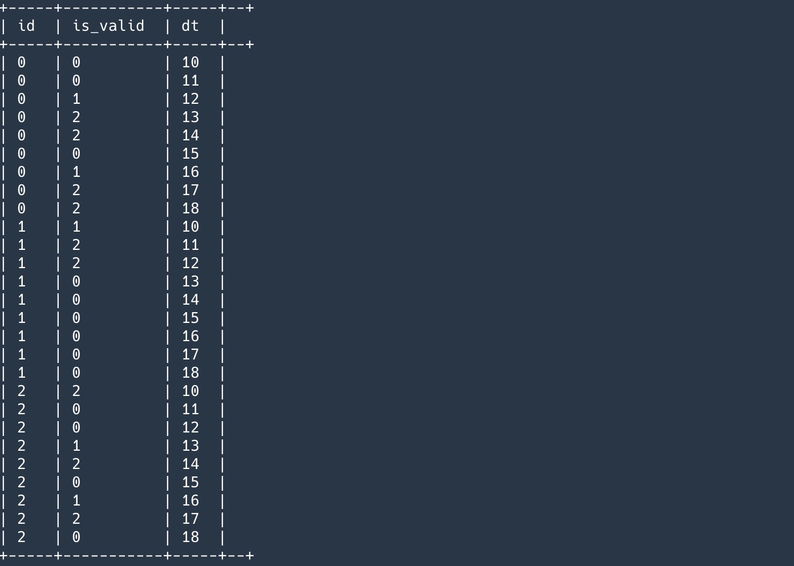

# 大数据开发-Sql-涉及迭代数据的sql问题处理思路

在前面一篇里面，[算法-一个经典sql 题和一个Java算法题](<算法-一个经典sql 题和一个Java算法题_u936wfKDsbMS9ghFBs3UuD.md> "算法-一个经典sql 题和一个Java算法题") [大数据开发-Hive-常用日期函数&&日期连续题sql套路](大数据开发-Hive-常用日期函数&&日期连续题sql套路_mRV4MJJKiR7GbzQU2VbSdS.md "大数据开发-Hive-常用日期函数&&日期连续题sql套路")有一道经典sql题目，解决连续问题，本文继续总结关于连续性的套路，来自于实际生产项目的问题，本文略去其他不重要信息字段，来从更深地层次解决问题，由于在生产中，常常是理解需求，转换需求，让需求拆解为更通用的处理方式，同时从解决难题中提高自己，解决这些问题，也是快乐的源泉之一😀。

# 1.生产问题原始描述

关于给用户打标签的问题，对于标签的数据源在实际环境下几乎是覆盖全部门甚至全公司的，有的数据源本身是明细方式，有的是原始ods日志方式，有的是维度表，有的是名单表，对于需求方来说要的是快速迭代上线标签，看需求或者数据仓库划分或者处理麻烦程度，往往会采用不同的处理方式，另外对于标签的应用方来说一定会有人查值，值查人，资产分析等，本文的例子就一个名单表，什么是名单表呢，就是圈客的结果，比如满足某条件某条件的一堆id，标签天然就是为满足圈客用的，但是原始数据它是圈客的结果，所以同时为了使得标签在业务方使用起来更方便，所以把名单表加工成标签，那么需求就确定了，从名单表里面加工出标签。

原始表如下

```javascript
# id  dt
1   10
2   10
2   11
3    11
```

解释，为了说明更简单，假设日期类型都用数字来表示，每天会有一群去重id，下一天的id更这一天的id必然是两个交叉圆的形式，即既有多出来的，又有少出来的，又有重叠的。

现在需求就是，

我要筛选任意时间段的用户，满足是这段时间首次有效，或者无效，或者存量有效，分别对应描述里面的多出来，少了重合的每天

至于有效的定义就是，前一天名单没有这个id，下一天有这个id，这就是首次有效，但是对于名单这种数据来说，一定会有有效，无效，有效，无效，这种,所以标签的每天分片里面会有昨天的id加今天的id.

# 2.生产问题分析拆解

针对上面分析到的问题，有效无效这种状态不能是最近一次，或者首次的有效，因为会有区段的概念，比如某历史一段时间，只要首次出现在这段时间的，而且多天重合的。所以针对这个问题，我这边处理成每天相对于前一天的有效状态，分别为0，1，2，也即对应无效，首次有效，存量有效，另外对应每一段的信息。

所以这样问题就化解为，先求有效状态，然后再在有效状态的基础上，加工出最早时间和最晚时间，为了筛选方便，我另外加工出两个冗余子属性字段，是否首次有效和是否当前有效,对于有效无效，如果用窗口函数，找到同一个id的前一个日期，如果是日期的前一天，即表示2，存量有效，如果不为前一天则为增量有效，但是这种方式没法把无效的取出来，所以我后面想到的是用full join来实现，这样即可以把前一天后一天的数据都拿到。

# 3.问题解决

```sql
-- 对于有效无效的加工
with t3 as (
select id,dt,CASE
                  WHEN a.did IS NOT NULL
                          AND b.did IS NULL THEN 1
                       WHEN a.did IS NULL
                           AND b.did IS NOT NULL THEN 0
                     WHEN a.did IS NOT NULL
                           AND b.did IS NOT NULL THEN 2
                           end as is_valid
 from t1 a full join b on a.id = b.id
 )

-- 最早时间12，最晚时间14，是否首次有效，是否当前有效
select id,min(dt) as min_dt,max(dt) as max_dt, gid from (
select id,dt,is_valid, (dt - row_number() over (partition by id order by dt)) gid from t3 where is_valid != 0
) tmp group by id,gid
```

# 4.总结套路

## 4.1.首先思考可以用到的日期函数

datediff, date\_sub/date\_add

## 4.2.连续日期

连续问题都会用到一个排名函数，但是排名函数的值是数值，要与日期的连续性做到映射，才方便分组，比如可以把日期映射到连续数字，或者数字映射到连续日期，实现这两个的操作就是通过前面的datedff 和 date\_sub组合，原理就是日期与日期相减即可得到连续整数，整数随便与某个日期做相减即可得到连续的日期,其中date\_sub可以是反向排序得到连续日期。

## 4.3.通过连续的排序日期或者排序id相减，然后分组gid

即可解决此类问题

求连续状态时间的开始和结束时间

## 4.4 对于特殊问题，比如想知道前后分区的数据

现有方式，一种是lag和lead窗口函数，另外一种是自表关联，效率应该窗口函数高一点，基于本题，由于名单表的特殊原因，如果再给全量id打标签，这样结果分区的数据和原分区的数据不同，是加上了前一天失效的用户，所以用的自表fulljoin关联。



