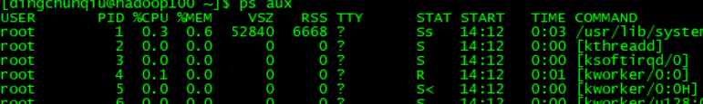

# 大数据开发-linux下常见问题详解

# 1.user ss is currently user by process 3234

问题原因：root --> ss --> root 栈递归一样

解决方式：exit 退出当前到ss再退出到root 然后执行命令即可。

# 2.列出某目录下的目录而不是文件

参考：ls --[https://jingyan.baidu.com/article/e8cdb32b100dd537052badc5.html](https://jingyan.baidu.com/article/e8cdb32b100dd537052badc5.html "https://jingyan.baidu.com/article/e8cdb32b100dd537052badc5.html")

# 3.登录用户与当前用户

whoami 当前用户

who am i 登录用户

其中有root权限才可以对一些非自己创建目录默认写权限，比如登录 root用户 切换到普通hu用户，则不能写/opt下面文件夹，也不能写/home/huhu下面的东西，实际上进不去，读权限都没有。

综上，普通用户只能在/home/当前用户文件夹下面写东西。

# 4.ll 后面的几个参数的意义

其中链接数是怎么算的：

对于文件来说 就是1

对于目录来说，空目录是2，里面有别的文件夹则加1，有别的文件不加，简单来说就是里面的目录数。

# [5.ps](http://5.ps "5.ps") -aux 每一列字段代表的含义

ps –aux          （功能描述：查看系统中所有进程）

USER：该进程是由哪个用户产生的

PID：进程的ID号

%CPU：该进程占用CPU资源的百分比，占用越高，进程越耗费资源；

%MEM：该进程占用物理内存的百分比，占用越高，进程越耗费资源；

VSZ：该进程占用虚拟内存的大小，单位KB；

RSS：该进程占用实际物理内存的大小，单位KB；

TTY：该进程是在哪个终端中运行的。其中tty1-tty7代表本地控制台终端，tty1-tty6是本地的字符界面终端，tty7是图形终端。pts/0-255代表虚拟终端。

STAT：进程状态。常见的状态有：R：运行、S：睡眠、T：停止状态、s：包含子进程、+：位于后台

START：该进程的启动时间

TIME：该进程占用CPU的运算时间，注意不是系统时间

COMMAND：产生此进程的命令名

# 6.top命令

ps命令：可以查看进程的瞬间信息。

top命令：可以持续的监视进程的信息。

参数：

\-d 秒数：指定top命令每隔几秒更新。默认是3秒在top命令的交互模式当中可以执行的命令：

\-i：使top不显示任何闲置或者僵死进程。

\-p：通过指定监控进程ID来仅仅监控某个进程的状态。

\-s ： 使top命令在安全模式中运行。这将去除交互命令所带来的潜在危险。

操作选项：

P：         以CPU使用率排序，默认就是此项

M：        以内存的使用率排序

N：        以PID排序

q：         退出top

# 7.mount 命令

如果有第二行提示说明没有挂载好，重新设置

参考：[https://www.cnblogs.com/zwgblog/p/5840611.html](https://www.cnblogs.com/zwgblog/p/5840611.html "https://www.cnblogs.com/zwgblog/p/5840611.html")

8.键盘上的home按键 和end按键可以对Linux端的命令进行前后移动

# 9.rsync -rvlrsync 源目录  目的目录

同步是属于增量同步

# 10.centos图形化界面与命令行的切换（centos7 略有不同）

以管理员权限编辑/etc/inittab把

id:5:initdefault:

改为

id:3:initdefault:

centos7:

1、查看目前默认的启动默认

命令： systemctl get-default

multi-user.target 命令行模式 graphical.target 为图形界面模式

2、按需要修改

设置为图形界面模式

systemctl set-default graphical.target

设置为命令行模式

systemctl set-default multi-user.target

重启 验证

# 11.linux后台运行进程，及恢复

可参考：[https://www.cnblogs.com/kex1n/p/7211008.html](https://www.cnblogs.com/kex1n/p/7211008.html "https://www.cnblogs.com/kex1n/p/7211008.html")

简单版本：[https://blog.csdn.net/u012317833/article/details/39249395](https://blog.csdn.net/u012317833/article/details/39249395 "https://blog.csdn.net/u012317833/article/details/39249395")

(1) CTRL+Z挂起进程并放入后台

(2) jobs 显示当前暂停的进程

(3) bg %N 使第N个任务在后台运行(%前有空格)

(4) fg %N 使第N个任务在前台运行

第二种

使用 screen 很方便，有以下几个常用选项：

用screen -dmS session\_name来建立一个处于断开模式下的会话（并指定其会话名）。

用screen -list(\$screen -ls)来列出所有会话。

用screen -r session\_name来重新连接指定会话。

用screen -d session\_name 来删除会话

用screen -S session\_name 来创建会话

用快捷键CTRL+a d来暂时断开当前会话。

问题：如果正在执行的进程怎么让它进入后台ctrl + z 再加bg

# 12.【centos7】ifconfig 只显示lo回环，没有网卡也就是eth-xxx这种，需要重启网卡

systemctl stop NetworkManager

systemctl disable NetworkManager

systemctl restart network

重启失败可能会报错：

Job for network.service failed

Job for network.service failed because the control process exited with error code. See "systemctl status network.service" and "journalctl -xe" for details.

so 执行：

journalctl -xe

参考：[https://blog.csdn.net/weiyongle1996/article/details/75128239](https://blog.csdn.net/weiyongle1996/article/details/75128239 "https://blog.csdn.net/weiyongle1996/article/details/75128239")

# 13.ssh 某台机器后为啥不能在脚本里面执行调用利用java -version这种带环境变量的用户程序

这种情况是无shell的，所以调用的是按配置文件顺序调用最后一层的.bashrc.所以可以将profile里面的数据写入.bashrc中，记得source .bashrc即可

# 14.复制centos7产生的网络问题解决

NetworkManager 和 network冲突

[https://www.cnblogs.com/leokale-zz/p/7832576.html](https://www.cnblogs.com/leokale-zz/p/7832576.html "https://www.cnblogs.com/leokale-zz/p/7832576.html")

14.linus-centos 向外开放端口

1、开启防火墙&#x20;

systemctl start firewalld

2、开放指定端口

firewall-cmd --zone=public --add-port=1935/tcp --permanent

命令含义：

\--zone #作用域

\--add-port=1935/tcp  #添加端口，格式为：端口/通讯协议

\--permanent  #永久生效，没有此参数重启后失效

3、重启防火墙

firewall-cmd --reload

4、查看端口号

netstat -ntlp   //查看当前所有tcp端口·

netstat -ntulp |grep 1935   //查看所有1935端口使用情况·

# 15、查看目录下存在某个字符串的文件名

find . | xargs grep -ri "tez-0.9.2" &#x20;
