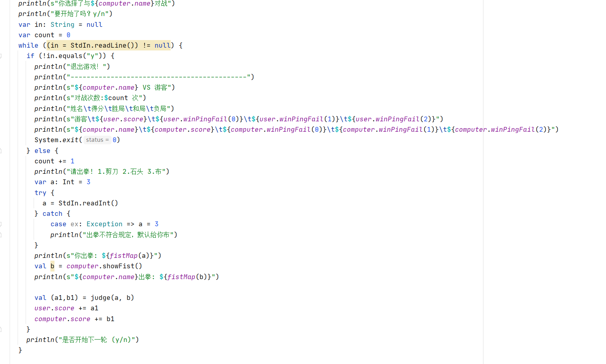
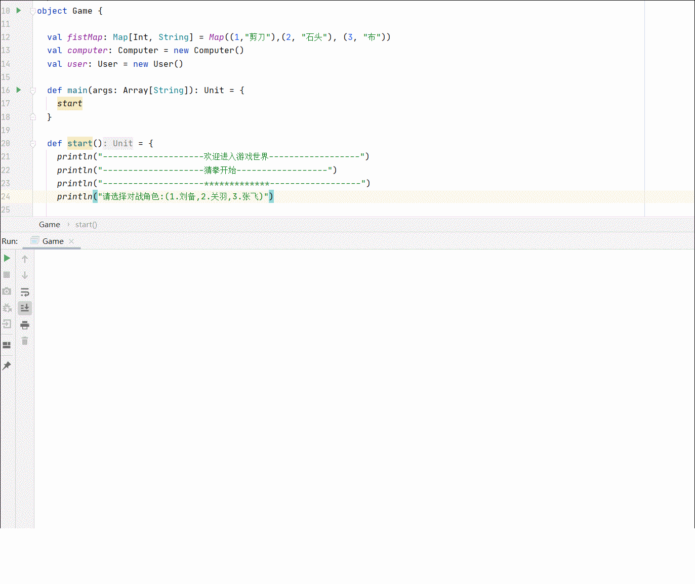
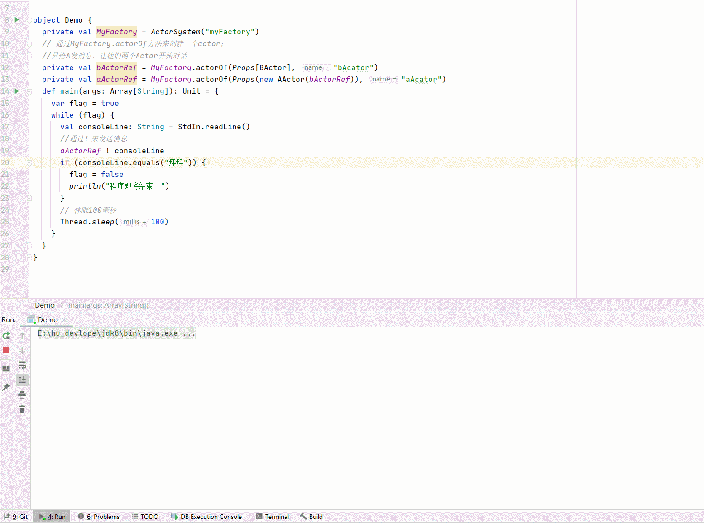
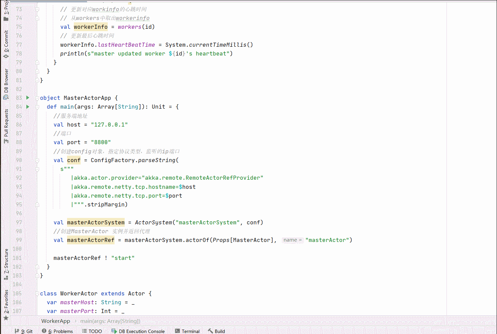

# 大数据开发-从Scala到Akka并发编程

[4-1 Scala作业.pdf](<file/4-1 Scala作业_UVqqJLwoIp.pdf>)

# 1.递归实现瓶盖，瓶子换酒瓶的算法

## 1.1 需求描述

每瓶啤酒2元，3个空酒瓶或者5个瓶盖可换1瓶啤酒。100元最多可喝多少瓶啤酒？（不允许借啤酒）
思路：利用递归算法，一次性买完，然后递归算出瓶盖和空瓶能换的啤酒数

## 1.2 代码实现

```scala
  def extralPeer(bot: Int, cap: Int): Int = {
    val count = bot / 3 + cap / 5
    if (count <= 0)
      return 0

    val modBot = bot % 3
    val modCap = cap % 5
    count + extralPeer(count + modBot, count + modCap)
  }
```

# 2.Scala实现猜拳游戏

## 2.1 需求如下

1.  选取对战角色
2.  开始对战，用户出拳，与对手进行比较，提示胜负信息
3.  猜拳结束算分，平局都加一分，获胜加二分，失败不加分
4.  循环对战，当输入“n”时，终止对战，并显示对战结果
5.  游戏结束后显示得分

## 2.2 实现逻辑和主要代码

1.  创建用户类User，定义类的属性（name，score）和类的方法（showFist())
2.  创建计算机类Computer，定义类的属性（name，score）和类的方法（showFist())
3.  实现计算机随机出拳
4.  创建游戏类Game，定义类的属性（甲方玩家、乙方玩家、对战次数）
5.  编写初始化方法、游戏开始方法

主要代码：



## 2.3 效果演示

代码：[https://github.com/hulichao/bigdata-code/tree/master/src/main/scala/com/hoult/scala/job/game](https://github.com/hulichao/bigdata-code/tree/master/src/main/scala/com/hoult/scala/job/game "https://github.com/hulichao/bigdata-code/tree/master/src/main/scala/com/hoult/scala/job/game")



```scala
def extralPeer(bot: Int, cap: Int): Int = {
  val count = bot / 3 + cap / 5
  
  if (count <= 0)
  
    return 0
  
  val modBot = bot % 3
  
  val modCap = cap % 5
  
  count + extralPeer(count + modBot, count + modCap) 
  } 
```

# 3.用户位置时长统计sql

## 3.1 需求描述

现有如下数据需要处理： 字段：用户ID，位置ID，开始时间，停留时长（分钟）
4行样例数据：` UserA,LocationA,8,60 UserA,LocationA,9,60 UserB,LocationB,10,60 UserB,LocationB,11,80` 样例
数据中的数据含义是： 用户`UserA`，在`LocationA`位置，从8点开始，停留了60钟
处理要求： 1、对同一个用户，在同一个位置，连续的多条记录进行合并 2、合并原则：开始时间取最早时间，停留
时长累计求和

## 3.2 Sql实现

```sql
select user_id, location_id, min(start_time) as start_time, sum(stay_time) as stay_time from t1 group by user_id, location_id
```

# 4.Actor间通讯

编写两个Actor, 分别是AActor和BActor，两个Actor之间可以互相发送消息

## 4.1主要实现

先用一个`start`命令启动`AActor`,然后给自己发 一个消息，启动`go`后面的流程，然后`A,B`互相循环发送消息

主要代码：[https://github.com/hulichao/bigdata-code/tree/master/src/main/scala/com/hoult/scala/job/actor](https://github.com/hulichao/bigdata-code/tree/master/src/main/scala/com/hoult/scala/job/actor "https://github.com/hulichao/bigdata-code/tree/master/src/main/scala/com/hoult/scala/job/actor")

```scala
object Demo {
  private val MyFactory = ActorSystem("myFactory")
  // 通过MyFactory.actorOf方法来创建一个actor；
  //只给A发消息，让他们两个Actor开始对话
  private val bActorRef = MyFactory.actorOf(Props[BActor], "bAcator")
  private val aActorRef = MyFactory.actorOf(Props(new AActor(bActorRef)), "aAcator")
  def main(args: Array[String]): Unit = {
    var flag = true
    while (flag) {
      val consoleLine: String = StdIn.readLine()
      //通过！来发送消息
      aActorRef ! consoleLine
      if (consoleLine.equals("拜拜")) {
        flag = false
        println("程序即将结束！")
      }
      // 休眠100毫秒
      Thread.sleep(100)
    }
  }
}
```



# 5.模拟Spark中Master与Worker进程通讯

[https://www.jianshu.com/p/43cf21b424ec](https://www.jianshu.com/p/43cf21b424ec "https://www.jianshu.com/p/43cf21b424ec")

为了加深对主从服务心跳检测机制（HeartBeat）的理解，模拟master与slave之间的通信。

1.  Worker 注册到 Master，Master 完成注册，并回复 Worker 注册成功(注册功能)
2.  Worker 定时发送心跳，并在 Master 接收到
3.  Master 接收到 Worker 心跳后，要更新该 Worker 的最近一次发送心跳的时间
4.  给 Master 启动定时任务，定时检测注册的 Worker 有哪些没有更新心跳，并将其从 hashmap 中删除

## 5.1 代码实现

关键点：Worker 和 Master的启动方式都是 通过发送start来启动的，协议使用模板类来实现，故增加几个case class，处理逻辑注意 客户端要发送哪几类消息，服务端要接受那几类消息，两者结合使用即可，代码：[https://github.com/hulichao/bigdata-code/tree/master/src/main/scala/com/hoult/scala/job/s](https://github.com/hulichao/bigdata-code/tree/master/src/main/scala/com/hoult/scala/job/actor "https://github.com/hulichao/bigdata-code/tree/master/src/main/scala/com/hoult/scala/job/s")park

主要实现：

```scala
//master消息处理
val workers = mutable.Map[String, WorkerInfo]()
  override def receive: Receive = {
    case "start" => {
      println("master running....")
      // 检查超时worker
      self ! StartTimeOutWorker
    }

    case StartTimeOutWorker => {
      println("start check timeout worker...")
      // 定义定时器，每隔一段时间检查worker心跳是否超时
      import context.dispatcher
      context.system.scheduler.schedule(0 millis, 9000 millis, self, RemoveTimeOutWorker)
    }
    case RemoveTimeOutWorker => {
      // 获取workers中所有workerInfo
      val workerInfos = workers.values
      // 获取当前时间
      val currentTime = System.currentTimeMillis()
      // 找出超时6秒的worker
      workerInfos.filter(info => (currentTime - info.lastHeartBeatTime) > 6000)
        .foreach(workers -= _.id)
      println(s"===> workers.size = ${workers.size}")
    }

    case RegisterWorkerInfo(id, cpu, ram) => {
      //判断是否已注册
      if (!workers.contains(id)) {
        val info =
        // 添加数据
        workers += (id -> new WorkerInfo(id, cpu, ram)) //worker列表添加
        println("workers => 注册:" + workers)
        //注册成功回复消息
        sender() ! RegisteredWorkerInfo
      }

    }
    case HeartBeat(id) => {
      // 更新对应workinfo的心跳时间
      // 从workers中取出workerinfo
      val workerInfo = workers(id)
      // 更新最后心跳时间
      workerInfo.lastHeartBeatTime = System.currentTimeMillis()
      println(s"master updated worker ${id}'s heartbeat")
    }
```

```scala
//worker消息处理
override def receive: Receive = {

    case "start" => {
      println("worker running...")
      // 发送注册信息
      masterProxy ! RegisterWorkerInfo(id, 16, 16 * 1024)
    }
    case RegisteredWorkerInfo => {
      println(s"worker ${id} registered!")

      // 定义定时器，每隔一段时间告诉自己发送心跳
      import context.dispatcher
      // 0 millis：立即执行
      // 3000 millis：每隔3秒执行
      // self：接收对象，发给自己
      // SendHeartBeat：发送内容
      context.system.scheduler.schedule(0 millis, 3000 millis, self, SendHeartBeat)
    }
    //发送心跳
    case SendHeartBeat => {
      println(s"worker ${id} send heartbeat to master")
      masterProxy ! HeartBeat(id)
    } 
```

## 5.3 演示



