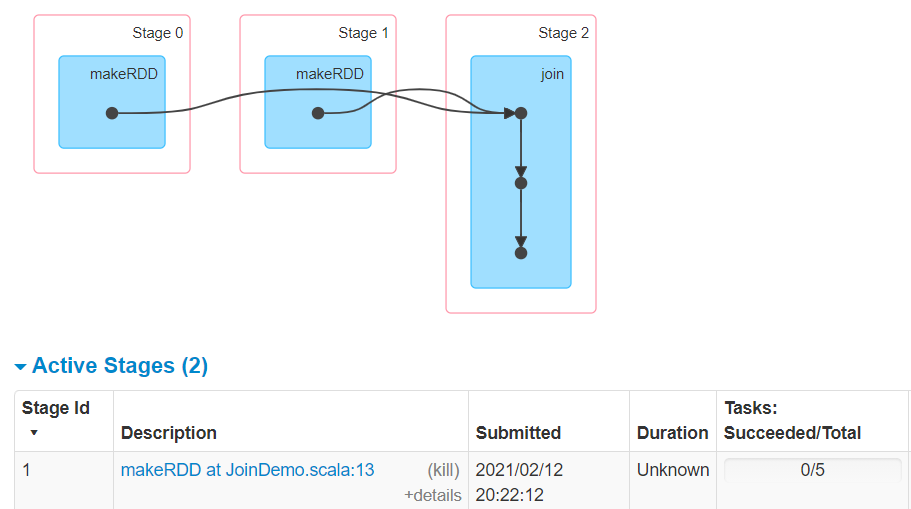
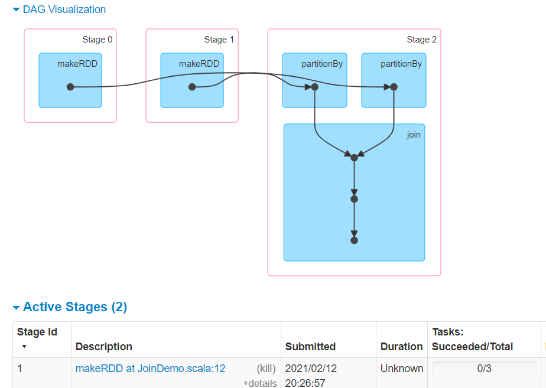

# 大数据开发-从cogroup的实现来看join是宽依赖还是窄依赖

前面一篇文章提到[大数据开发-Spark Join原理详解](<大数据开发-Spark Join原理详解_tYc7uVdj1arV952G85EF3U.md> "大数据开发-Spark Join原理详解"),本文从源码角度来看cogroup 的join实现

# 1.分析下面的代码

```scala
import org.apache.spark.rdd.RDD
import org.apache.spark.{SparkConf, SparkContext}
object JoinDemo {
  def main(args: Array[String]): Unit = {
    val conf = new SparkConf().setAppName(this.getClass.getCanonicalName.init).setMaster("local[*]") 
    val sc = new SparkContext(conf)
    sc.setLogLevel("WARN")
    
    val random = scala.util.Random
    val col1 = Range(1, 50).map(idx => (random.nextInt(10), s"user$idx"))
    val col2 = Array((0, "BJ"), (1, "SH"), (2, "GZ"), (3, "SZ"), (4, "TJ"), (5, "CQ"), (6, "HZ"), (7, "NJ"), (8, "WH"), (0, "CD"))
    val rdd1: RDD[(Int, String)] = sc.makeRDD(col1) 
    val rdd2: RDD[(Int, String)] = sc.makeRDD(col2)
    val rdd3: RDD[(Int, (String, String))] = rdd1.join(rdd2) 
    println(rdd3.dependencies)
    val rdd4: RDD[(Int, (String, String))] = rdd1.partitionBy(new HashPartitioner(3)).join(rdd2.partitionBy(new HashPartitioner(3)))
    println(rdd4.dependencies)
    sc.stop() 
  }
}
```

分析上面一段代码，打印结果是什么，这种join是宽依赖还是窄依赖，为什么是这样

# 2.从spark的ui界面来查看运行情况

关于stage划分和宽依赖窄依赖的关系，从2.1.3 如何区别宽依赖和窄依赖就知道stage与宽依赖对应，所以从rdd3和rdd4的stage的依赖图就可以区别宽依赖，可以看到join划分除了新的stage，所以rdd3的生成事宽依赖，另外`rdd1.partitionBy(new HashPartitioner(3)).join(rdd2.partitionBy(new HashPartitioner(3)))` 是另外的依赖图，所以可以看到partitionBy以后再没有划分新的 stage，所以是窄依赖。






# 3.join的源码实现

前面知道结论，是从ui图里面看到的，现在看join源码是如何实现的（基于spark2.4.5）

先进去入口方法，其中withScope的做法可以理解为装饰器，为了在sparkUI中能展示更多的信息。所以把所有创建的RDD的方法都包裹起来，同时用RDDOperationScope 记录 RDD 的操作历史和关联，就能达成目标。

```scala
  /**
   * Return an RDD containing all pairs of elements with matching keys in `this` and `other`. Each
   * pair of elements will be returned as a (k, (v1, v2)) tuple, where (k, v1) is in `this` and
   * (k, v2) is in `other`. Performs a hash join across the cluster.
   */
  def join[W](other: RDD[(K, W)]): RDD[(K, (V, W))] = self.withScope {
    join(other, defaultPartitioner(self, other))
  }
```

下面来看`defaultPartitioner` 的实现，其目的就是在默认值和分区器之间取一个较大的，返回分区器

```scala
def defaultPartitioner(rdd: RDD[_], others: RDD[_]*): Partitioner = {
    val rdds = (Seq(rdd) ++ others)
    // 判断有没有设置分区器partitioner
    val hasPartitioner = rdds.filter(_.partitioner.exists(_.numPartitions > 0))
    
    //如果设置了partitioner，则取设置partitioner的最大分区数
    val hasMaxPartitioner: Option[RDD[_]] = if (hasPartitioner.nonEmpty) {
      Some(hasPartitioner.maxBy(_.partitions.length))
    } else {
      None
    }
 
    //判断是否设置了spark.default.parallelism，如果设置了则取spark.default.parallelism
    val defaultNumPartitions = if (rdd.context.conf.contains("spark.default.parallelism")) {
      rdd.context.defaultParallelism
    } else {
      rdds.map(_.partitions.length).max
    }
 
    // If the existing max partitioner is an eligible one, or its partitions number is larger
    // than the default number of partitions, use the existing partitioner.
    //主要判断传入rdd是否设置了默认的partitioner 以及设置的partitioner是否合法                
    //或者设置的partitioner分区数大于默认的分区数 
    //条件成立则取传入rdd最大的分区数，否则取默认的分区数
    if (hasMaxPartitioner.nonEmpty && (isEligiblePartitioner(hasMaxPartitioner.get, rdds) ||
        defaultNumPartitions < hasMaxPartitioner.get.getNumPartitions)) {
      hasMaxPartitioner.get.partitioner.get
    } else {
      new HashPartitioner(defaultNumPartitions)
    }
  }

  private def isEligiblePartitioner(
     hasMaxPartitioner: RDD[_],
     rdds: Seq[RDD[_]]): Boolean = {
    val maxPartitions = rdds.map(_.partitions.length).max
    log10(maxPartitions) - log10(hasMaxPartitioner.getNumPartitions) < 1
  }
}
```

再进入join的重载方法，里面有个`new CoGroupedRDD[K](Seq(self, other), partitioner)`

```scala
def join[W](other: RDD[(K, W)], partitioner: Partitioner): RDD[(K, (V, W))] = self.withScope {
    this.cogroup(other, partitioner).flatMapValues( pair =>
      for (v <- pair._1.iterator; w <- pair._2.iterator) yield (v, w)
    )
  }
def cogroup[W](other: RDD[(K, W)], partitioner: Partitioner)
    : RDD[(K, (Iterable[V], Iterable[W]))] = self.withScope {
  if (partitioner.isInstanceOf[HashPartitioner] && keyClass.isArray) {
    throw new SparkException("HashPartitioner cannot partition array keys.")
  }
  //partitioner 通过对比得到的默认分区器，主要是分区器中的分区数
  val cg = new CoGroupedRDD[K](Seq(self, other), partitioner)
  cg.mapValues { case Array(vs, w1s) =>
    (vs.asInstanceOf[Iterable[V]], w1s.asInstanceOf[Iterable[W]])
  }
}


  /**
   * Return an RDD containing all pairs of elements with matching keys in `this` and `other`. Each
   * pair of elements will be returned as a (k, (v1, v2)) tuple, where (k, v1) is in `this` and
   * (k, v2) is in `other`. Performs a hash join across the cluster.
   */
  def join[W](other: RDD[(K, W)], numPartitions: Int): RDD[(K, (V, W))] = self.withScope {
    join(other, new HashPartitioner(numPartitions))
  } 
```

最后来看CoGroupedRDD，这是决定是宽依赖还是窄依赖的地方，可以看到如果左边rdd的分区和上面选择给定的分区器一致，则认为是窄依赖，否则是宽依赖

```scala
  override def getDependencies: Seq[Dependency[_]] = {
    rdds.map { rdd: RDD[_] =>
      if (rdd.partitioner == Some(part)) {
        logDebug("Adding one-to-one dependency with " + rdd)
        new OneToOneDependency(rdd)
      } else {
        logDebug("Adding shuffle dependency with " + rdd)
        new ShuffleDependency[K, Any, CoGroupCombiner](
          rdd.asInstanceOf[RDD[_ <: Product2[K, _]]], part, serializer)
      }
    }
  }
```

总结，join时候可以指定分区数，如果join操作左右的rdd的**分区方式和分区数一致**则不会产生shuffle，否则就会shuffle，而是宽依赖，分区方式和分区数的体现就是分区器。
