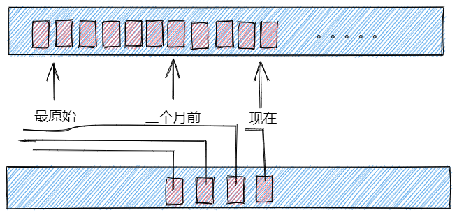

# 大数据开发-实时范围-统计系统设计

# 1.背景

在大数据生产环境下，往往需求是越快越好，对于实时系统开发，需求往往是一个状态值，比如多少次，多少个，而对于离线数据开发，因为不是实时，所以可以开发各种复杂需求，另外一种基于Lambda架构或者Kappa架构的，往往场合时实时统计系统，实时统计系统在前面Lambda架构的设计中已经谈过，本文时另外一种更复杂的应用场景，对于Lambda架构中产生的流水，要尽可能快地满足范围查询，什么意思呢，Lambda架构中，虽说可以查询一个范围统计的流水，但是为了尽可能地快，将离线计算结果是count，count(distinct) 这两种可以更细地划分，做初步的聚合，比如生成一个Set的集合，这样可以满足在查询层更快地合并数据，但是同时也增加了架构的复杂性和非通用性，同理本文的实时范围查询，是基于需求的一种复杂设计，解决的是这样的一个问题，我想求一段范围的count，怎么保证最快地计算结果。

```powershell
## 原始数据表t1流水如下
transactionId,id1,id2,money,create_time
## 目的
## 输入id1, 一段范围create_time, 得到count(money) 
```

# 2.设计

前面背景中主要抛出一个问题，如何设计这样的系统，满足快速求时间范围的count, 需要达到生产级别的实时查询系统。

（1）为了快速count，必然不能只有流水，只有流水的count，遇到数据量大的范围count，很耗时，所以设计预计算count，即截至到xx，某个id的所有count（money)

&#x20; (2)  在查询时候只需要查到开始时间的最左时间流水，和结束时间的右逼近流水，相减即可

（3）为了快速查询时间和id，必然需要这两个加索引

（4）如果需求是最近三个月的查询，那么回溯时候，可以认为设计开始时间节点，从那里开始时0，然后开始不断累加


注意：（4）看应用需求，可以将最原始节点卡在三个月前，令那个时间点的截至数据count就是0

示意图如下：



# 3.实现方案

假设是（3）方案，更通用的方案，就是数据会存的更多一点

假设原始全量数据存在于mysql表中，那么需要新建立一张t2表，字段如下：

```powershell
id1,create_time, money_sum
```

（1）首次计算如下

```powershell
SELECT id1,
       create_time,
       sum() over(PARTITION BY money_sum
                  ORDER BY create_time) AS money_sum
WHERE create_time > NOW
```

(2) 增量计算

```powershell
## 查询t1一条增量记录
select id1,create_time,money from t1
## 查询 t2 这个id1的最近一条记录
SELECT id1,
       create_time,
       monye_sum + MONEY AS money_sum
FROM
  (SELECT id1,
          create_time,
          money_sum,
          row_number() over(PARTITION BY id1
                            ORDER BY create_time DESC) r
   FROM t2
   WHERE id1 = xx )
WHERE r=1
## 将这条记录insert到t2即可 
```

# 4.总结 && 探讨

如果数据有同一时间的多条记录怎么办，如果重复记录有延迟怎么办

针对第一个问题，如果有多条重复记录，就要看业务需求了，业务需求如果一定要精准实时的，那么必须要等下个时间的数据过来或者确定统计结束，才能将money加上，就是3.(2)中的select xx from t1可能有多条数据的情况，一定要确保这个id不会有同一重复的记录才行，这时候就有两种处理方式，一种是默认等1s，如果没有新数据就结束，另外一种是等新时间点数据，如果来了就算结束，如果业务需求可以接受延迟，那么同样的数据，不同的查询时间点可能就会有不同的结果。

所以真的要看业务需求来看设计方式，比较常见的方式是延迟等待，没有新时间就计算。
