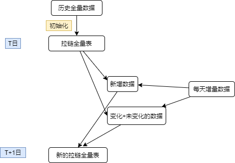
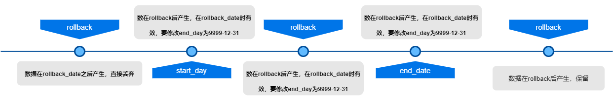
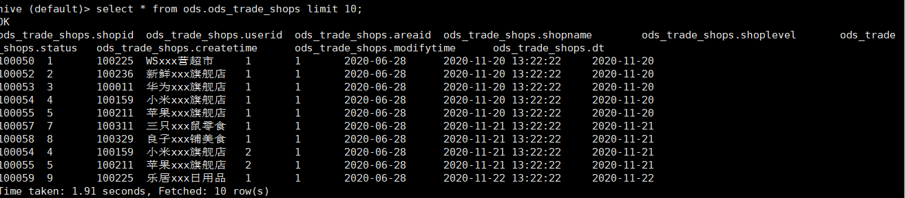
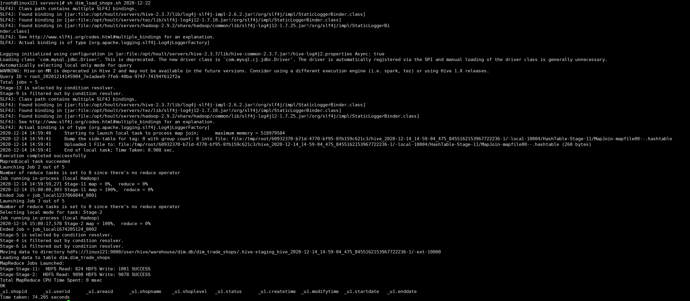

# 大数据开发-数仓拉链表，如何迭代或者回滚

# 1.背景

拉链表是什么，在数仓建立时候，一种重要的表数据处理方式，可以将数据结构于算法，类比于拉链表于数仓，旨在解决数仓建立里面的SCD需求，那么什么是SCD，就是缓慢变化维，随着时间流逝，数据相对事实表发生缓慢变化。

SCD的常用处理方式有以下几种：

-   保留原值
-   直接覆盖
-   增加新属性列
-   快照表
-   拉链表

本文主要讲解拉链表来处理SCD的问题，其特点归纳以下，有以下几种场景时候，可以使用拉链表。

1.表数据量较大，用全量表会占用很多存储

2.表数据会有修改，用增量表，难以处理重复且修改数据

3.有回溯的需求，需要知道历史某个时间点的全量数据

4.数据有修改，但是频率和量不是很大比如只有百万分之一有修改

# 2.拉链表处理理论

首先拉链表是一个全量表且不是分区表，为了达到前面描述的各种效果，必然需要一个中间表来做中间跳板，这个中间跳板表是一个分区表，数据是增量数据，增量内容包括修改和增加，即常常是`create_time or update_time`  落在当前天，对于拉链表需要增加两个与原始数据没有关系的两个字段来标识数据开始时间和有效截至时间，在示例中，这两个日期分别为`start_date ` 和 `end_date` ，拉链表其处理方式主要有以下三种：初始化，每天更新数据，回滚数据。

## 2.1 初始化和新增数据

其每天的滚动方式如下图：



初始化部分，是拉链全量表的开始时间，也奠定了回滚时候能够回滚的最早时间，每天更新逻辑如上图，新增数据会分为两部分，一部分是每天新增的数据，对于当天分区里面有相同变化或者未变化的数据时候，分别修改对应的`start_date ` 和 `end_date` 即可达到更新数据。

## 2.1 数据回滚

对于上面的更新逻辑，我们来考虑如何回滚数据，即回到历史的某个时间点，对于拉链表来说是全量表，所以只有一个回滚即可。回滚策略可以根据回滚时间点和数据生成的`start_date ` 和 `end_date`，具体怎么回滚，我们来看下面的示意图：



在`end_date < rollback_date` 的数据要保留，对于处理`end_date ≥ rollback_date ≥ start_date` 设置`end_date` 为`9999-12-31` ，对于回滚的结果，一般为了保持数据的完整性，可以将回滚的数据放在一个新的拉链临时表中。

# 3.拉链表处理案例

对于数仓的常用分层DIM即维度层是拉链表的常用场景，下面有个例子拉看看拉链表怎么做新增和回滚。

用拉链表实现核心交易分析中DIM层商家维表，并实现该拉链表的回滚。

## 3.1 创建表并导入数据

其中商家维表结构如下：

```sql
--创建商家信息表(增量表 分区表)
drop table if exists ods.ods_trade_shops;
create table ods.ods_trade_shops(
  `shopid` int COMMENT '商铺ID',
  `userid` int COMMENT '商铺负责人', 
  `areaid` int COMMENT '区域ID',
  `shopname` string COMMENT '商铺名称',
  `shoplevel` int COMMENT '商铺等级',
  `status` int COMMENT '商铺状态',
  `createtime` string COMMENT '创建日期',
  `modifytime` string COMMENT  '修改日期'
) COMMENT '商家信息表'
PARTITIONED BY (`dt` string)
row format delimited fields terminated by ',';

-- 创建商家信息维表
drop table if exists dim.dim_trade_shops;
create table dim.dim_trade_shops(
  `shopid` int COMMENT '商铺ID',
  `userid` int COMMENT '商铺负责人', 
  `areaid` int COMMENT '区域ID',
  `shopname` string COMMENT '商铺名称',
  `shoplevel` int COMMENT '商铺等级',
  `status` int COMMENT '商铺状态',
  `createtime` string COMMENT '创建日期',
  `modifytime` string COMMENT  '修改日期',
  `startdate` string  COMMENT '生效起始日期',
  `enddate` string  COMMENT '失效结束日期'
) COMMENT '商家信息表';

```

导入以下测试数据：

```sql
/root/data/shop-2020-11-20.dat
100050,1,100225,WSxxx营超市,1,1,2020-06-28,2020-11-20 13:22:22
100052,2,100236,新鲜xxx旗舰店,1,1,2020-06-28,2020-11-20 13:22:22
100053,3,100011,华为xxx旗舰店,1,1,2020-06-28,2020-11-20 13:22:22
100054,4,100159,小米xxx旗舰店,1,1,2020-06-28,2020-11-20 13:22:22
100055,5,100211,苹果xxx旗舰店,1,1,2020-06-28,2020-11-20 13:22:22
 
 
/root/data/shop-2020-11-21.dat
100057,7,100311,三只xxx鼠零食,1,1,2020-06-28,2020-11-21 13:22:22
100058,8,100329,良子xxx铺美食,1,1,2020-06-28,2020-11-21 13:22:22
100054,4,100159,小米xxx旗舰店,2,1,2020-06-28,2020-11-21 13:22:22
100055,5,100211,苹果xxx旗舰店,2,1,2020-06-28,2020-11-21 13:22:22
 
 
/root/data/shop-2020-11-22.dat
100059,9,100225,乐居xxx日用品,1,1,2020-06-28,2020-11-22 13:22:22
100060,10,100211,同仁xxx大健康,1,1,2020-06-28,2020-11-22 13:22:22
100052,2,100236,新鲜xxx旗舰店,1,2,2020-06-28,2020-11-22 13:22:22

load data local inpath '/root/data/shop-2020-11-20.dat' overwrite into table ods.ods_trade_shops partition(dt='2020-11-20');
load data local inpath '/root/data/shop-2020-11-21.dat' overwrite  into table ods.ods_trade_shops partition(dt='2020-11-21');
load data local inpath '/root/data/shop-2020-11-22.dat' overwrite  into table ods.ods_trade_shops partition(dt='2020-11-22');

```



## 3.2 拉链表初始化

假设将第一天数据作为历史的所有数据

```sql
INSERT OVERWRITE TABLE dim.dim_trade_shops
SELECT shopid,
       userid,
       areaid,
       shopname,
       shoplevel,
       status,
       createtime,
       modifytime,
       CASE
           WHEN modifytime IS NOT NULL THEN substr(modifytime, 0, 10)
           ELSE substr(createtime, 0, 10)
       END AS startdate,
       '9999-12-31' AS enddate
FROM ods.ods_trade_shops
WHERE dt ='2020-11-20';
```

## 3.3 更新拉链表

对于增量表，一般的逻辑是，`create_time`或者`modifytime`的截取作为当天分区`dt`，`modifytime `大于等于`create_time ` ,这里取前两个

```sql
INSERT OVERWRITE TABLE dim.dim_trade_shops
SELECT shopid,
       userid,
       areaid,
       shopname,
       shoplevel,
       status,
       createtime,
       modifytime,
       CASE
           WHEN modifytime IS NOT NULL THEN substr(modifytime, 0, 10)
           ELSE substr(createtime, 0, 10)
       END AS startdate,
       '9999-12-31' AS enddate
FROM ods.ods_trade_shops
WHERE dt = '2020-11-21'
UNION ALL
SELECT b.shopid,
       b.userid,
       b.areaid,
       b.shopname,
       b.shoplevel,
       b.status,
       b.createtime,
       b.modifytime,
       b.startdate,
       CASE
           WHEN a.shopid IS NOT NULL
                AND b.enddate ='9999-12-31' THEN date_add('2020-11-21', -1)
           ELSE b.enddate
       END AS enddate
FROM
  (SELECT *
   FROM ods.ods_trade_shops
   WHERE dt='2020-11-21') a
RIGHT JOIN dim.dim_trade_shops b ON a.shopid = b.shopid;
```

加载拉链表的脚本如下：

`dim_load_shops.sh`

```sql
#!/bin/bash
 
source /etc/profile
if [ -n "$1" ]
then
  do_date=$1
else
  do_date=`date -d "-1 day" +%F`
fi
 
sql="
INSERT OVERWRITE TABLE dim.dim_trade_shops
SELECT shopid,
       userid,
       areaid,
       shopname,
       shoplevel,
       status,
       createtime,
       modifytime,
       CASE
           WHEN modifytime IS NOT NULL THEN substr(modifytime, 0, 10)
           ELSE substr(createtime, 0, 10)
       END AS startdate,
       '9999-12-31' AS enddate
FROM ods.ods_trade_shops
WHERE dt = '$do_date'
UNION ALL
SELECT b.shopid,
       b.userid,
       b.areaid,
       b.shopname,
       b.shoplevel,
       b.status,
       b.createtime,
       b.modifytime,
       b.startdate,
       CASE
           WHEN a.shopid IS NOT NULL
                AND b.enddate ='9999-12-31' THEN date_add('$do_date', -1)
           ELSE b.enddate
       END AS enddate
FROM
  (SELECT *
   FROM ods.ods_trade_shops
   WHERE dt='$do_date') a
RIGHT JOIN dim.dim_trade_shops b ON a.shopid = b.shopid;
"
 
hive -e "$sql"
```

可以执行此脚本来加载`2020-12-22` 的数据，`sh dim_load_shops.sh 2020-12-22 `



## 3.4 回滚拉链表到某一时间点

先创建一个临时表，`tmp.shops_tmp`  用来放回滚的数据

```sql
DROP TABLE IF EXISTS tmp.shops_tmp;
CREATE TABLE IF NOT EXISTS tmp.tmp_shops AS
SELECT shopid,
       userid,
       areaid,
       shopname,
       shoplevel,
       status,
       createtime,
       modifytime,
       startdate,
       enddate
FROM dim.dim_trade_shops
WHERE enddate < '2020-11-21'
UNION ALL
SELECT shopid,
       userid,
       areaid,
       shopname,
       shoplevel,
       status,
       createtime,
       modifytime,
       startdate,
       '9999-12-31' AS enddate
FROM dim.dim_trade_shops
WHERE startdate <= '2020-11-21'
  AND enddate >= '2020-11-21';


INSERT OVERWRITE TABLE dim.dim_trade_shops
SELECT *
FROM tmp.tmp_shops;
```

回滚脚本和更新脚本类似，只要更新其中的sql即可，这里不再重复。
