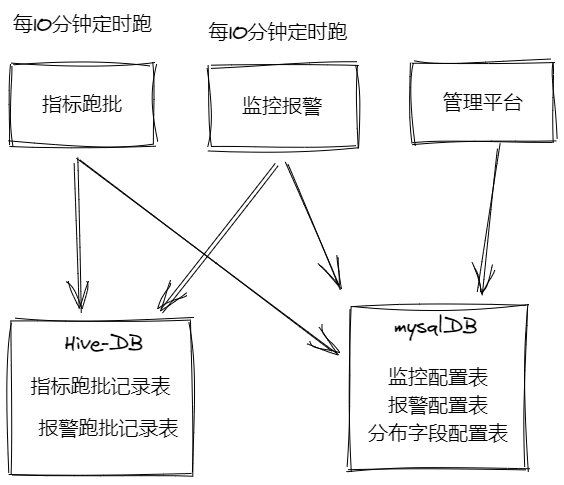
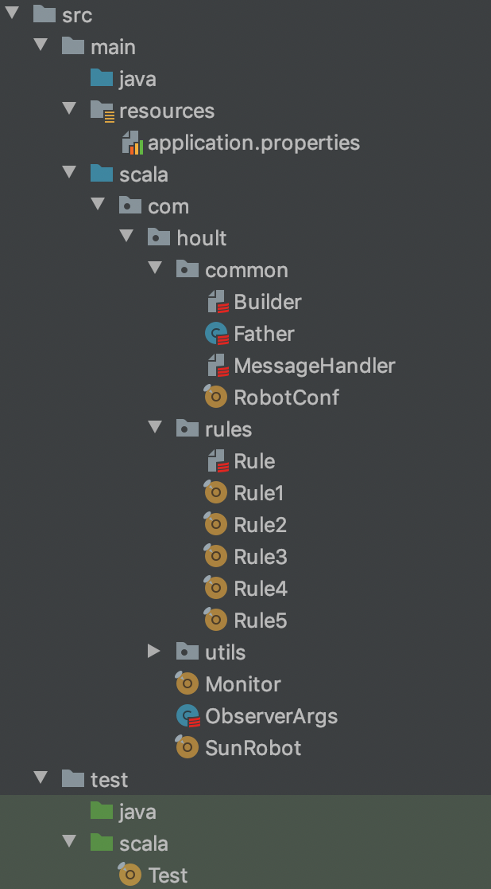

# 大数据开发-数据表监控-实现1

# 1.简介

[大数据开发-表数据波动、码值分布波动监控 && 报警](<大数据开发-表数据波动、码值分布波动监控 && 报警_5C8diAwyCL1jsFo9kJETvn.md> "大数据开发-表数据波动、码值分布波动监控 && 报警")，是关于理论和设计部分，初步计算已经写完，管理平台部分，后续完善，本文主要针对模块设计部分，整体模块实现上是离线数据源的异步模块，分为指标跑批模块，监控报警模块，平台管理模块，指标跑批模块和监控报警模块主要是基于离线数据的表的通讯，即不是耦合的架构，分别是两个例行的任务,看下面的图，




# 2.说明

其中表设计了五张表，分别是指标跑批记录表，报警跑批记录表，和mysql表监控配置表，报警配置表，分布字段配置表，指标跑批和监控跑批不直接任务依赖，而是通过指标跑批记录表，直接产生报警跑批记录

# 3.代码实现

整个项目目录结构如下图：

**resource**: 配置文件

**common**: 一些公共的模块，Builder是发送消息构建器，Father是Spark项目的公共代码

**rules**: 下面有5个指标的规则，分别是检查分区是否存储，检查分区数量是否大于某个值，检查分区数量波动，检查分布，检查分布大向量波动

**utils**: 里面放的是一些工具，比如日期处理工具类，表格式处理工具，sql处理工具等

**Monitor**: 指标跑批的主类

**SunRobot**: 报警跑批的主类入库




# 4.Monitor类说明

rule的一些实现，不细说了，根据源代码很好看懂，而Monitor是怎么根据这些规则，生成对应的流水，主要实现代码如下：

```scala
package com.hoult

import com.beust.jcommander.JCommander
import com.hoult.common.Father
import com.hoult.rules.{Rule1, Rule2, Rule3, Rule4, Rule5, TableMonitorConf, TableMonitorRecord}
import com.hoult.utils.{DateTool, PropertiesUtils}
import org.apache.spark.sql.Dataset

import scala.collection.mutable.ListBuffer

object Monitor extends Father {

  val mysqlProps = PropertiesUtils.getMysqlProps()
  var broadTableConfs: Dataset[TableMonitorConf] = null

  def main(args: Array[String]): Unit = {

    val info: ObserverArgs = new ObserverArgs
    println("入参:: " + args.mkString(","))
    JCommander.newBuilder().addObject(info).build().parse(args.toArray: _*)

    //广播配置表
    prepare()

    //生成表 * 规则 个 dataframe
    import spark.implicits._
    val tableConfArray: Array[TableMonitorConf] = spark.sql("select * from table_monitor_conf where db_table_name !='default.default'").as[TableMonitorConf].collect()
    val defaultTableConf = spark.sql("select * from table_monitor_conf where db_table_name ='default.default'").as[TableMonitorConf].collect().take(1)(0)
    var ll: ListBuffer[Dataset[TableMonitorRecord]] = ListBuffer[Dataset[TableMonitorRecord]]() //所有规则一起跑

    //默认值填充
    val tConfs = tableConfArray.map( conf => {
      TableMonitorConf(
        if(conf.db_table_key == null) defaultTableConf.db_table_key else conf.db_table_key,
        conf.db_table_name,
        if (conf.table_charge_people == null) defaultTableConf.table_charge_people else conf.table_charge_people,
        if (conf.done_path == null) defaultTableConf.done_path else conf.done_path,
        if (conf.where_condition == null) defaultTableConf.where_condition else conf.where_condition,
        if (conf.if_done == null) defaultTableConf.if_done else conf.if_done,
        if (conf.if_check_partition == null) defaultTableConf.if_check_partition else conf.if_check_partition,
        if (conf.if_check_partition_count == null) defaultTableConf.if_check_partition_count else conf.if_check_partition_count,
        if (conf.if_check_partition_count_fluctuates == null) defaultTableConf.if_check_partition_count_fluctuates else conf.if_check_partition_count_fluctuates,
        if (conf.if_check_distribute == null) defaultTableConf.if_check_distribute else conf.if_check_distribute,
        if (conf.if_check_distribute_fluctuates == null) defaultTableConf.if_check_distribute_fluctuates else conf.if_check_distribute_fluctuates
      )})

    //遍历所有规则
    for (elem <- tConfs) {
      //规则1
      if ("1".equals(elem.if_check_partition)) {
        ll +:= Rule1.runRule(elem.db_table_name, elem.db_table_key, elem.where_condition, info.runDay)
      }

      //规则2
      if ("1".equals(elem.if_check_partition_count)) {
        ll +:= Rule2.runRule(elem.db_table_name, elem.db_table_key, elem.where_condition, info.runDay)
      }

      //规则3
      if ("1".equals(elem.if_check_partition_count_fluctuates)) {
        ll +:= Rule3.runRule(elem.db_table_name, elem.db_table_key, elem.where_condition, info.runDay)
      }
      //规则4
      if ("1".equals(elem.if_check_distribute)) {
        ll +:= Rule4.runRule(elem.db_table_name, elem.db_table_key, elem.where_condition, info.runDay)
      }

      //规则5
      if ("1".equals(elem.if_check_distribute_fluctuates)) {
        ll +:= Rule5.runRule(elem.db_table_name, elem.db_table_key, elem.where_condition, info.runDay)
      }
    }

    if (ll.size == 0)
      return
    ll.reduce(_.union(_)).select(
      "db_table_key",
      "db_table_name",
      "check_data_time",
      "rule_name",
      "rule_result",
      "rule_error",
      "checked_partition"
    ).createOrReplaceTempView("temp_table_rule_records")

    val partition = DateTool.getLatest30minutePatition
    spark.sql("set hive.reduce.tasks=1")
    spark.sql(s"insert overwrite table table_monitor.table_rule_records partition(dt=${info.runDay},hm=$partition) select * from temp_table_rule_records")

  }

  def prepare(): Unit = {
    import spark.implicits._
    //1.基础配置表缓存到集群 table_monitor_conf
    val tableConfs: Dataset[TableMonitorConf] = spark.read.jdbc(mysqlProps.getProperty("url"), "table_monitor_conf", mysqlProps).as[TableMonitorConf].cache()
    tableConfs.createOrReplaceTempView("table_monitor_conf")

    //2.配置表缓存到集群 table_monitor_distribute_conf
    spark.read.jdbc(mysqlProps.getProperty("url"), "table_monitor_distribute_conf", mysqlProps).cache().createOrReplaceTempView("table_monitor_distribute_conf")

  }

}

```

整理流程就是读配置表的信息，包括设置默认参数，最后就是调用拿出来的配置表的信息和规则的信息

# 5.SunRobot说明

这个模块就是报警以及生成拦截done文件的模块，主要功能就是根据前面的指标流水以及配置表的配置的表元信息进行比对，看看是否满足check要求，如果满足了就生成done，如果不满足就生成undone, 如果配置了报警，就会根据报警规则进行报警，暂且只有发送到通讯工具一项，主要代码如下：

```scala
import com.beust.jcommander.JCommander
import com.hoult.common.{Father, Message, RobotConf}
import com.hoult.rules.TableMonitorConf
import com.hoult.utils.{DgsFileSystem, PropertiesUtils}
import org.apache.hadoop.fs.Path
import org.apache.spark.sql.Dataset
import org.joda.time.DateTime
import scalaj.http.Http

/**
 * 根据rule跑批结果 和 报警配置进行报警
 */
object SunRobot extends Father {

  import spark.implicits._
  val mysqlProps = PropertiesUtils.getMysqlProps()
  def main(args: Array[String]): Unit = {

    val info: ObserverArgs = new ObserverArgs
    println("入参:: " + args.mkString(","))
    JCommander.newBuilder().addObject(info).build().parse(args.toArray: _*)
    //1.基础配置表缓存到集群 table_monitor_conf
    val tableConfs: Dataset[TableMonitorConf] = spark.read.jdbc(mysqlProps.getProperty("url"), "table_monitor_conf", mysqlProps).as[TableMonitorConf].cache()

    //2.默认规则提取-->driver
    val defaultConf: TableMonitorConf = tableConfs.where("db_table_name='default.default'").as[TableMonitorConf].take(1)(0)

    //3.配置表缓存到集群 table_monitor_notify_conf
    import org.apache.spark.sql.functions.broadcast
    val tableNotifyConf = spark.read.jdbc(mysqlProps.getProperty("url"), "table_monitor_notify_conf", mysqlProps).as[TableNotifyConf].cache()
    broadcast(tableNotifyConf).createOrReplaceTempView("table_monitor_notify_conf")

    import spark.implicits._
    //从配置表捞取需要的信息 and 默认值填充
    val tConfs = tableConfs.map( conf => {
      TableMonitorConf(
        if (conf.db_table_key == null) defaultConf.db_table_key else conf.db_table_key,
        conf.db_table_name,
        if (conf.table_charge_people == null) defaultConf.table_charge_people else conf.table_charge_people,
        if (conf.done_path == null) defaultConf.done_path else conf.done_path,
        if (conf.where_condition == null) defaultConf.where_condition else conf.where_condition,
        if (conf.if_done == null) defaultConf.if_done else conf.if_done,
        if (conf.if_check_partition == null) defaultConf.if_check_partition else conf.if_check_partition,
        if (conf.if_check_partition_count == null) defaultConf.if_check_partition_count else conf.if_check_partition_count,
        if (conf.if_check_partition_count_fluctuates == null) defaultConf.if_check_partition_count_fluctuates else conf.if_check_partition_count_fluctuates,
        if (conf.if_check_distribute == null) defaultConf.if_check_distribute else conf.if_check_distribute,
        if (conf.if_check_distribute_fluctuates == null) defaultConf.if_check_distribute_fluctuates else conf.if_check_distribute_fluctuates
    )})

    broadcast(tConfs).createOrReplaceTempView("table_monitor_conf")

    val confUnions: Dataset[ConfUnion] = spark.sql(
      """
        |SELECT
        |       a.db_table_key,
        |       a.db_table_name,
        |       notify_enable,
        |       check_count_threshold,
        |       normal_produce_datetime,
        |       check_distribute_json_threshold,
        |       check_count_fluctuates_threshold,
        |       b.if_done,
        |       b.done_path,
        |       b.table_charge_people
        |FROM table_monitor_notify_conf a
        |LEFT JOIN table_monitor_conf b on a.db_table_name = b.db_table_name and a.db_table_key = b.db_table_key
        |where notify_enable='1'
        |""".stripMargin).as[ConfUnion]

    excute(confUnions, info.runDay)

  }

  def excute(confUnions: Dataset[ConfUnion], runDay: String): Unit = {

    val record = spark.sql(s"""
         |SELECT db_table_key,
         |       db_table_name,
         |       check_data_time,
         |       rule_name,
         |       rule_result,
         |       checked_partition,
         |       rule_error
         |FROM
         |  (SELECT db_table_key,
         |          db_table_name,
         |          check_data_time,
         |          rule_name,
         |          rule_result,
         |          rule_error,
         |          checked_partition,
         |          row_number() over(partition by db_table_key, db_table_name, rule_name
         |                            order by check_data_time desc) rn
         |   FROM table_monitor.table_rule_records
         |   WHERE dt='$runDay' ) tmp
         |   WHERE rn = 1
         |""".stripMargin)

    record
      .join(confUnions, Seq("db_table_name","db_table_key"), "left")
      .filter("notify_enable='1'")
      .createOrReplaceTempView("tmp_records")


    val now = DateTime.now().toString("yyyy-MM-dd HH:mm:ss")

```

```scala
val result = spark.sql("")
// done文件
    val notifyRecords = result
      .as[NotifyRecord]
      .collect()
      .map(r => NotifyRecord(
      r.db_table_name,
      r.view_url,
      r.db_table_key,
      r.rule_name,
      r.if_ok,
      if (r.db_table_key != null) s"${r.done_path}/${r.db_table_name}/${r.db_table_key}/" else s"${r.done_path}/${r.db_table_name}/default/",
      r.table_charge_people,
      r.trouble_description,
      r.check_data_time,
      r.checked_partition
    ))


    sc.makeRDD(notifyRecords).toDS().createOrReplaceTempView("tmp_notify_records")
    val dgs = DgsFileSystem.getFileSystem

    //写日志记录
    spark.sql("set hive.reduce.tasks = 1")
    spark.sql(s"insert overwrite table table_monitor.table_monitor_notify_records partition(dt=${runDay}) select * from tmp_notify_records")

    //取是否生成done 或者 undone文件 （针对只监控超时产出的表，不需要做依赖，就不需要生成done依赖文件）
    val ifDoneMap = confUnions
      .selectExpr("concat(db_table_key, db_table_name) AS key_name", "if_done")
      .rdd
      .map(row => row.getAs("key_name").toString -> row.getAs("if_done").toString)
      .collectAsMap()

    //1.所有的写done或者非done
    for (elem <- notifyRecords) {
      if (ifDoneMap.getOrElse(elem.db_table_key + elem.db_table_name, "0").equals("1")) {
        if ("0".equals(elem.if_ok)) {
          dgs.createNewFile(new Path(s"${elem.done_path}$runDay/${elem.rule_name}.undone"))
        } else {
          dgs.deleteOnExit(new Path(s"${elem.done_path}$runDay/${elem.rule_name}.undone"))
          dgs.createNewFile(new Path(s"${elem.done_path}$runDay/${elem.rule_name}.done"))
        }
      }

    }

    //2.有问题的才报警
    val notifyRecordsTmp = notifyRecords.filter(_.trouble_description != null)
    //2.1 取超时时间
    val normalTimeMap = spark.sql(
      s"""
         |SELECT concat(db_table_key, db_table_name) AS key_name,
         |       normal_produce_datetime
         |FROM table_monitor_notify_conf
         |where normal_produce_datetime is not null
         |GROUP BY db_table_key,
         |         db_table_name,
         |         normal_produce_datetime
         |""".stripMargin)
        .rdd
        .map(row => row.getAs("key_name").toString -> row.getAs("normal_produce_datetime").toString)
      .collectAsMap()


    for (elem <- notifyRecordsTmp) {
      //未生成且大于超时时间才报警
      if ("0".equals(elem.if_ok) && normalTimeMap.getOrElse(elem.db_table_key + elem.db_table_name, "08:00").compareTo(elem.check_data_time.substring(11, 16)) < 0) {
        resp(Message.build(RobotConf.GROUP_ID, elem.table_charge_people,
          s"""
             |【表监控报警-${elem.db_table_key}/${elem.db_table_name}】
             |分区: ${elem.checked_partition}
             |检查时间：${elem.check_data_time}
             |规则：${elem.rule_name}
             |问题：${elem.trouble_description}
             |详情：${elem.view_url}""".stripMargin))
      }
    }


//      println("报警：" + Message.build(RobotConf.GROUP_ID, elem.table_charge_people, elem.db_table_name + "\n" + elem.trouble_description + "\n" + elem.view_url))
//      println("done：" + elem)
//      println("写日志：" + elem)


  }


  def resp(msg: String) = {
    Http(RobotConf.API_URL)
      .header("Content-Type", "application/json")
      .postData(msg).asBytes
  }


  case class NotifyRecord(
                           db_table_name: String,
                           view_url: String,
                           db_table_key: String,
                           rule_name: String,
                           if_ok: String,
                           done_path: String,
                           table_charge_people: String,
                           trouble_description: String,
                           check_data_time: String,
                           checked_partition: String
                         )

  case class TableNotifyConf(
                                 var db_table_key: String,
                                 var db_table_name: String,
                                 var notify_enable: String,
                                 var check_count_threshold: String,
                                 var normal_produce_datetime: String,
                                 var check_distribute_json_threshold: String,
                                 var check_count_fluctuates_threshold: String
                               )

  case class ConfUnion(
                        var db_table_key: String,
                        var db_table_name: String,
                        var notify_enable: String,
                        var check_count_threshold: String,
                        var normal_produce_datetime: String,
                        var check_distribute_json_threshold: String,
                        var check_count_fluctuates_threshold: String,
                        var if_done: String,
                        var done_path: String,
                        var table_charge_people: String
                      )
}
 
```

**PS**: 代码块太长，放不了一起，所以分开两个块来放
