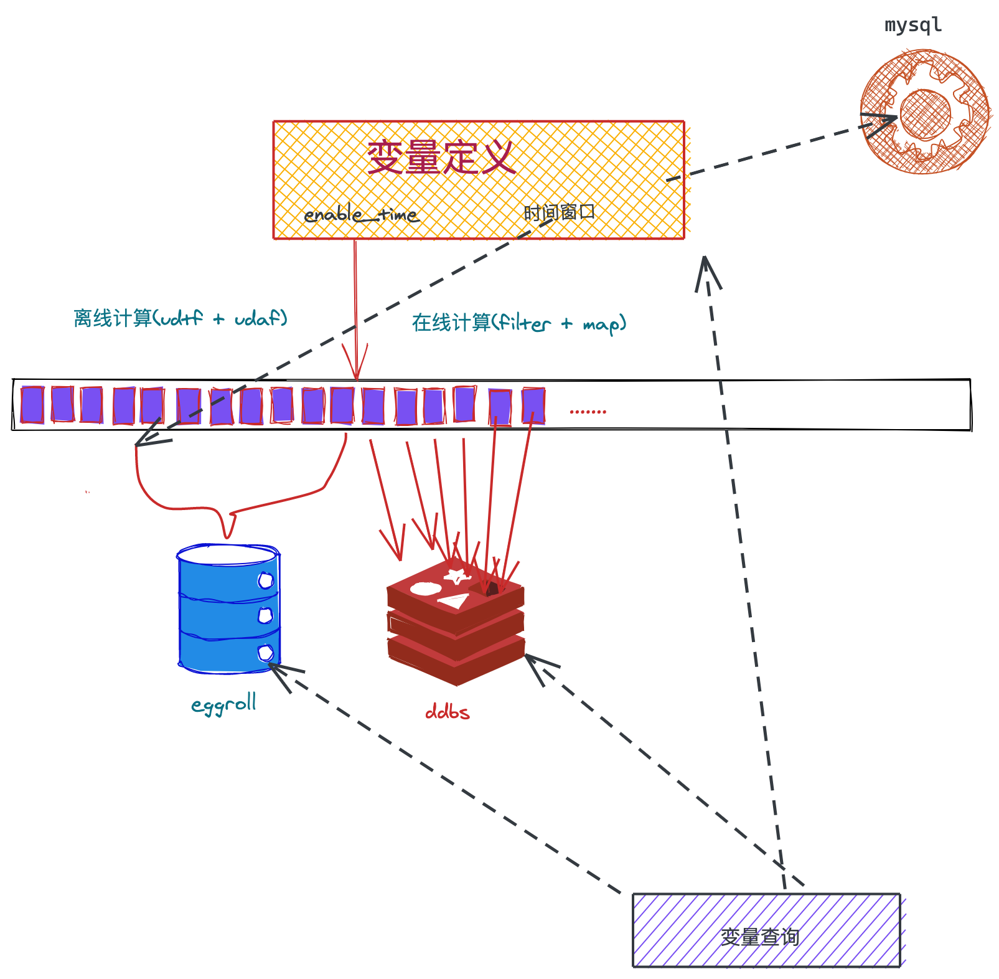

# 大数据开发-深入理解大数据Lambda架构

# 1.大数据处理的挑战

缕一缕it的发展，第一阶段是各大系统各大平台的出现，解决的是线下搬到线上的效率问题，而下一个阶段是数据时代，处理这些各大平台积累的数据，积累的数据，一般比较大，大数据做的是什么，大规模的数据处理，主要是离线为主，所以就出现了hadoop的三大基础组件，分别解决大数据存储，计算，大表存储，这个阶段基本解决了大数据的计算，也即可以编写出程序，完成大数据的大规模运算，后面又出现了实时处理，第一个出现的就是storm，可以处理实时的单个数据，这样就展现了最新的数据，但是同时也看到了，如果既想要最新的又想要历史的，要怎么办呢，所以Storm的作者Nathan Mara提出了Lambda架构，这种架构主要解决离线数据计算结果怎么和实时处理的结果合并提供最后的结果。

# 2.大数据Lambda架构应该有那些特点

首先缕缕需求，我们要的就是一种在线计算结果和离线计算结果合并的架构，试想一种信贷场景，我要得到某个用户交易过的所有贷款机构，假设用这个结果来算多头分，需求场景就是要实时取到最新的数据，比如上一秒交易是A机构，那下一秒交易就得拿到这个机构，那么对于历史数据必然是要存量计算，这种计算必然是需要花费一定时间的，而上一秒交易的A机构，一般在离线仓库里面不会马上放进去，只能将这种数据放到实时处理里边， 细想这种结构，要有下面几个特点，

-   至少保证离线exact-once，环境有时候是不可靠的，尤其是在线系统，在保证exact-once又更差一点，通过离线复算 覆盖在线的方式，即是重刷数据的过程
-   可扩展性，比如离线计算效率不行，可以通过加资源来实现
-   维护性，lambda架构需要保证在线离线的计算逻辑一致，尽量将逻辑用相同的方式来实现在线离线一致性
-   可以通过查询接口查询离线在线计算出来的数据

总的来说本质就是，数据记录 + 查询服务

# 3.大数据Lambda架构简介

前面从需求角度来说明了，一个lambda架构要满足什么特点，我们就得到了数据记录 + 查询服务的这种模式，由于数据记录的写入方式不同，lambda架构里面把写数据记录的曾分为离线批计算层和在线实时计算层

我们得到下面的一个公式

$1.Query = Function(all data)$

$2.all data = batch data + speed data$

为了方便查询Query又常常作为一个view, 这样的一个lambda架构，其实现方案又很多，比如批计算层，可以使用spark，hive等来计算 离线批大数据，而实时层可以使用程序实时计算，可以选择Flink等框架，如果逻辑不复杂也可以使用程序直接生成，至于存储，又可以将离线计算和实时计算的结果分开存储或者使用时序数据库合并存储，另外对于查询，既可以用程序来合并读全部数据，有可以在视图级别做合并。

# 4.Lambda架构的分层

前面讲到大概lambda架构里面的三个模块，分别为离线计算层，在线计算层，查询服务层

首先是离线计算层，由于历史数据较多，会放到hdfs上面，计算方式，使用mr的模型计算 就可，如果有问题，是支持批量重新计算来修复的。

其次是查询view，对于离线预处理好的数据和在线计算结果进行合并提供服务。

# 5.Lambda架构的实现示例

这个架构，是一种实现方式，离线计算采用hive和spark，为了和在线计算逻辑对齐，采用相同jar依赖的方式，只不过离线计算的逻辑是在udf里面，同时有个enable\_time来区分在线离线数据时间点，eggroll可以理解为类似于hbase的离线kv存储数据库。

# 6.思考Lambda架构的问题

Lambda架构经历多年的发展，其优点是稳定，对于实时计算部分的计算成本可控，批量处理可以用晚上的时间来整体批量计算，这样把实时计算和离线计算高峰分开，这种架构支撑了数据行业的早期发展，但是它也有一些致命缺点，并在大数据3.0时代越来越不适应数据分析业务的需求。缺点如下：

-   **实时与批量计算结果不一致引起的数据口径问题**：因为批量和实时计算走的是两个计算框架和计算程序，算出的结果往往不同，经常看到一个数字当天看是一个数据，第二天看昨天的数据反而发生了变化。
-   **批量计算在计算窗口内无法完成**：在IOT时代，数据量级越来越大，经常发现夜间只有4、5个小时的时间窗口，已经无法完成白天20多个小时累计的数据，保证早上上班前准时出数据已成为每个大数据团队头疼的问题。
-   **开发和维护的复杂性问题**：Lambda 架构需要在两个不同的 API（application programming interface，应用程序编程接口）中对同样的业务逻辑进行两次编程：一次为批量计算的ETL系统，一次为流式计算的Streaming系统。针对同一个业务问题产生了两个代码库，各有不同的漏洞。这种系统实际上非常难维护
-   **服务器存储大**：数据仓库的典型设计，会产生大量的中间结果表，造成数据急速膨胀，加大服务器存储压力。

# 7.参考

[https://www.cnblogs.com/cciejh/p/lambda-architecture.html](https://www.cnblogs.com/cciejh/p/lambda-architecture.html "https://www.cnblogs.com/cciejh/p/lambda-architecture.html")

[http://blog.itpub.net/69983799/viewspace-2721063/](http://blog.itpub.net/69983799/viewspace-2721063/ "http://blog.itpub.net/69983799/viewspace-2721063/")
