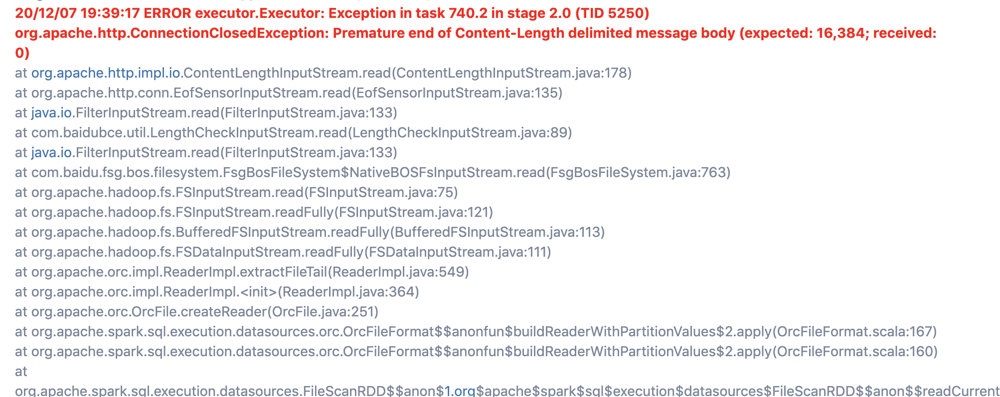

# 大数据开发-生产中遇到的10个致命问题

生产环境版本 Hive: 1.2.1, Spark: 2.3.2

# 1.insert overwrite directory 不会覆盖数据

**注意**，生成结果是目录，生成目录里面的不同文件名不会被覆盖，因此很容易出现数据double或者没有覆盖到数据的问题，比如数据分片原始结果如下：

```powershell
/mytable/000000_0
/mytable/000000_1
/mytable/000000_2
/mytable/000000_3 
## 新生成的数据只含有 000000_0分片，那么1 2 3分片并不会被删掉
```

**解决方式**：使用目录上面建立外表insertoverwrite, 如果这个目录是导入其他系统的目录文件，可能更致命。注意建立外表时候，如果是分区表，删除掉分区，然后insert overwrite也会导致数据重复，测试版本2.3.2

```sql
//a文件数据内容
//2  10
//2  10
//2  10
//创建管理表
create table t2(id int) partitioned by (dt string);
load data local inpath '/xxx/a'

// 创建外分区表
create external table t1(id int) partitioned by (dt string);
// overwrite分区10
insert overwrite table t1 partition(dt='10') select 1 from t2 where dt=10;
//删除分区10
ALTER TABLE t1 DROP PARTITION(dt='10');
// overwrite 10这个分区
insert overwrite table t1 partition(dt='10') select 2 from t2 where dt=10;
```

结果显示6条数据，显然是异常的，在hive中这个结果是正常的（ps,最后发现是由于组内小伙伴自己调试原因，改了参数，其实默认参数是没问题的,就是true）

解决方式：

```sql
set spark.sql.hive.convertMetastoreParquet=true
```

```sql
set spark.sql.hive.convertMetastoreOrc=true
```

# 2.insert tableA select xx from tableB 字段属性问题

注意：`select` 的字段名即使和`tableA`中的字段一样，但是插入顺序与字段顺序不一样，那么结果也是有问题的

常见发生情况为 `later view` 下的`select`，以为字段名对了，插入就没问题，实际上是按顺序插入的，即select再插入，也许与底层是mr实现有关系

# 3.spark.write 写文件如果是覆盖写，如果是并发多个写，同样可能会出现数据重复

通过spark.write写的方式，然后再与表关联，写路径的方式主要有下面两种，通过参数：`mapreduce.fileoutputcommitter.algorithm.version` 来控制，

Spark写入HDFS是依赖于Hadoop的FileOutputCommitter的，它有两种算法，一种是直接写到临时目录，再copy到输出目录，称之为v1版本，另外一种是直接输出到结果目录，称之为v2版本，输出性能上v2版本好一点，但是这两种都不能保证最终一致性，也就是在并发写，情况下都是有问题的，其中v1是两阶段提交，可以保证读的时候，不是脏数据

具体可参考：[https://blog.csdn.net/u013332124/article/details/92001346](https://blog.csdn.net/u013332124/article/details/92001346 "https://blog.csdn.net/u013332124/article/details/92001346")

常发生于任务刚启动，然后停止，又立刻重新调度


注意：离线的事务性比较差，多注意一下，尽量不要立刻重启任务，让同一个目录写数据的操作同时进行，如果一定要马上重启调度任务，解决方式是kill掉任务，删除\_remporay文件即可，离线情况下一致性往往大于性能，拒自己情况选择v1还是v2版本的提交。

# 4.msck repair table 的问题

在回溯数据和例行执行任务时候，可能会出现写数据还没写完，回溯的任务将表msck repair ,导致下游任务读到的数据不完全，跟3问题类似，其中两个version的提交，在msck repair 之后，都会出现，数据不完全，下游任务就检测到分区

**解决方式**：

```sql
write + repair —> insert / write + add partition
```

# 5.insert overwrite自个表分区

在hive里面直接写是支持的，在spark里面会先删数据分区，然后懒加载才开始读数据，这样就导致空指针，空数据问题，解决方法是先cache + 随便一个action 数据缓存到内存。

注意：一般这样不建议，除非是刚开始开发的不重要的表，离线的做法是增加version来区分版本，常用在增加字段，修改字段生成逻辑，先增加个version，在新version上来搞，搞完了通知下游切换，或者保证无误，将version改到老分区。

# 6.切记用最近的逻辑来依赖分区

实际场景中，要尽可能地让数据跑批幂等，否则会出现在不知情维护情况下出现线上问题，增量表幂等常用处理方式`  ods_day ≤ 当天  ` ，全量表常用处理方式`ods_day=当天`即使并不需要卡这个时间，在当前天修数据，或者回溯时候，就不能保证数据一直有效，不能回溯的数据，查问题会让你恶心至极。

# 7.Spark和Hive的不兼容问题

对于Orc文件格式和Parquet文件格式，从兼容上来说，Spark实现更新一点，Hive稍微旧一点，比如用Spark建立的分区在某些情况写出现null, empty等问题，可以设置下面两个参数，开启使用hive的orc和Parquet格式来建表，这样Spark和Hive就可以读到可以同时兼容的数据表了，建议除非一些临时表，需要落库的表，可以尽量用Hive的方式来建，建完以后，Spark写的时候多加下面的参数就不会有兼容问题了

```sql
//第一种
set spark.sql.hive.convertMetastoreParquet=true
set spark.sql.hive.convertMetastoreOrc=true 

//第二种
// Spark使用与Hive相同的约定写parquet数据
.config("spark.sql.parquet.writeLegacyFormat", "true") 
```

# 8.读文件Qps过高问题

```bash
20/12/07 19:39:17 ERROR executor.Executor: Exception in task 740.2 in stage 2.0 (TID 5250)
org.apache.http.ConnectionClosedException: Premature end of Content-Length delimited message body (expected: 16,384; received: 0)
```




遇到如图所示问，从表面展示出来的是，读文件太高，导致传输只传输了一半数据，与机器限流有关，就我厂而言，问过bmr维护的人，给的答复是，减少对某一文件的读取频率

**解决方式**：刚开始有些郁闷，离线数据读难道还有并发问题，其实是限制的在某个datanode上某个文件块的读取qps, 所以，从这些方面来排查，首先分析哪些表是关键表，对关键表看看是否都是大文件，如果是的话调整其为小文件，常见方式有repatition 输出或者hive的reduce数。

# 9.排序窗口函数的bug

经过多次测试，-这个符号不起作用

```scala
spark.sql(sql).withColumn("rn", row_number().over(Window.partitionBy('f_trans_id).orderBy(-'f_modify_time)))
// 替代方案(最好用sql形式而不是DSL，感觉不是很直观)
spark.sql(sql).withColumn("rn", row_number().over(Window.partitionBy('f_trans_id).orderBy($"f_modify_time".desc))
spark.sql(sql).withColumn("rn", row_number().over(Window.partitionBy('f_trans_id).orderBy(col(f_modify_time).desc))

```

# 10.alter table cascase

`alter table` 要加`CASCADE`，否则回溯的历史数据分区的数据在hive中看不到,原理是不加`cascade`只对加了字段以后的元数据有用，对于旧分区回溯，即使数据回溯完成，你也是拿不到的，如果在回溯完才发现这个问题，可以`change colunmn`的方式来补元数据

**参考**：

[https://www.turbofei.wang/spark/2019/09/30/关于Spark数据计算结果异常的场景分析](https://www.turbofei.wang/spark/2019/09/30/关于Spark数据计算结果异常的场景分析 "https://www.turbofei.wang/spark/2019/09/30/关于Spark数据计算结果异常的场景分析")

[https://blog.csdn.net/u013332124/article/details/92001346](https://blog.csdn.net/u013332124/article/details/92001346 "https://blog.csdn.net/u013332124/article/details/92001346")

