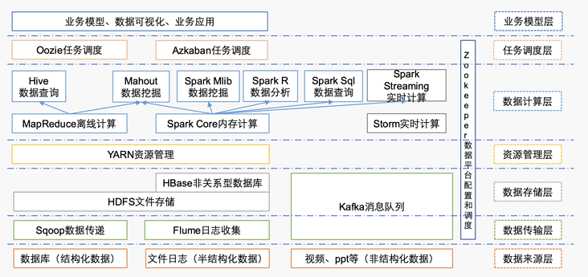
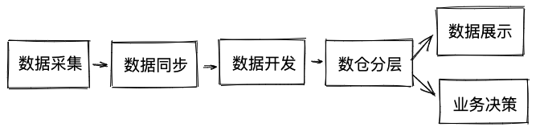

# 大数据开发-职位分类

如何跟一个非相关性的人解释你是做大数据的，你是做大数据的哪一部分工作，从求职者角度，如何从jd描述中估摸大概率做哪一块，从猎头角度，如何从一份简历中看出你更匹配哪个jd

# 1.相关技术

大数据开发的技术名词无非是下面几种，

Hadoop,Hive,Spark,Kafka,Sqoop,Flink,Oozie,Hbase,hue

但是大数据架构根据每个厂的基础建设不同，可能会有不同的方案，但是总的流程是大致一致的

涉及的语言一般是：Java, Scala, Python, Go  其中前两者是必须掌握的主语言，后两者是平台或者业务多

# 2.流程

粗略地来讲，应用角度，最终有两种服务去向，一种是返回给用户，一种是做业务决策，虽说业务决策最终大概率也是返回给用户，但是这是一个隐含的很长的链，所以假设不考虑这个，返给用户又包括：实时返回，定时返回，运营结果返回，

其他就是辅助上面数据流转的框架引擎，监控系统等等，调度系统

### 数据采集

自己后台业务数据，埋点数据，第三方数据

### 数据同步

将业务数据库数据或者kafka等日志拉到数仓

### 数据开发

将原始ods层数据根据数仓划分一层层加工

### 数据展示

将最后的数据再导入到业务数据库

# 3.岗位分类

基础平台团队

主要负责搭建稳定、可靠的大数据存储和计算平台。

核心成员包括：

### 数据开发工程师

负责Hadoop、Spark、Hbase和Storm等系统的搭建、调优、维护和升级等工作，保证平台的稳定。

### 数据平台架构师

负责大数据底层平台整体架构设计、技术路线规划等工作，确保系统能支持业务不断发展过程中对数据存储和计算的高要求。

### 运维工程师

负责大数据平台的日常运维工作

## 数据平台团队

主要负责数据的清洗、加工、分类和管理等工作，构建企业的数据中心，为上层数据应用提供可靠的数据。

### 数据开发工程师

负责数据清洗、加工、分类等开发工作，并能响应数据分析师对数据提取的需求。

### 数据挖掘工程师

负责从数据中挖掘出有价值的数据，把这些数据录入到数据中心，为各类应用提供高质量、有深度的数据。

### 数据仓库架构师

负责数据仓库整体架构设计和数据业务规划工作。

## 数据分析团队

主要负责为改善产品体验设计和商业决策提供数据支持。

### 业务分析师

主要负责深入业务线，制定业务指标，反馈业务问题，为业务发展提供决策支持。

### 建模分析师

主要负责数据建模，基于业务规律和数据探索构建数据模型，提升数据利用效率和价值

