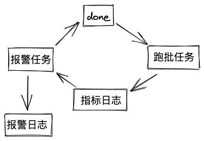

# 大数据开发-表数据波动、码值分布波动监控 && 报警

数据监控在数据开发中的地位是显而易见的，本篇对前面的[基于done文件的数据监控理论](https://www.cnblogs.com/hulichao/p/14092958.html "基于done文件的数据监控理论")监控做了更进一步的设计产出。

**0. 设计摘要**

了解的大部分平台都是把任务执行，监控，和报警放在一起做，这样的好处是，让报警，监控更及时，但是在离线场景，实时性要求没那么高，如果能把这三个部分解耦，不体现在调度上的耦合很显然对数据治理方面有很大的帮助。所以任务执行、监控和报

警从设计上是可以完全分开的，分开可以让任务执行尽可能只做任务执行的事情，监控可以根据多种监控规则来进行数据统计，数据分布，而报警则专注于如何根据监控的结果进行自定义灵活地报警。其中在设计上可以以监控为主体，任务执行和报警可以依

据需求来定制，从而更好满足各方需求。 监控规则的设计，暂时从以下几个方面入手，**数据分区的生成**、**数据分区的数据量**、**数据分区的数据量波动**、**表数据字段的码值分布、表数据字段的码值分布波动**。监控的主要职责是跑数，跑出报警需要的数据，而

报警，可以根据监控的输出数据以及监控配置进行生成done文件或者undone 和 报警。

done目录和原表目录类似 表/版本/分区或日期/done/a.done or b.done or c.done (根据配置的根目录 + 表路径的后半部分来生成)

# 1.表数据监控

监控什么？要达到什么目的？

监控主要有两个目的，一个是报警，另外一个是拦截，拦截为了发生问题时不继续往下走，所以一般配置有拦截必有报警，有报警不一定有拦截，比如延时报警。

### 1.1 输入什么

一个调度平台的调度时间，以天为单位，最后体现在跑批日志的分区字段上，可以支持回溯，其他监控需要的配置信息都在表数据监控的主表里面，一些特别的配置信息，会用到附属表，比如分布子表。

### 1.2 计算模型

耗费计算资源依次为**少，中，高，较高**

#### 1.2.1分区有没有生成&#x20;

码值1 生成，0没有生成

#### 1.2.2分区数据量

select count  表名  where 输入条件

#### 1.2.3 环比分区数量波动

使用场景针对有时间的分区表，其他情况不支持结果保存error字段

根据输入条件的日期格式判断环比是小时级、天级、月级

a = select count  表名  where （输入条件）

b = select count  表名  where （输入条件 - 环比单位）

结果 $\frac {a -b} {a}$

#### 1.2.4 数据码值分布

什么是数据码值分布？

假设有下面标签表tag\_table

| sex(性别) | age(年龄) | rank(等级) |
| ------- | ------- | -------- |
| 男       | null    | A        |
| 女       | 19      | B        |
| 未知      | 45      | C        |
| 。。。     | 。。。     | D        |

对于连续性数值：只有非正常值(未知 + null值)，正常值三种

对于有码值分布的：有含义的码值，null

所以数据结果是：

```scala
{
    "sex":{
        "男":0.25,
        "女":0.65,
        "未知":0.05,
        "NULL":0.05
    },
    "age":{
        "normal":0.65,
        "NULL":0.35
    },
    "rank":{
        "A":0.1,
        "B":0.5,
        "C":0.3,
        "D":0.1
    }
}
```

#### 1.2.5 数据码值分布波动数据

说明：监控是表级别的，所以必然有表→字段→码值都要覆盖到

字段的检查由填入的值来作为输入源，没有配的字段=全表字段-输入字段 ，码值自动计算，对于少码值或者多码值的，波动值较大直接给100%

如何衡量数据分布波动, 参考1.2.4 数据码值分布，环比上个周期和本周期的数据如下：

```scala
//昨天
{
    "sex":{
        "男":0.25,
        "女":0.65,
        "未知":0.05,
        "NULL":0.05
    },
    "age":{
        "normal":0.65,
        "NULL":0.35
    },
    "rank":{
        "A": 0.1,
        "B": 0.5,
        "C": 0.3,
        "D": 0.1
    }
}

//今天
{
    "sex":{
        "男": 0.20,
        "女": 0.70,
        "未知": 0.05,
        "NULL": 0.05
    },
    "age":{
        "NULL": 1
    },
    "rank":{
        "A": 0.4,
        "B": 0,
        "C": 0.1,
        "D": 0,
        "E": 0.5
    }
} 
```

码值的变动 波动给 100% 附带 error信息

其他使用下面公式来计算$ \frac {a + b -  2a} {a+b-b}  $

```scala
{"sex":  0.89, "age", 0.68, "rank": 0.55}
```

# 2.报警设计

报警任务的每次启动可以依赖当天分区数据监控的日志跑批分区，即至少有跑批日志，才开始进行报警任务。报警的输入是监控主表和监控跑批表，输出done,undone && 报警，于报警日志中。弱报警 && 强报警

# 3. 整体设计


使用平台例行任务来调度监控任务，使用mysql开发环境来读配置，使用gp来存储结果数据，使用平台同步功能将同结构的hive结果表同步到gp来做报表展示，整个过程支持回溯。

任务和数据依赖示意图：



**表数据监控配置表**：

```sql
-- 第一版
-- 总表
create table table_monitor_conf
(
    db_table_key                        varchar(255) default 'default' not null,
    db_table_name                       varchar(255)                   not null comment '库表',
    table_charge_people                 varchar(255)                   not null comment '表负责人',
    done_path                           varchar(255)                   null comment 'done 文件输出位置前缀',
    where_condition                     varchar(255)                   null comment 'where 子句内容 eg:version=20201201 and dt=#yyyyMMdd#',
    if_done                             varchar(255)                   null comment '是否生成done文件',
    if_check_partition                  varchar(255)                   null comment '是否检测分区生成',
    if_check_partition_count            varchar(255)                   null comment '是否检测分区数据量',
    if_check_partition_count_fluctuates varchar(255)                   null comment '是否检测分区数据量波动',
    if_check_distribute                 varchar(255)                   null comment '是否检测数据分布',
    if_check_distribute_fluctuates      varchar(255)                   null,
    primary key (db_table_name, db_table_key)
);

-- rule4 和 rule5 时候使用
create table table_monitor_distribute_conf
(
    db_table_name        varchar(255)   not null comment '库，表名',
    with_code_value_keys varchar(10000) null comment '有码值的字段',
    no_code_value_keys   varchar(10000) null comment '无码值的字段',
    constraint table_monitor_distribute_fk
        foreign key (db_table_name) references table_monitor_conf (db_table_name)
            on update cascade on delete cascade
);
-- 第二版--先用旧版
create table table_rule_conf (
  db_table_key string comment '同一个表有多个版本时候使用',
  db_table_name string comment '被监控库.表', 
  table_charge_people string comment '表负责人',
  done_path string comment 'done 文件输出位置前缀',
  where_condition string comment 'where 子句内容，dt日期是java格式 eg:version=20201201 and dt=#yyyyMMdd#',
  rule1_if_check_partition string  comment '规则1：是否监控产出分区',
  rule2_if_check_partition_count string  comment '规则2：是否监控产出分区数据量',
  rule3_if_check_partition_count_fluctuates string comment '规则3：是否监控产出分区数据量波动',
  rule4_if_check_distribute string comment '规则4：是否监控产出表数据分布',
  rule5_if_check_distribute_fluctuates string comment '规则5：是否监控产出表数据分布波动'
) 
```

其中当table\_monitor\_conf 的 db\_table = 'default.default' 时候表示是所有配置记录的默认值。

**表数据量监控跑批记录**：

```sql
create table table_rule_records (
  db_table_key string comment '同一个表有多个版本时候使用',
  db_table_name  string  comment '跑批表，来源table_monitor_conf 的db_table',
  check_data_time string comment '任务实际跑批时间-程序生成',
  rule_name string comment '规则名',
  rule_result string comment '规则结果',
  rule_error string comment '规则异常信息',
  checked_partition string comment '被检查的分区'
) partitioned by (dt string,hm string);

```

**报警配置表**

```sql
--第一版
create table table_monitor_notify_conf
(
    db_table_key                     varchar(255) default 'default' null,
    db_table_name                    varchar(255)                   null comment '库表',
    check_count_threshold            bigint                         null comment '监控产出分区数据量的阈值',
    normal_produce_datetime          varchar(255)                   null comment '表数据正常例行产生时间',
    check_distribute_json_threshold  double                         null comment '表数据分布阈值,与前一周期的大向量的余弦距离',
    check_count_fluctuates_threshold double                         null comment '监控产出分区数据量波动的阈值',
    notify_enable                    int                            null comment '是否开启此报警',
    constraint table_monitor_notify___fk
        foreign key (db_table_name, db_table_key) references table_monitor_conf (db_table_name, db_table_key)
            on update cascade on delete cascade
);

create index table_monitor_notify_conf__index
    on table_monitor_notify_conf (db_table_name);
    
    
--第二版,先不用
create table table_monitor_notify_conf(
  db_table string comment '库表',
  notify_enable string comment '是否开启此报警',
  if_done string comment '总开关：是否生成done文件'
  
  normal_produce_datetime string comment '表数据正常产生时间',
  check_count_threshold bigint  comment '监控产出分区数据量的阈值',
  check_count_fluctuates_threshold double comment '监控产出分区数据量波动的阈值' ,
  check_distribute__json_threshold double comment '表数据分布波动阈值'
)

```

**报警日志表**

```.properties
CREATE TABLE table_monitor_notify_records(
`db_table_name` string COMMENT '哪个表有问题', 
`view_url` string COMMENT '页面展示地址', 
`db_table_key` string comment 'key+name唯一标识表',
rule_name string comment '规则名称',
`if_ok` string comment '是否满足检查',
`done_path` string comment 'done_文件路径',
`table_charge_people` string COMMENT '表负责人',
 `trouble_description` string COMMENT '有什么问题', 
 `check_data_time` string COMMENT '报警时间-程序生成'
 )
PARTITIONED BY (`dt` string)

```

写出数据，done 文件 ，undone文件 每个表，每个分区只有一个

数据分布，在分布波动的第一次跑数据时候，就会写一份

**总共有几个任务**：监控任务，报警任务各1个，每天1点->晚上8点，10分钟一次

**其他**:  &#x20;

hi\_email\_message\_phone string comment '报警方式，保留字段'

zhiban\_people string comment '值班负责人，保留字段',

TODO:&#x20;

-   [ ] 增加值班人，报警方式升级、
-   [ ] 根据依赖来报警
-   [ ] 通过群内机器人，来操作报警日志表，达到报警暂停一段时间的作用
