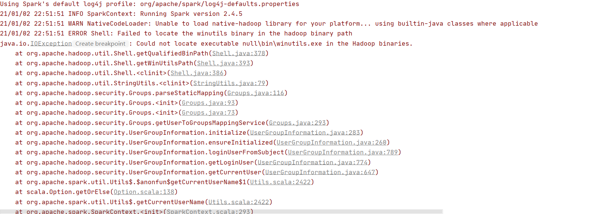
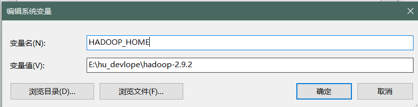
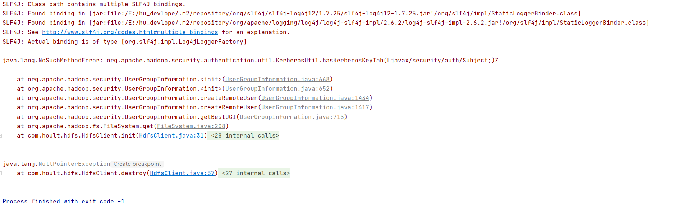
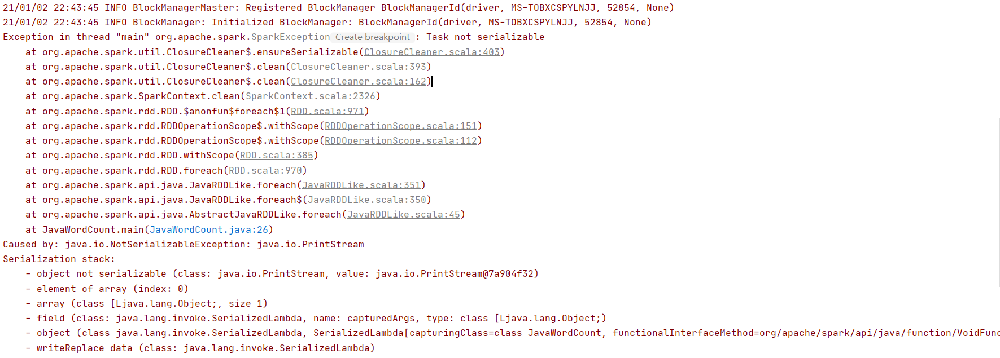

# 大数据开发-解决Windows下，开发环境常遇的几个问题

# 1.背景

大数据开发的测试环境，很多人不以为然，其实重复的打包，上传，测试虽然每次时间大概也就几分钟，但是积累起了往往会花费很多的时间，但是一个完整的测试环境在生产环境下往往难形成闭环，抛开堡垒机权限不说，hadoop，hive，spark等服务端的权限也会难倒一群英雄好汉，主要是太繁琐了，测试环境的搭建，我这里采用Docker容器，适合多端迁移，而且容器的镜像大小也比虚拟机小很多，难度上说，也只需要掌握几个基础的命令即可，除非想引入K8s等技术，但测试环境完全没必要，Docker环境搭建大数据平台的系列从这里[大数据开发-Docker-使用Docker10分钟快速搭建大数据环境,Hadoop、Hive、Spark、Hue、Kafka、ElasticSearch.....](大数据开发-Docker-使用Docker10分钟快速搭建大数据环境,Hadoop、Hive、Spa_gYBiPQj42ryu5qSBiff5kb.md "大数据开发-Docker-使用Docker10分钟快速搭建大数据环境,Hadoop、Hive、Spark、Hue、Kafka、ElasticSearch.....")\`[https://blog.csdn.net/hu\_lichao/article/details/112125800](https://blog.csdn.net/hu_lichao/article/details/112125800 "https://blog.csdn.net/hu_lichao/article/details/112125800")\`，环境搭建好了，可能还是会有一些特殊的问题

# 2.如何解决缺失winutils.exe

在Win操作系统，idea下开发hadoop程序或者Spark程序，那么你肯定会遇到下面的问题



之所以出现上面的问题，Spark程序和Hadoop在idea写编写的程序是依赖hadoop的环境的，所以要提前配置好，并且设定`HADOOP_HOME` ，不一定需要`$HADOOP_HOME/bin` 到`PATH` ，后者是给快捷方式用的



**注意**：配置完环境变量后要将idea，退出后重进，不能**`Restart`**

# 3.如何解决java.lang.NoSuchMethodError: org.apache.hadoop.security.authentication.util.KerberosUtil.hasKerberosKeyTab(Ljavax/security/auth/Subject;)Z

错误如下图



出现这个问题的原因是版本冲突，即使看起来不那么明显，可能是spark依赖的包中的hadoop和hadoop依赖的版本不一致[https://stackoverflow.com/questions/45470320/what-is-the-kerberos-method](https://stackoverflow.com/questions/45470320/what-is-the-kerberos-method "https://stackoverflow.com/questions/45470320/what-is-the-kerberos-method")，具体不一致的问题，可能各有不同，解决难易程度因人而异😁😁😁,我的解决方式就是`exclude`掉`spark`的低版本`hadoop`

# 4.如何解决Exception in thread "main" org.apache.spark.SparkException: Task not serializable



这个问题，我是这么遇到的，如下程序：

```java
// results.foreach(System.out::println); //输出没有序列化
   results.foreach(x -> System.out.println(x));

```

首先`foreach`是action算子，需要将task上的数据拉到driver上来遍历显示，就需要序列化，如果习惯了Java的lambda写法，可能会写第一种，第一种写法的问题是没有序列化，序列化是在闭包里完成的，而使用静态方法调用的方式，没有闭包化，所以会报序列化的问题，写成第二种就可以了，System.out是一个`final static`对象。

```java
  public final static PrintStream out = null;
```

# 5.Failed to connect to /xxx.xxx.xxx:50010 for block, add to deadNodes and continue

用java通过api读取hdfs上面的文件是，出现了`Failed to connect to /xxx.xxx.xxx:50010 for block, add to deadNodes and continue`

这是由于本地测试和服务器不在一个局域网,安装的hadoop配置文件是以内网ip作为机器间通信的ip.在这种情况下,我们能够访问到namenode机器,namenode会给我们数据所在机器的ip地址供我们访问数据传输服务,但是返回的的是datanode内网的ip,我们无法根据该IP访问datanode服务器.让namenode返回给我们datanode的域名,在开发机器的hosts文件中配置datanode对应的外网ip和域名,并且在与hdfs交互的程序中添加如下代码即可`Configuration conf = new Configuration(); `

`//设置通过域名访问datanode conf.set("dfs.client.use.datanode.hostname", "true");`

