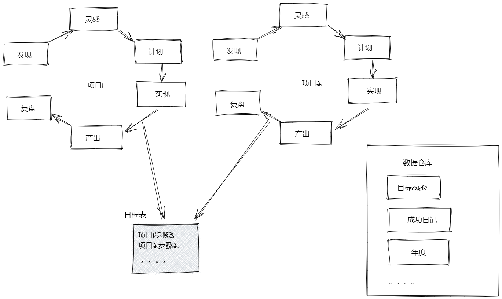
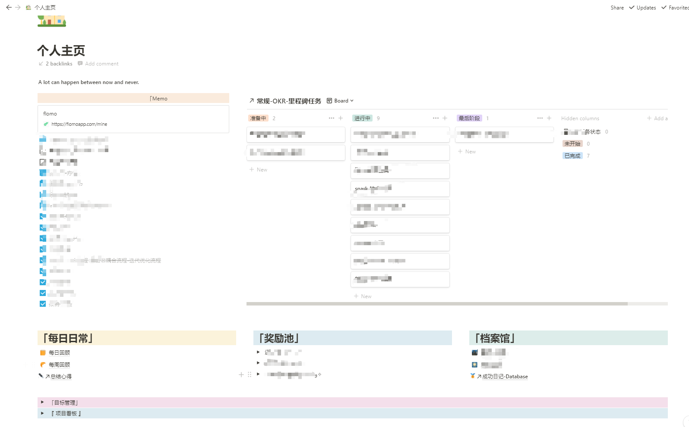

# 时间管理-我的工作流-操作系统简介

# 1.问题

像一些效率工具，比如滴答清单，Notion/我来，Xmind，Cubox等这些，差不多都有两年以上的使用基础，但是苦于一直还是沦为了工具人，而不是用工具解决问题的人，像Notion的Database, 维格表/飞书表格的很好解决了信息系统数据冗余的却没有关联的问题，Cubox解决了截切 收藏的问题，滴答清单在ToDo方面很好地指引了我，另外在我来这款工具上，我也花了很多心力做了知识系统，其他还有Flomo,可以解决Memo无压力记录，但是慢慢地也发现很多问题，比如多个系统的交互关联问题，这是一个头疼的点，其中Notion其实可以解决这些大部分问题的，但是闹心的是国内的速度，所以很扯，逐渐想用我来代替，但是苦于我来一直没有DB，工具的切换造成了很多重复性工作，像一个朋友针对此问题，寻求Api的方式，而我也较懒，真的一直在朝用工具解决问题的方向努力，所以在这点，还是不愿意寻求Api的方式解决系统联动，但是确实这样浪费了很多时间，这值不值得，确实只有经历过后才知道。

# 2.寻求解决

像前面的问题，一直就有，我相信2021可能是知识型工具爆发的元年，最终慢慢会归于一统，在这之前，我觉得我该好好想想，如果我去做这个工具呢，我要做成什么样，或者说，我是不是应该从内心深处，了解这个工具的应该需求是什么，而不是仅仅从现有工具中选择并去堆砌自己的操作系统，这样我会被工具的规划拖着鼻子走，比如一直期待的我来DB, 每个产品的痛点也很明显，正如Notion的理念，它是一瑞士军刀，你可以用它来做多想做的事情，它的门槛也许较高，但是是否能满足你需求，只有你自己知道，所以了解自己的需求才是最重要的，不能仅仅被它某个功能，某个外表吸引而去选择它，让它恶心你，但是你又必须去痛苦滴使用它，你没法接受与它和解，是因为你觉得优点和缺点都很明显，但是你care的呢，才是你所需要的，也就是你的需求。

# 3.我的需求

痛点和优点，各个软件都有，而我的需求，也渐渐清晰，就是罗列出这些工具，罗列出我的需求来。

## 3.1 目的

既然是工具，就要以满足我的目标来使用，那么我的目的就是搭建基于自己的操作系统，为了学习，工作，生活更爽，像玩游戏一样，既有迭代升级，又有创造，里程碑，又有目标，还有奖励，具体点要有下面几个特点，

-   收集，如果有好的文章能够永久收藏，收藏可以有类似归档的效果，所以**cubox**是必选
-   简单，使用起来不要有太多压力
-   使工作，学习等更有效率（计划，记录，检索等）
-   做过的事情有所记录或者收获，大脑总是记不住很多，所以系统要让我记住这些相对有意义的点
-   优化迭代自己过去的流程，反思，复盘，不足与优势
-   做一件有意义的事情记录和思考是闭环的

其中最重要的是需要闭环，闭环很重要，你不能在做完一个项目后，忘记它，你需要像大脑记忆触点一样，在下次有同样需求的时候，尽快地调动出来，也即，事前计划，事中记录，事后回顾

## 3.2 尝试

既然已经定了目的，就缕一缕现有使用过的或者听过的工具

-   cubox做收集网页
-   flomo临时想法，可以减轻记录和思考压力，
-   滴答清单做todo和专注
-   我来，知识系统搭建，多建立双链
-   notion的db, 维格表的db, 飞书表格的db

## 3.3 项目场景

### 3.3.1 工作持续性主线

发现-灵感-计划-实现-产出-复盘-记录

后面每一轮会参考前面产出记录下来的，在每个阶段做修正和优化

第N轮：发现（联想）-灵感（联想）-计划（联想）-实现（联想）-产出-复盘（联想）-记录-总结（联想）

可以发现，除了执行的那一步，其他都需要通过前面的知识来关联，执行中有问题的，修正的其实是计划，所以说执行和记录时最简单的，记录就是将整个过程怎么做的，怎么想的记录下来，总结就是提炼好的点，忘记不好的点

为了方便联想，可以将之前总结的用索引，双链来记录，方便后续很快联想，至于细节部分，在总结的时候去关联当时的记录即可

发现和灵感阶段的事情往往较多，要遵循less is more,  这些是不是实现几个维度的比较核心关键的点，如果是的话再去做，也就是why和how

### 3.3.2 生活持续性主线

**习惯类**：定计划-打卡执行-记录-统计

**项目类**：发现（联想）-灵感（联想）-计划（联想）-实现（联想）-产出-复盘（联想）-记录-总结（联想）

### 3.3.3 数据仓库

**知识类**：知识系统-网状，参考类-网状

**任务管理类**：数据db

**目标管理**：数据db

**项目管理**：数据db

**任务管理**：数据db

**成功日记**：数据db

**习惯类/日程表**：自动数据db

**奖励清单**：数据db

总结一下，其实想要的就是一个数据仓库和实现这套数据仓库的信息系统，习惯类和日程表归为一起的原因是，习惯类必然有时间标识，日程表里面除了习惯类的就是其他为实现你的某个项目或者任务的一条执行信息，可以看到除了知识类信息，其他大部分都是需要的像关系型数据库的数据信息，但是每个人可能有每个人的一套游戏操作系统。

# 4.实践

人生的游戏就是如此，既想很爽，又不想爽到无极限，所以你需要自己的操作系统，主要是通过notion的db来搭建的（可以考虑用其他工具）

当然也可能有一天我真的会去做这个工具，更多有想法的可以联系我，咱们一起探讨，关于个人操作系统的，下面链接会持续更新：[https://www.wolai.com/bzSbH75zFP8UFD7Yjn7aB2?theme=light](https://www.wolai.com/bzSbH75zFP8UFD7Yjn7aB2?theme=light "https://www.wolai.com/bzSbH75zFP8UFD7Yjn7aB2?theme=light")
