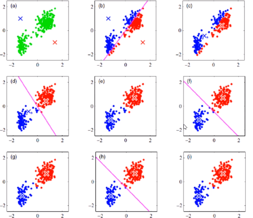
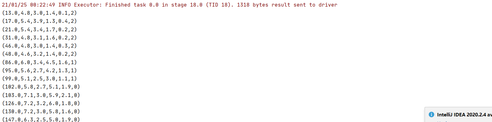

# 机器学习-KMeans算法原理 && Spark实现

不懂算法的数据开发者不是一个好的算法工程师，还记得研究生时候，导师讲过的一些数据挖掘算法，颇有兴趣，但是无奈工作后接触少了，数据工程师的鄙视链，模型>实时>离线数仓>ETL工程师>BI工程师（不喜勿喷哈），现在做的工作主要是离线数仓，当然前期也做过一些ETL的工作，为了职业的长远发展，拓宽自己的技术边界，有必要逐步深入实时和模型，所以从本篇文章开始，也是列个FLAG，深入学习实时和模型部分。

> 改变自己，从提升自己不擅长领域的事情开始。

# 1. KMeans - 算法简介

K-Means算法是无监督的聚类算法，它实现起来比较简单，聚类效果也不错，因此应用很广泛，

-   K-means算法，也称为K-平均或者K-均值，一般作为掌握聚类算法的第一个算法。
-   这里的K为常数，需事先设定，通俗地说该算法是将没有标注的 M 个样本通过迭代的方式聚集成K个簇。
-   在对样本进行聚集的过程往往是以样本之间的距离作为指标来划分。



**核心**：K-means聚类算法是一种迭代求解的聚类分析算法，其步骤是随机选取K个对象作为初始的聚类中心，然后计算每个对象与各个种子聚类中心之间的距离，把每个对象分配给距离它最近的聚类中心。聚类中心以及分配给它们的对象就代表一个聚类。每分配一个样本，聚类的聚类中心会根据聚类中现有的对象被重新计算。这个过程将不断重复直到满足某个终止条件。终止条件可以是没有（或最小数目）对象被重新分配给不同的聚类，没有（或最小数目）聚类中心再发生变化，误差平方和局部最小

# 2.KMeans 算法流程

#### 2.1 读取文件，准备数据，对数据进行预处理&#x20;

#### 2.2 随机找K个点，作为初始的中心点

#### 2.3 遍历数据集，计算每一个点到3个中心的距离，距离那个中心点最近就属于哪个中心点

#### 2.4 根据新的分类计算新的中心点

#### 2.5 使用新的中心点开始下一次循环（继续循环步骤2.3）

**退出循环的条件**：

1.指定循环次数

2.所有的中心点几乎不再移动（即中心点移动的距离总和小于我们给定的一个常熟，比如0.00001）

# 3. KMeans算法优缺点

**K值的选择**： k 值对最终结果的影响至关重要，而它却必须要预先给定。给定合适的 k 值，需要先验知识，凭空估计很困难，或者可能导致效果很差。

**异常点的存在**：K-means算法在迭代的过程中使用所有点的均值作为新的质点(中心点)，如果簇中存在异常点，将导致均值偏差比较严重。 比如一个簇中有2、4、6、8、100五个数据，那么新的质点为24，显然这个质点离绝大多数点都比较远；在当前情况下，使用中位数6可能比使用均值的想法更好，使用中位数的聚类方式叫做K-Mediods聚类(K中值聚类)

**初值敏感**：K-means算法是初值敏感的，选择不同的初始值可能导致不同的簇划分规则。为了避免这种敏感性导致的最终结果异常性，可以采用初始化多套初始节点构造不同的分类规则，然后选择最优的构造规则。针对这点后面因此衍生了：二分K-Means算法、K-Means++算法、K-Means||算法、Canopy算法等

实现简单、移动、伸缩性良好等优点使得它成为聚类中最常用的算法之一。

# 4.KMeans算法Spark实现

## 4.1 数据下载和说明

链接：[https://pan.baidu.com/s/1FmFxSrPIynO3udernLU0yQ](https://pan.baidu.com/s/1FmFxSrPIynO3udernLU0yQ "https://pan.baidu.com/s/1FmFxSrPIynO3udernLU0yQ")提取码：hell
复制这段内容后打开百度网盘手机App，操作更方便哦

鸢尾花数据集，数据集包含3类共150调数据，每类含50个数据，每条记录含4个特征：花萼长度、花萼宽度、花瓣长度、花瓣宽度

过这4个 特征，将花聚类，假设将K取值为3，看看与实际结果的差别

## 4.2 实现

没有使用mlb库，而是使用scala原生实现

```scala
package com.hoult.work

import org.apache.commons.lang3.math.NumberUtils
import org.apache.spark.SparkContext
import org.apache.spark.rdd.RDD
import org.apache.spark.sql.SparkSession

import scala.collection.mutable.ListBuffer
import scala.math.{pow, sqrt}
import scala.util.Random

object KmeansDemo {

  def main(args: Array[String]): Unit = {

    val spark = SparkSession
      .builder()
      .master("local[*]")
      .appName(this.getClass.getCanonicalName)
      .getOrCreate()

    val sc = spark.sparkContext
    val dataset = spark.read.textFile("data/lris.csv")
      .rdd.map(_.split(",").filter(NumberUtils.isNumber _).map(_.toDouble))
      .filter(!_.isEmpty).map(_.toSeq)


    val res: RDD[(Seq[Double], Int)] = train(dataset, 3)

    res.sample(false, 0.1, 1234L)
      .map(tp => (tp._1.mkString(","), tp._2))
      .foreach(println)
  }

  // 定义一个方法 传入的参数是 数据集、K、最大迭代次数、代价函数变化阈值
  // 其中 最大迭代次数和代价函数变化阈值是设定了默认值，可以根据需要做相应更改
  def train(data: RDD[Seq[Double]], k: Int, maxIter: Int = 40, tol: Double = 1e-4) = {

    val sc: SparkContext = data.sparkContext

    var i = 0 // 迭代次数
    var cost = 0D //初始的代价函数
    var convergence = false   //判断收敛，即代价函数变化小于阈值tol

    // step1 :随机选取 k个初始聚类中心
    var initk: Array[(Seq[Double], Int)] = data.takeSample(false, k, Random.nextLong()).zip(Range(0, k))

    var res: RDD[(Seq[Double], Int)] = null

    while (i < maxIter && !convergence) {

      val bcCenters = sc.broadcast(initk)

      val centers: Array[(Seq[Double], Int)] = bcCenters.value

      val clustered: RDD[(Int, (Double, Seq[Double], Int))] = data.mapPartitions(points => {

        val listBuffer = new ListBuffer[(Int, (Double, Seq[Double], Int))]()

        // 计算每个样本点到各个聚类中心的距离
        points.foreach { point =>

          // 计算聚类id以及最小距离平方和、样本点、1
          val cost: (Int, (Double, Seq[Double], Int)) = centers.map(ct => {

            ct._2 -> (getDistance(ct._1.toArray, point.toArray), point, 1)

          }).minBy(_._2._1)  // 将该样本归属到最近的聚类中心
          listBuffer.append(cost)
        }

        listBuffer.toIterator
      })
      //
      val mpartition: Array[(Int, (Double, Seq[Double]))] = clustered
        .reduceByKey((a, b) => {
          val cost = a._1 + b._1   //代价函数
          val count = a._3 + b._3   // 每个类的样本数累加
          val newCenters = a._2.zip(b._2).map(tp => tp._1 + tp._2)    // 新的聚类中心点集
          (cost, newCenters, count)
        })
        .map {
          case (clusterId, (costs, point, count)) =>
            clusterId -> (costs, point.map(_ / count))   // 新的聚类中心
        }
        .collect()
      val newCost = mpartition.map(_._2._1).sum   // 代价函数
      convergence =  math.abs(newCost - cost) <= tol    // 判断收敛，即代价函数变化是否小于小于阈值tol
      // 变换新的代价函数
      cost = newCost
      // 变换初始聚类中心
      initk = mpartition.map(tp => (tp._2._2, tp._1))
      // 聚类结果 返回样本点以及所属类的id
      res = clustered.map(tp=>(tp._2._2,tp._1))
      i += 1
    }
    // 返回聚类结果
    res
  }

  def getDistance(x:Array[Double],y:Array[Double]):Double={
    sqrt(x.zip(y).map(z=>pow(z._1-z._2,2)).sum)
  }


}


```

完整代码：[https://github.com/hulichao/bigdata-spark/blob/master/src/main/scala/com/hoult/work/KmeansDemo.scala](https://github.com/hulichao/bigdata-spark/blob/master/src/main/scala/com/hoult/work/KmeansDemo.scala "https://github.com/hulichao/bigdata-spark/blob/master/src/main/scala/com/hoult/work/KmeansDemo.scala")

结果截图：


