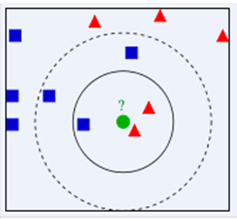

# 机器学习-KNN算法原理 && Spark实现

不懂算法的数据开发者不是一个好的算法工程师，还记得研究生时候，导师讲过的一些数据挖掘算法，颇有兴趣，但是无奈工作后接触少了，数据工程师的鄙视链，模型>实时>离线数仓>ETL工程师>BI工程师（不喜勿喷哈），现在做的工作主要是离线数仓，当然前期也做过一些ETL的工作，为了职业的长远发展，拓宽自己的技术边界，有必要逐步深入实时和模型，所以从本篇文章开始，也是列个FLAG，深入学习实时和模型部分。

> 改变自己，从提升自己不擅长领域的事情开始。

# 1. KNN - K近邻算法简介

首先，KNN是一种分类算法，有监督的机器学习，将训练集的类别打标签，当测试对象和训练对象完全匹配时候，就可以对其进行分类，但是测试对象与训练对象的多个类，如何匹配呢，前面可以判别是否测试对象术语某个训练对象，但是如果是多个训练对象类，那如何解决这种问题呢，所以就有了KNN，KNN是通过测量不同特征值之间的距离进行分类。它的思路是：如果一个样本在特征空间中的k个最相似(即特征空间中最邻近)的样本中的大多数属于某一个类别，则该样本也属于这个类别，其中K通常是不大于20的整数。KNN算法中，所选择的邻居都是已经正确分类的对象。该方法在定类决策上只依据最邻近的一个或者几个样本的类别来决定待分样本所属的类别



KNN算法的核心思想是，如果一个样本在特征空间中的K个最相邻的样本中的大多数属于某一个类别，则该样本也属于这个类别，并具有这个类别上样本的特性。该方法在确定分类决策上只依据最邻近的一个或者几个样本的类别来决定待分样本所属的类别。KNN方法在类别决策时，只与极少量的相邻样本有关。由于KNN方法主要靠周围有限的邻近的样本，而不是靠判别类域的方法来确定所属类别的，因此对于类域的交叉或重叠较多的待分样本集来说，KNN方法较其他方法更为适合。

# 2.KNN 算法流程

#### 2.1 准备数据，对数据进行预处理 。

#### 2.2 计算测试样本点（也就是待分类点）到其他每个样本点的距离。

#### 2.3 对每个距离进行排序，然后选择出距离最小的K个点 。

#### 2.4 对K个点所属的类别进行比较，根据少数服从多数的原则，将测试样本点归入在K个点中占比最高的那一

# 3. KNN算法优缺点

优点：易于理解，实现起了很方便，无需预估参数，无需训练

缺点：数据集中如果某个类的数据量很大，那么势必导致测试集合跑到这个类的更多，因为离这些点较近的概率也较大

# 4.KNN算法Spark实现

## 4.1 数据下载和说明

链接：[https://pan.baidu.com/s/1FmFxSrPIynO3udernLU0yQ](https://pan.baidu.com/s/1FmFxSrPIynO3udernLU0yQ "https://pan.baidu.com/s/1FmFxSrPIynO3udernLU0yQ")提取码：hell
复制这段内容后打开百度网盘手机App，操作更方便哦

鸢尾花数据集，数据集包含3类共150调数据，每类含50个数据，每条记录含4个特征：花萼长度、花萼宽度、花瓣长度、花瓣宽度

过这4个 特征预测鸢尾花卉属于（iris-setosa, iris-versicolour, iris-virginica）中的哪一品种

## 4.2 实现

```scala
package com.hoult.work

import org.apache.spark.rdd.RDD
import org.apache.spark.{SparkConf, SparkContext}

object KNNDemo {
  def main(args: Array[String]): Unit = {

    //1.初始化
    val conf=new SparkConf().setAppName("SimpleKnn").setMaster("local[*]")
    val sc=new SparkContext(conf)
    val K=15

    //2.读取数据,封装数据
    val data: RDD[LabelPoint] = sc.textFile("data/lris.csv")
      .map(line => {
        val arr = line.split(",")
        if (arr.length == 6) {
          LabelPoint(arr.last, arr.init.map(_.toDouble))
        } else {
          println(arr.toBuffer)
          LabelPoint(" ", arr.map(_.toDouble))
        }
      })


    //3.过滤出样本数据和测试数据
    val sampleData=data.filter(_.label!=" ")
    val testData=data.filter(_.label==" ").map(_.point).collect()

    //4.求每一条测试数据与样本数据的距离
    testData.foreach(elem=>{
      val distance=sampleData.map(x=>(getDistance(elem,x.point),x.label))
      //获取距离最近的k个样本
      val minDistance=distance.sortBy(_._1).take(K)
      //取出这k个样本的label并且获取出现最多的label即为测试数据的label
      val labels=minDistance.map(_._2)
        .groupBy(x=>x)
        .mapValues(_.length)
        .toList
        .sortBy(_._2).reverse
        .take(1)
        .map(_._1)
      printf(s"${elem.toBuffer.mkString(",")},${labels.toBuffer.mkString(",")}")
      println()
    })
    sc.stop()

  }

  case class LabelPoint(label:String,point:Array[Double])

  import scala.math._

  def getDistance(x:Array[Double],y:Array[Double]):Double={
    sqrt(x.zip(y).map(z=>pow(z._1-z._2,2)).sum)
  }
}

```

完整代码：[https://github.com/hulichao/bigdata-spark/blob/master/src/main/scala/com/hoult/work/KNNDemo.scala](https://github.com/hulichao/bigdata-spark/blob/master/src/main/scala/com/hoult/work/KNNDemo.scala "https://github.com/hulichao/bigdata-spark/blob/master/src/main/scala/com/hoult/work/KNNDemo.scala")

