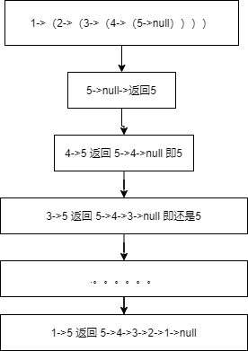

# 算法-如何理解递归，写好递归函数

不是每个程序员天生对递归理解深刻，刚入大一时候，当别人写出第一个求最大公约数的递归函数时，对其多么的惊叹，竟然可以不用循环，竟然代码可以这么简洁，确实递归在大多数情况下实现时候代码很短，大部分人也知道递归，也能基本看懂递归，可是却经常不知道怎么写，或者写出来的递归经常死循环，写算法往往也是学的是套路，只有极少数人是创造算法的，大部分人是用算法的，而递归是确实有套路可循的。

本文即从递归的扎马步开始，从几个简单例子到通用套路，一步一步拆解递归

## 1  递归的三要素

写递归，就是写三要素的实现，三要素分别为函数，边界，递推公式，刚开始只要记住要这么写，写几个算法之后，就能慢慢明白为什么要这样搞。

### 1.1 递归首要元素-函数&#x20;

明确你的函数是干什么用的，函数的入参应该是什么，返回值是什么，这三个问题，先从函数是干什么用的开始，你可以定义一个函数`f()` 假设已经实现了每一步递归的实现，再去明确这个实现 到底做了什么，入参至少要什么，返回值和参数返回可以理解为是一个东西，都是为了返回给上层调用或者全局的一个数据，想清楚函数的三个要素，那你的函数就定义好了。

### 1.2 递归边界、跳出递归

同样，先这样去做，再去想为什么，这一步要判断的就是函数的入参，入参的`null` ，入参为初始值，比如斐波那契数列的前1位或者2位，开始时候可能不一定想的完全，那没关系，下面的一步还会继续完善，所以我这里举得例子是斐波那契的前1**或**2位，而不是直接说结论，这一步骤是在函数的实现里面，所以考虑方式就是假设，入参到了临界值或者初始值，或者特殊值，你要判断一下，第一遍写的时候比如斐波那契，可以直接这么写

```java
if (n == 1)
  return 1;
if (n == 2)
  return 1; 
```

想到的不一定完全对，或者那么地很优雅， 没关系，只要想到要考虑边界就可以了。下面就是想边界的意义是什么？有两点，其一，异常值边界，其二递归结束判断，比如此题中的n < 0 怎么办，和 `n == 1` 和 `n == 2` 就分别对应前面说的，当然这两点可能考虑不那么完全，假设你只考虑了像前面代码中的，或者写边界时候发现写的多了，或者冗余了，这样不影响程序的结果，那么写完递推公式，我们再来回顾边界问题。

### 1.3  递推公式

这个就要先谈意义，再谈实现了，意义在于逐渐减少算法的规模，或者定义一种方式让输入的值尽可能地靠近临界值，也就是找一个关系`f(n)` 与` f(n-x)`序列的关系，`f(n)` 代表要解决的问题规模，`f(n-x)` 比n小的问题规模的函数值，这是递归函数中的关键一步，没有递推公式，就没有递归。例如斐波那契序列，中的递推公式是`f(n)=f(n-1) + f(n-2)`我们来观察这个公式，发现其第`n` 于 `n-1` 和 `n-2 `有关系，所以我们来看，如果输入任何整数，那么`n-1,n-2 `可能取值是负数，`0`，`1+`，可以看到边界`0`和负数没有考虑在内，所以，这时回顾前面1.2 的递归，我们来补充一下边界后得到：

```javascript
if (n <= 2)
  return 1;

```

## 2 递归的案例

下面通过三个简单例子，我们来练习使用递归，分别是青蛙跳台阶问题，等同于斐波那契序列，递归方式反转单链表，递归遍历树，以及针对三个

### 2.1 青蛙跳台阶问题

第一定义函数,明确函数只有一个唯一的输入值`n`  ，第二找到递归结束条件或者递归边界，可以发现当台阶是1或者2时候最容易得到，至于递推式，可以发现青蛙在每次跳的时候有两种跳法，那青蛙怎么到达第`n ` 个台阶，就是有两种跳法，分别对应`f(n-1)` 和 `f(n-2)` ，所以递归式就是`f(n)=f(n-1)+f(n-2)` ,那么整个算法就是如下：

```javascript
//一只青蛙一次可以跳上1级台阶，也可以跳上2级。求该青蛙跳上一个n级的台阶总共有多少种跳法。
//1。定义函数
public int f2(int n) {
   //2.确定边界
    if (n == 1)
        return 1;
    if (n == 2)
        return 2;
   //3.确定递归式
    return f2(n-1) + f2(n-2);
}
```

继续检查边界，发现n如果小于1，就会陷入死循环，那么程序可以改成这样：

```java
if (n == 1)
  return 1;

if (n == 2)
  return 2;

if (n < 1)
  return 0;
  
//当然简单写，可以这样搞

if (n < 1)
  return 0;
if (n <= 2)
  return n; 
```

### 2.2 递归方式反转单链表

单链表的反转，一般考虑到是双指针反转，当然递归写也可以，同样，首先定义函数，发现函数只有一个入参即节点`node` 这个`node` 在根节点或者任意中间节点都适用，其二确定边界，在反转单链表时候，可能会漏了`node.next` 的边界，此时两种方式，1，冗余写，只要你考虑到了，这可能是边界，你多写了绝对不会错，甚至，你可以多写两到三步也完全没问题，2，少写的话，就写完递归方式再来检查，比如反转单链表这个题，你会看到如果`node.next` 为空，那么`node.next.next` 就会报空指针问题，一般写完递归式后最好回头检查一下边界，可以查缺补漏，去冗余或者补条件。

此题的核心点是解开链的递归式，就是

```java
Node last = f3(node.next); //假设当前节点的下一节点后的链表已经反转
node.next.next = node; //当前节点指向的节点指向当前节点
node.next = null ;//原来当前节点是指向下一节点的，解开当前节点，并把节点指向空
//此处解释，为什么指向空，首先可以将node节点理解为第一个节点，那么第一节点反转后，就是最后一个节点，则指向是null，否则它还是指向2，就有问题哟
//那么如果不是第一个节点呢？这个指针是怎么指向的 
```

举个例子，假设，单链表是`1，2，3，4，5`那么递归的过程如下图:




看图，可以发现每一步的当前节点，放入反转链表后，都是最后一个，那它必然指向`null` 这样懂了把！

```javascript
class Node{
    int data;
    Node next;
} 
public Node f3(Node node) {
    //2.确定返回边界
    if (node == null || node.next == null)
        return node;
    //3.拿到递归推导
    Node last = f3(node.next);
    node.next.next = node;
    node.next = null ;//这个的作用是什么?,解开死循环，最后是有A->B,B->A
    return last;
}
    
```

### 2.3 递归遍历树&#x20;

递归遍历树也是最简单的，假设你之前没有看过遍历的代码，那么从零来开始考虑这个问题，首先定义函数，确认入参和单链表反转类似，只需要一个`TreeNode` 节点，然后考虑边界为`null` ，和不为`null` ，你首先想到是不是这样？

```java
if (node == null)
  return ;

if (node.left == null && node.right == null) {
  System.out.pritln(node.val);
  return ;
}

```

现在看起来是有点冗余，但是假设你并不知道，那么接下来下递归式，以先序为例

```java
//首先节点本身
System.out.println(node.val);      
//然后节点左
preOrder(node.left);      
//然后节点右 
preOrder(node.right); 
```

就这样完了，然后回顾前面的边界问题，只有上面的代码两行，可以看到在节点为`null` 的时候，就直接`return` 了，不用考虑子节点，字节点的边界在父节点的边界中已经考虑到了，当然写了这条边界完全不影响程序运行哦，所以最终的前中后序遍历如下代码：

```javascript
 //二叉树前序遍历
public static void preOrder(TreeNode node) {
    if (node == null)
        return;
    System.out.println(node.val);
    preOrder(node.left);
    preOrder(node.right);
}

//二叉树中序遍历
public static void inOrder(TreeNode node) {
    if (node == null)
        return;
    preOrder(node.left);
    System.out.println(node.val);
    preOrder(node.right);
}

//二叉树后序遍历
public static void postOrder(TreeNode node) {
    if (node == null)
        return;
    preOrder(node.left);
    preOrder(node.right);
    System.out.println(node.val);
}
```

### 2.4 通过一个序列构造二叉树

下面，我们补一个递归算法题，输入一个二叉树序列，来还原构造二叉树，顺便测试一下前面的遍历树的代码，同样熟悉了递归的套路后，我们直接来写代码

```java
//1.定义函数确认，只需要一个参数，即剩余序列
public static TreeNode createBinaryTree(LinkedList<Integer> inputList) {
        //定义一个空的树节点，此处为了整齐划一，在边界和递归体里面都可以用，所以写在第一行
        TreeNode node = null;
        //2.边界
        if (inputList == null || inputList.isEmpty())
            return node;

        //3.主要递归体，从链表中删除并取第一个元素，构建好左右节点，最后返回当前节点
        Integer data = inputList.removeFirst();
        //data，主要是异常值判断，前面已经判断过链表为空了
        if (data != null) {
            node = new TreeNode(data);
            node.left = createBinaryTree(inputList);
            node.right = createBinaryTree(inputList);
        }
        return node;
}

    public static void main(String[] args) {
        //前序遍历序列
        LinkedList<Integer> inputList = new LinkedList<Integer>(Arrays.asList(new Integer[]{3,2,9,null,null,10,null,null,8,null,4}));

        TreeNode node = createBinaryTree(inputList);

        //前序遍历
        System.out.println("前序遍历：");
        preOrder(node);

    } 
```

## 3. 总结

如何写好递归，就三步，首先确认函数的输入值，返回值，即函数本身要做什么功能。其次，判断边界，将可以想到的边界都写一下。最后写递归体，包括函数返回值，然后回去检查边界，对边界增删改查。

ps: 更多的情况下，只是没想好算法是怎么样，如果想好了，能够用模拟法，把整个图画出来，写代码就参考本文，即可一气呵成。。。
