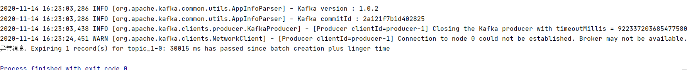
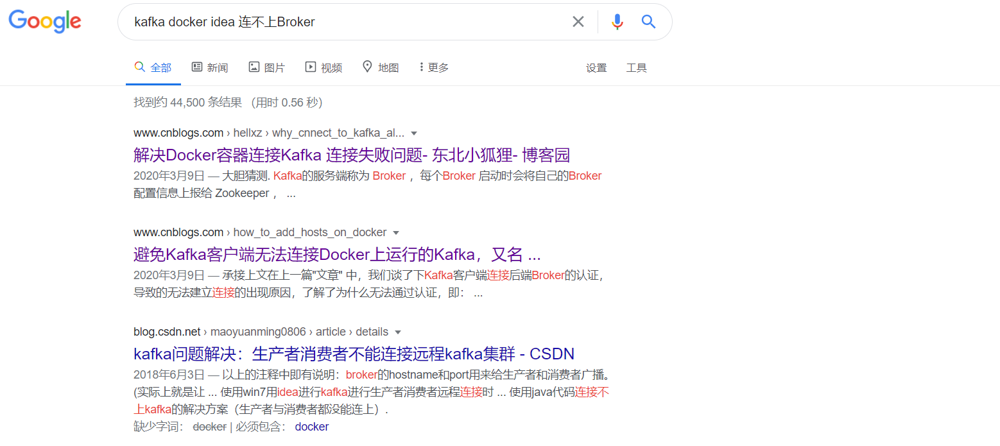
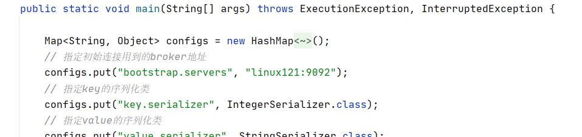
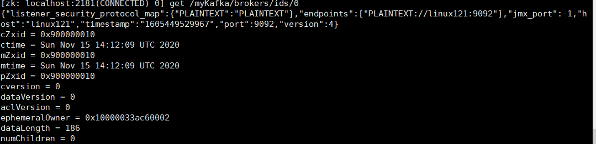
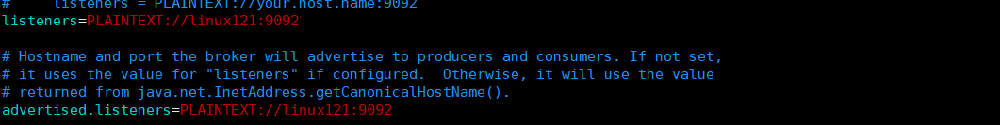

# 连接不上Docker-Kafka-broker及Kafka解决内网外网隔离的几个重要参数

# 1.背景

像之前的大数据环境等都是通过Docker来搭建的，无论是在学习，测试，迁移时候无疑是最快的方式，尤其是在多个环境下还想使用同一套环境时候,[https://github.com/hulichao/docker-bigdata](https://github.com/hulichao/docker-bigdata "https://github.com/hulichao/docker-bigdata"),搭建思路，可以参考本仓库，一般情况下只要注意比虚拟机要多做个端口映射等，端口映射也即网络方面，其实是相对冗余的，所以在搭建kafka的环境时候正好遇到了下面的问题，如下图`connection to node 0 colud not be establised. Broker may not be avaliable`

kafka连不上broker，在虚拟机的机器上没问题，但是本地使用idea连接是有问题的。

# 2.思路

是事后写的博客，所以当时的一些排查问题的截图，不一一贴出来了，只简述一下过程和最终解决，以及引出kafka对内外网隔离时候的解决方式

## 2.1 首先排查各种网络问题

比如虚拟机网络，使用`ping www.baidu.com` 再检查端口使用`telnet linux121 9092` 发现都没有问题，另外查了Docker的虚拟网卡，可以参考另外一篇文章，[https://blog.csdn.net/hu\_lichao/article/details/109538567](https://blog.csdn.net/hu_lichao/article/details/109538567 "https://blog.csdn.net/hu_lichao/article/details/109538567")，发现也没有问题

## 2.2 然后开始考虑是Kafka的问题

本来没有往这个方向想，最后只好借助`google`, 输入关键字 `kafka docker idea 连不上Broker` ,如下图

然后参考第一条，读取关键的信息：`Kafka的客户端（生产者与消费者统称）要连接 Broker 需要经过一层认证，不通过认证就无法连接！` 然后继续往下读，客户端连接Kafka需要两层认证，其一是Zk上的Broker中的`advertised.listeners` 配置的连接和端口，注意：这里较坑的一点就是，必须原样比对   PLAINTEXT 中的内容要和Java程序中的要对应，即不考虑你是怎么拿到虚拟机中的Docker中的kafka的连接，总之你要发送的`bootstrap.servers` 的内容要和`PLAINTEXT` 要一致，这就需要配置linux121 的hosts，映射到实际的ip和端口了。

> 📌java代码

> 📌zk获取broker信息

> 📌kafka的server.properties的配置

# 3.Kafka的内外网参数

根据前面的排查问题，有两个重要参数，`listeners`和`advertise.listeners` 那这两个参数是做什么用的呢，这里拿来官方的翻译，

> 用于指定当前Broker向外发布服务的地址和端口。与 advertised.listeners 配合，用于做内外网隔离。

下面介绍几个相关参数：

`listener.security.protocol.map`

内外网隔离配置：监听器名称和安全协议的映射配置。比如，可以将内外网隔离，即使它们都使用SSL。`listener.security.protocol.map=INTERNAL:SSL,EXTERNAL:SSL` 注意，每个监听器的名称只能在map中出现一次。
[inter.broker.listener.name](http://inter.broker.listener.name "inter.broker.listener.name")&#x20;

用于配置broker之间通信使用的监听器名称，该名称必须在`advertised.listeners`列表中。例如`inter.broker.listener.name=EXTERNAL`
`listeners`

用于配置broker监听的URI以及监听器名称列表，使用逗号隔开多个URI及监听器名称。
如果监听器名称代表的不是安全协议，必须配置`listener.security.protocol.map`。
每个监听器必须使用不同的网络端口。
`advertised.listeners`
需要将该地址发布到zookeeper供客户端使用，如果客户端使用的地址与listeners配置不同。
可以在zookeeper的 `get /brokers/ids/<`[broker.id](http://broker.id "broker.id")`>` 中找到。

在IaaS环境，该条目的网络接口得与broker绑定的网络接口不同。
如果不设置此条目，就使用`listeners`的配置。跟listeners不同，该条目不能使用`0.0.0.0`网络端口。
`advertised.listeners`的地址必须是listeners中配置的或配置的一部分。

**注意**：INTERNAL 和 EXTERNAL的作用就是相当于给PLAINTEXT协议起了两个别名，默认map中只能有一个同名的协议，故分开写

下面是一个典型的常用配置：

以上是使用wolai笔记写的，可以使用我的邀请码`DJED4WI`进行注册哟，名额有限，来抢啦！

# 4.参考

-   [https://www.cnblogs.com/hellxz/p/why\_cnnect\_to\_kafka\_always\_failure.html](https://www.cnblogs.com/hellxz/p/why_cnnect_to_kafka_always_failure.html "https://www.cnblogs.com/hellxz/p/why_cnnect_to_kafka_always_failure.html")

